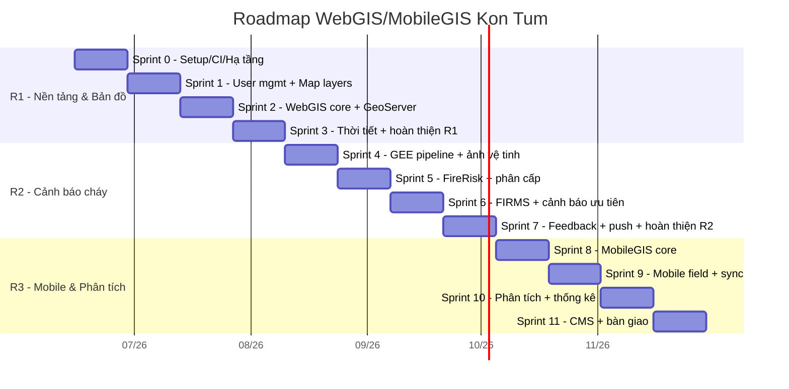
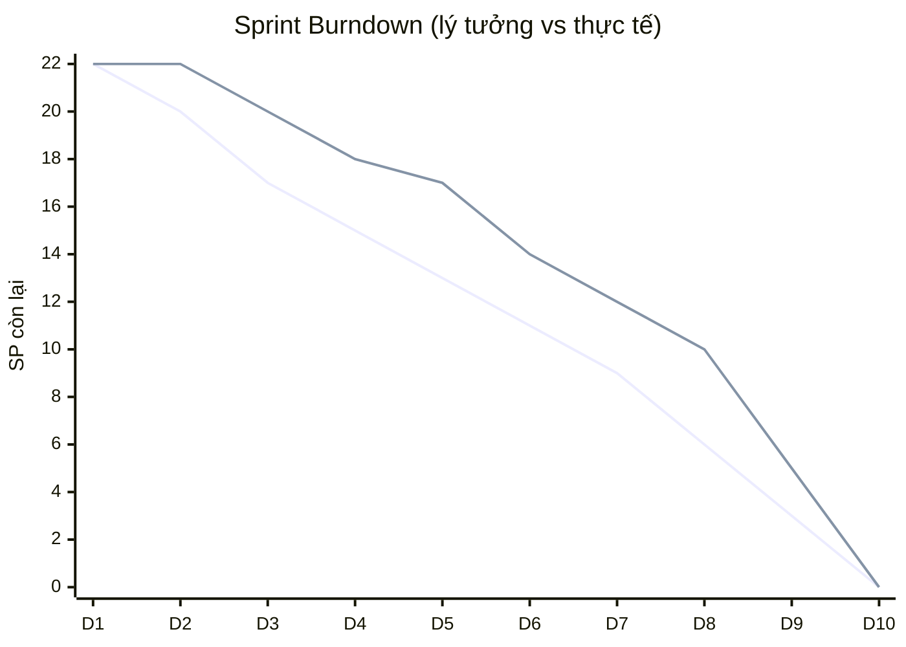
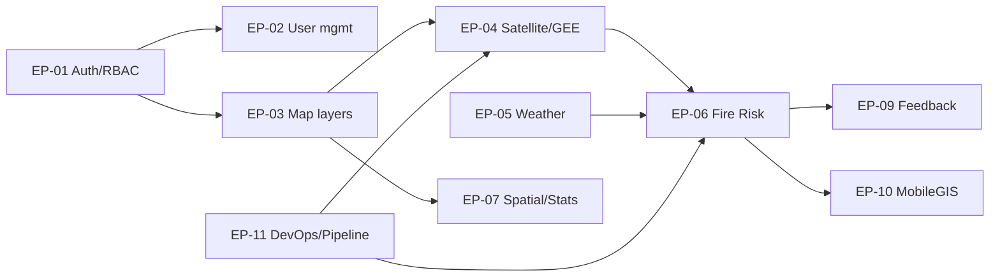

# 03 — Release & Sprint Plan

## 1. Chiến lược phát hành (Release Strategy)

Phát hành theo 3 mốc (Milestone), mỗi mốc là một Increment có thể demo cho cơ quan chủ quản.

| Release | Tên | Mục tiêu | Epics chính |
|---------|-----|----------|-------------|
| **R1 — MVP Nền tảng & Bản đồ** | "Bản đồ sống" | Đăng nhập, RBAC, WebGIS với lớp dữ liệu công khai, thời tiết cơ bản | EP-01, EP-02, EP-03, EP-05, EP-11 |
| **R2 — Cảnh báo cháy rừng** | "Cảnh báo sớm" | Pipeline GEE→PostGIS, FireRisk, FIRMS, cảnh báo Web + push | EP-04, EP-06, EP-09 |
| **R3 — Hoàn thiện & Mobile** | "Toàn diện" | MobileGIS, phân tích không gian, thống kê, CMS | EP-07, EP-08, EP-10 |

## 2. Giả định năng lực

- Velocity khởi điểm: **22 SP/sprint** (hiệu chỉnh sau Sprint 1–2).
- Sprint dài 2 tuần. Tổng backlog ~359 SP; trừ phần Auth đã Done (~30 SP) → còn ~329 SP → ~15 sprint (~7.5 tháng) cho full scope.

## 3. Roadmap (Mermaid Gantt)

## 4. Chi tiết Sprint (R1 + đầu R2)

### Sprint 0 — Khởi tạo (Setup)
**Goal:** Sẵn sàng môi trường, CI, chuẩn hóa pipeline dữ liệu.
- US-101 CI lint+test (5)
- US-100 Khung cron ingestion ổn định (8)
- US-103 Backup PostGIS (3)
- Spike: kết nối GEE service account, FIRMS key (3)
- **Tổng: ~19 SP**

### Sprint 1 — Quản trị người dùng + Lớp dữ liệu
**Goal:** Admin quản lý user; định nghĩa & CRUD lớp dữ liệu bản đồ.
- US-010 CRUD/khóa/soft delete user (8)
- US-012 Danh sách user phân trang (3)
- US-020 CRUD map layers metadata (8)
- US-011 Hồ sơ cá nhân (5) *(stretch)*
- **Tổng: ~19–24 SP**

### Sprint 2 — WebGIS core
**Goal:** Người dân xem lớp công khai + popup; proxy GeoServer.
- US-021 Import shapefile/GeoJSON (13)
- US-022 API features theo bbox (8)
- **Tổng: ~21 SP**

### Sprint 3 — WebGIS tương tác + Thời tiết → chốt R1
**Goal:** Layer switcher/3D, feature-info, thời tiết.
- US-023 Feature-info popup (5)
- US-024 Proxy WMS/WFS GeoServer (8)
- US-026 Layer switcher + 3D (5)
- US-040 Lớp thời tiết (8) *(stretch)*
- **Tổng: ~18–26 SP** → **Release R1**

### Sprint 4 — GEE pipeline + Ảnh vệ tinh
**Goal:** Tìm/xem Sentinel-2 + chỉ số.
- US-030 Tìm/xem Sentinel-2 (13)
- US-031 NDVI/NDMI/NBR (8)
- **Tổng: ~21 SP**

### Sprint 5 — Lõi FireRisk
**Goal:** Tính & phân cấp nguy cơ cháy, lưu PostGIS.
- US-050 Tính FireRisk cron (13)
- US-051 Phân cấp + lưu PostGIS (8)
- **Tổng: ~21 SP**

### Sprint 6 — FIRMS + Cảnh báo
- US-052 Ingest FIRMS (8)
- US-053 Bản đồ nguy cơ + popup (5)
- US-054 Cảnh báo ưu tiên (8)
- **Tổng: ~21 SP**

### Sprint 7 — Feedback + Push → chốt R2
- US-080 Gửi phản ánh (8)
- US-081 Xử lý phản ánh (5)
- US-055 Push FCM theo vị trí (8)
- **Tổng: ~21 SP** → **Release R2**

> Sprint 8–11 (R3) làm mịn ở Backlog Refinement trước khi vào.

## 5. Burndown mẫu (1 sprint 22 SP)

## 6. Quản trị phụ thuộc

## 7. Định nghĩa "Release Done"
- Tất cả Story trong release đạt DoD.
- Demo nghiệm thu với PO + stakeholder.
- Tài liệu API + vận hành cập nhật.
- Smoke test trên môi trường staging xanh.
