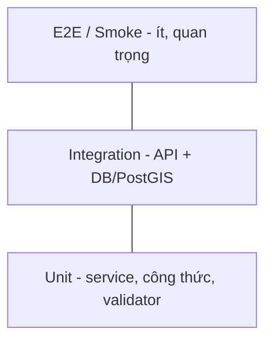

# 11 — Test & QA Strategy (Chiến lược kiểm thử)

## 1. Mục tiêu
Đảm bảo mỗi Increment đạt DoD, an toàn khi tích hợp dữ liệu ngoài (GEE/FIRMS), và bảo vệ tính đúng đắn của RBAC + dữ liệu không gian.

## 2. Kim tự tháp kiểm thử



| Tầng | Phạm vi | Công cụ đề xuất |
|------|---------|-----------------|
| Unit | service, util (công thức FireRisk, dedupe), validator Joi | **Jest** |
| Integration | route→controller→service→repository + DB thật | Jest + **supertest** + Postgres test (Docker/Testcontainers) |
| E2E/Smoke | luồng nghiệp vụ chính qua API/UI | Postman/Newman; Playwright (WebGIS) |
| Hiệu năng | API đọc, tải bản đồ | k6 / autocannon |
| Bảo mật | RBAC, rate-limit, injection | test thủ công + lint bảo mật |

> Hiện `package.json` chưa có test runner (`"test"` là placeholder). **Sprint 0 cần thêm Jest + supertest** và script `npm test` thật.

## 3. Phạm vi ưu tiên kiểm thử

### Bắt buộc (P0)
- Auth: đăng nhập/refresh/logout, rate-limit, reset, verify email.
- RBAC: mỗi endpoint chặn đúng vai trò (ma trận `06`/`10`).
- FireRisk: biên phân cấp `0.2/0.4/0.6/0.8`; spatial join priority.
- FIRMS dedupe + cron idempotent (chạy 2 lần không nhân đôi).
- Spatial: `ST_Intersects`/`ST_DWithin` trả đúng theo fixture.

### Quan trọng (P1)
- Import shapefile/GeoJSON: validate SRID, báo lỗi từng dòng.
- Feedback offline sync: không trùng (`client_uuid`).
- i18n: thông điệp đúng theo `?lang=`.

## 4. Dữ liệu & môi trường test
- DB test riêng (schema giống production), seed roles + fixture nhỏ (1 huyện).
- **Mock** dịch vụ ngoài ở unit/integration: GEE, FIRMS, OpenWeather, FCM, SMTP (nodemailer test transport).
- Vùng GEE thu nhỏ cho smoke test thật (tránh hạn ngạch).

## 5. CI (GitHub Actions) — định nghĩa US-101
```yaml
# .github/workflows/ci.yml (đề xuất)
name: CI
on: [push, pull_request]
jobs:
  test:
    runs-on: ubuntu-latest
    services:
      postgres:
        image: postgis/postgis:16-3.4
        env: { POSTGRES_PASSWORD: test, POSTGRES_DB: kontum_test }
        ports: ['5432:5432']
        options: >-
          --health-cmd pg_isready --health-interval 10s
          --health-timeout 5s --health-retries 5
    steps:
      - uses: actions/checkout@v4
      - uses: actions/setup-node@v4
        with: { node-version: '20' }
      - run: npm ci
      - run: npm run lint
      - run: npm run migrate   # áp migrations lên DB test
      - run: npm test
```
- Chặn merge nếu lint hoặc test đỏ (branch protection trên `develop`/`main`).

## 6. Chất lượng mã
- ESLint (đã có `.eslintrc.js`) bắt buộc pass.
- Conventional Commits; PR cần ≥1 review + CI xanh.
- Đo coverage; mục tiêu khởi điểm ≥ 60% cho `services/` + `repositories/` lõi.

## 7. Bug & quy trình
- Bug ghi trên board (Jira/GitHub Issues) với severity (S1 chặn → S4 nhỏ).
- Regression test thêm vào suite khi fix bug (chống tái phát).

## 8. Acceptance Testing (UAT)
- Cuối mỗi Release: PO + stakeholder chạy kịch bản nghiệm thu theo Acceptance Criteria (Gherkin trong `02`).
- Môi trường staging giống production; dữ liệu thật vùng nhỏ.

## 9. Khả truy cập & đa nền tảng (WebGIS/Mobile)
- WCAG AA cho UI WebGIS — **cần kiểm thử thủ công với trình đọc màn hình** + review chuyên gia (không thể tự động hóa hoàn toàn).
- Mobile: test trên thiết bị thật Android + iOS (GPS, camera, push).
