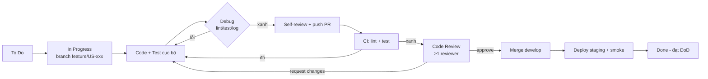

# 15 — Quy trình phát triển: Debug & Code Review

> Bổ sung bước **debug** và **code review** tường minh vào vòng đời mỗi User Story. Bám công cụ thực tế của dự án (Node/Express 5, `pg`, node-cron, ESLint, Jest đề xuất).

## 1. Vòng đời một Story (To Do → Done)



| Bước | Ai | Đầu ra |
|------|----|--------|
| In Progress | Dev | nhánh `feature/US-xxx` |
| Code + Test | Dev | code + unit/integration test |
| **Debug** | Dev | lint/test xanh cục bộ, lỗi đã reproduce & fix |
| Self-review | Dev | diff sạch, không TODO/secret |
| PR + CI | Dev/CI | PR mô tả rõ + CI xanh |
| **Code Review** | Reviewer | approve / request changes |
| Merge + staging | Dev | smoke test xanh |

## 2. Bước DEBUG (tường minh)

### 2.1 Nguyên tắc
1. **Reproduce trước khi sửa** — viết 1 test/HTTP request tái hiện lỗi, rồi mới fix (fix xong test phải xanh → chống tái phát).
2. **Đọc trước khi đoán** — đọc code + log thực tế, không suy diễn.
3. **Khoanh vùng theo lớp** — route → controller → service → repository → DB. Xác định lỗi ở tầng nào.
4. **Một thay đổi một lần** — nếu thử 2 lần không được, dừng lại tìm nguyên nhân gốc thay vì vá tiếp.

### 2.2 Công cụ debug theo tầng (dự án này)
| Tầng | Cách debug |
|------|-----------|
| HTTP/route | `morgan` log request; kiểm `Authorization`, body, status |
| Controller/service | `node --inspect server.js` + breakpoint (VS Code attach); hoặc log có ngữ cảnh |
| Repository/SQL | bật `DB_SLOW_QUERY_MS`; in câu SQL + params; chạy trực tiếp trên psql/pgAdmin |
| PostGIS | kiểm SRID (`ST_SRID`), `ST_IsValid`, `EXPLAIN ANALYZE` cho query bbox chậm |
| Cron jobs | chạy job thủ công (tách hàm khỏi lịch) + log start/end; kiểm `CLUSTER_WORKER_ID` |
| GEE/FIRMS/Weather | log payload request/response; test với vùng/ngày nhỏ; xử lý lỗi hạn ngạch |
| Auth/JWT | kiểm exp/secret/alg; decode token; kiểm revoke trong `auth.tokens` |
| WebSocket | log connect/broadcast; test bằng client ws đơn giản |

### 2.3 VS Code debug config (đề xuất `.vscode/launch.json`)
```jsonc
{
  "version": "0.2.0",
  "configurations": [
    {
      "type": "node",
      "request": "launch",
      "name": "Debug server",
      "program": "${workspaceFolder}/server.js",
      "envFile": "${workspaceFolder}/.env",
      "skipFiles": ["<node_internals>/**"]
    }
  ]
}
```

### 2.4 Checklist debug trước khi mở PR
- [ ] Đã reproduce lỗi bằng test/request cụ thể.
- [ ] `npm run lint` xanh; `npm test` xanh cục bộ.
- [ ] Không còn `console.log` rác / `debugger` / code chết.
- [ ] Đã kiểm edge case chính (input rỗng, sai quyền, dữ liệu lớn).
- [ ] Lỗi mới trả qua `core/error.response.js` + thông điệp i18n.

## 3. Bước CODE REVIEW (tường minh)

### 3.1 Trách nhiệm tác giả PR
- PR nhỏ, một mục đích (lý tưởng < ~400 dòng thay đổi).
- Mô tả PR theo mẫu (xem §3.4); link Story `US-xxx`.
- Tự review diff của mình trước khi gán reviewer.
- CI phải xanh trước khi yêu cầu review.

### 3.2 Trách nhiệm reviewer (SLA: phản hồi trong 1 ngày làm việc)
- Hiểu mục tiêu Story trước khi đọc code.
- Comment mang tính xây dựng; phân biệt **must-fix** vs **nit (tùy chọn)**.
- Kiểm tra theo checklist §3.3; chỉ approve khi đạt DoD.

### 3.3 Checklist Code Review (dành cho reviewer)
**Đúng đắn & nghiệp vụ**
- [ ] Đáp ứng Acceptance Criteria của Story.
- [ ] Theo pattern phân lớp: route → controller (mỏng, `asyncHandler`) → service (logic) → repository (SQL). Không SQL trong controller.
- [ ] Edge case & lỗi xử lý đầy đủ; trả lỗi qua `core/error.response.js`.

**Bảo mật**
- [ ] Validate input bằng Joi; không tin dữ liệu client.
- [ ] RBAC đúng (`requireRole` / kiểm quyền theo địa bàn).
- [ ] SQL dùng tham số hóa (chống SQL injection); không nối chuỗi.
- [ ] Sanitize HTML (tin tức/bình luận); upload kiểm MIME thực.
- [ ] Không hardcode secret; không log dữ liệu nhạy cảm/token.

**Dữ liệu & PostGIS**
- [ ] Có migration idempotent nếu đổi schema; SRID 4326; GIST index khi cần.
- [ ] Transaction cho thao tác nhiều bước (vd import replace).

**Chất lượng**
- [ ] ESLint pass; đặt tên rõ; không trùng lặp logic.
- [ ] Có test cho logic chính; test xanh.
- [ ] Cập nhật tài liệu API/`.env` nếu thay đổi.
- [ ] i18n cho thông điệp; phân trang chuẩn (`OK_LIST`).

### 3.4 Mẫu mô tả PR
```markdown
## Story
Closes US-xxx

## Thay đổi
- ...

## Cách test
- Bước reproduce / request mẫu / test đã thêm

## Ảnh hưởng
- Migration? Biến .env mới? Breaking change?

## Checklist
- [ ] Lint + test xanh
- [ ] Đã tự review
- [ ] Cập nhật tài liệu
```

### 3.5 Quy ước comment review
- `must:` bắt buộc sửa trước khi merge.
- `nit:` góp ý nhỏ, tác giả tự quyết.
- `q:` câu hỏi làm rõ.
- `praise:` ghi nhận điểm tốt.

## 4. Liên kết với quy trình hiện có
- **DoD** (`01-scrum-framework` §7): code review + test là điều kiện Done.
- **Git flow** (`01` §9): `feature/US-xxx` → PR → review → `develop` → `main`.
- **CI** (`11-test-qa-strategy` §5): lint + test tự động, chặn merge nếu đỏ.
- **Bug** (`11` §7): bug fix phải kèm regression test (đồng bộ §2.1 nguyên tắc reproduce).

## 5. Branch protection (đề xuất cấu hình GitHub)
- `develop` & `main`: yêu cầu PR + ≥1 approval + CI xanh + nhánh cập nhật mới nhất.
- Cấm push thẳng; cấm force-push.
- (Tùy chọn) yêu cầu giải quyết hết comment `must:` trước khi merge.
