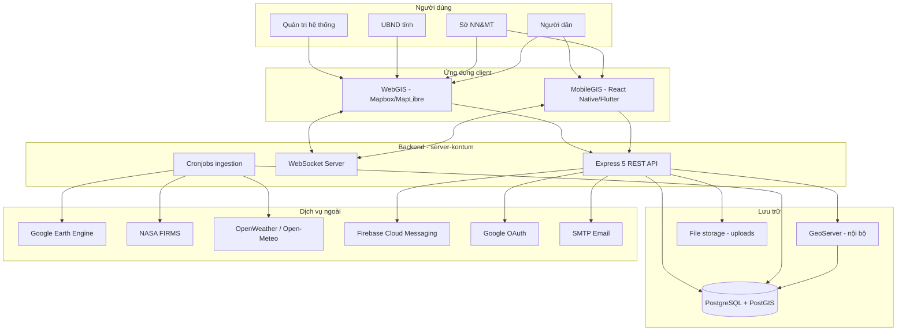
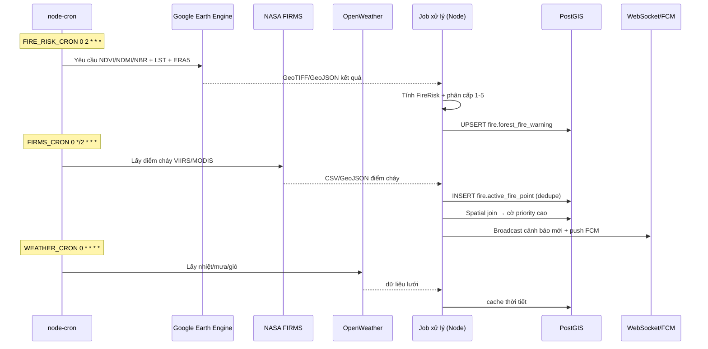
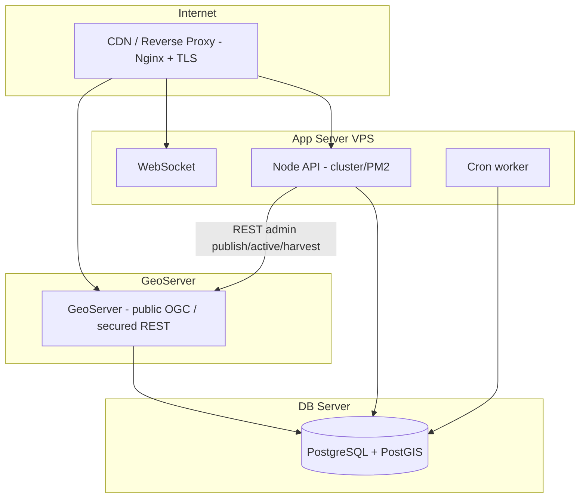

# 04 — System Architecture (Kiến trúc hệ thống)

## 1. Tổng quan kiến trúc (Context — C4 Level 1)



## 2. Tech Stack (theo mã nguồn thực tế)

| Lớp | Công nghệ | Ghi chú |
|-----|-----------|---------|
| Runtime | Node.js ≥ 14, CommonJS | `package.json` |
| Web framework | Express 5 | `app.js` |
| Bảo mật | helmet, cors, express-rate-limit, bcrypt | đã cấu hình |
| Auth | jsonwebtoken (HS256), passport (JWT + Google OAuth20) | access 15m/refresh 30d |
| Validation | Joi | `validate.middleware.js` |
| DB | PostgreSQL + PostGIS, driver `pg` (pool) | schema gis/fire/cms/field |
| Bản đồ server | GeoServer (WMS/WFS/WMTS/MVT) | public read-only OGC; REST admin chỉ backend gọi |
| Realtime | `ws` | `realtime/websocket.server.js` |
| Lịch | node-cron | token-cleanup, fire, firms, weather |
| Email | nodemailer | xác thực/reset |
| Upload | multer | ảnh/video/tài liệu |
| Nén/Log | compression, morgan | SSE bypass nén |
| Dữ liệu vệ tinh | Google Earth Engine | service account |
| Push | Firebase Cloud Messaging | MobileGIS |
| Frontend (đề xuất) | Mapbox GL JS / MapLibre + React | WebGIS — render mọi lớp từ GeoServer (WMS/MVT/WFS) |
| Mobile (đề xuất) | React Native hoặc Flutter | MobileGIS |

## 3. Kiến trúc phân lớp Backend (đã áp dụng)

```mermaid
flowchart LR
    Req[HTTP Request] --> MW[Middlewares\nlocale/auth/validate/upload/rate-limit]
    MW --> R[Routes]
    R --> C[Controllers\nasync-handler]
    C --> S[Services\nlogic nghiệp vụ]
    S --> Repo[Repositories\ntruy vấn SQL/PostGIS]
    Repo --> DB[(PostgreSQL/PostGIS)]
    C --> Resp[core/success|error.response]
```

**Nguyên tắc:**
- **Controllers** mỏng, bọc `async-handler`, không chứa SQL.
- **Services** giữ logic nghiệp vụ, không biết req/res.
- **Repositories** là nơi duy nhất chạm DB (dễ test, dễ đổi).
- **core/**: chuẩn hóa response, status code, reason phrase, i18n.

### Cấu trúc thư mục (mở rộng đề xuất)
```
src/
├── configs/        database, passport
├── controllers/    auth, user  → + layer, satellite, weather, fire-risk, feedback, news...
├── core/           response & status helpers
├── database/migrations/   SQL idempotent (001→01x)
├── helpers/        async-handler
├── jobs/           token-cleanup → + fire-risk.job, firms.job, weather.job
├── middlewares/    auth, error, locale, upload, validate, + rbac
├── realtime/       websocket.server
├── repositories/   user, token, social → + layer, fire, feedback...
├── routes/         index, auth, user → + (các route đang comment)
├── services/       auth, user → + các service module
├── utils/          context, crypto, i18n, mailer, tokenManager
│                   → + gee.client, firms.client, weather.client, geoserver.client, fcm.client
└── validators/     auth, user → + các validator module
```

## 4. Pipeline dữ liệu (Data Ingestion)



## 5. Mô hình triển khai (Deployment)



- `trust proxy = 1` → chạy sau reverse proxy.
- GeoServer expose các endpoint OGC public/read-only cho WMS/WFS/WMTS/MVT công khai; REST admin phải được bảo vệ và chỉ backend dùng.
- Node.js chỉ quản lý metadata GIS trong `gis.layer_registry` và gọi GeoServer REST API khi publish/unpublish/bật/tắt/harvest.
- Dùng `CLUSTER_WORKER_ID` để chỉ 1 worker chạy cron (tránh chạy trùng job).
- Rate-limit áp ở `/api/`.

## 6. Quyết định kiến trúc (ADR rút gọn)

| # | Quyết định | Lý do | Đánh đổi |
|---|-----------|-------|----------|
| ADR-1 | PostGIS làm kho không gian trung tâm | Chuẩn OGC, mạnh về spatial query | Cần kỹ năng GIS SQL |
| ADR-2 | GEE tính chỉ số thay vì tự xử ảnh | Tiết kiệm hạ tầng, dữ liệu sẵn | Phụ thuộc hạn ngạch GEE |
| ADR-3 | Frontend gọi trực tiếp GeoServer public OGC, Node quản lý metadata/REST admin | Giảm tải backend, đúng vai trò OGC server, phù hợp layer công khai/chỉ đọc | Cần cấu hình CORS/rate-limit/cache và bảo vệ REST admin trên GeoServer |
| ADR-4 | Tách schema gis/fire/cms/field | Module hóa, phân quyền rõ | Quản lý migration nhiều schema |
| ADR-5 | Cron trong app (node-cron) | Đơn giản, ít hạ tầng | Phải chống chạy trùng khi scale |
| ADR-6 | Stack render: PostGIS → GeoServer → Mapbox GL JS | 1 client thống nhất; GeoServer chuẩn OGC + cache | Cần extension MVT, vận hành thêm GeoServer |
| ADR-7 | Layer Registry Pattern cho quản lý lớp GIS ở admin | 1 UI admin thống nhất quản lý mọi lớp qua `gis.layer_registry`; dynamic query an toàn (table_name từ DB, không từ user input); per-layer RBAC qua JSONB; dễ thêm lớp mới không cần deploy code | Cần bảng bổ trợ (registry, import_jobs, edit_history); query động khó debug hơn query tĩnh |

## 7. Bảo mật xuyên suốt
- RBAC theo `auth.roles.permissions` (JSONB) — linh hoạt không cần migration.
- JWT access ngắn + refresh xoay vòng + revoke; cron dọn token.
- Helmet CSP, CORS whitelist, rate-limit.
- Secrets trong `.env`/secret store; key GEE file trong `.gitignore`.
- **Cảnh báo:** mọi endpoint công khai (lớp `is_public`, fire-risk) cần kiểm soát rò rỉ dữ liệu nội bộ; endpoint ghi dữ liệu bắt buộc auth + RBAC.
