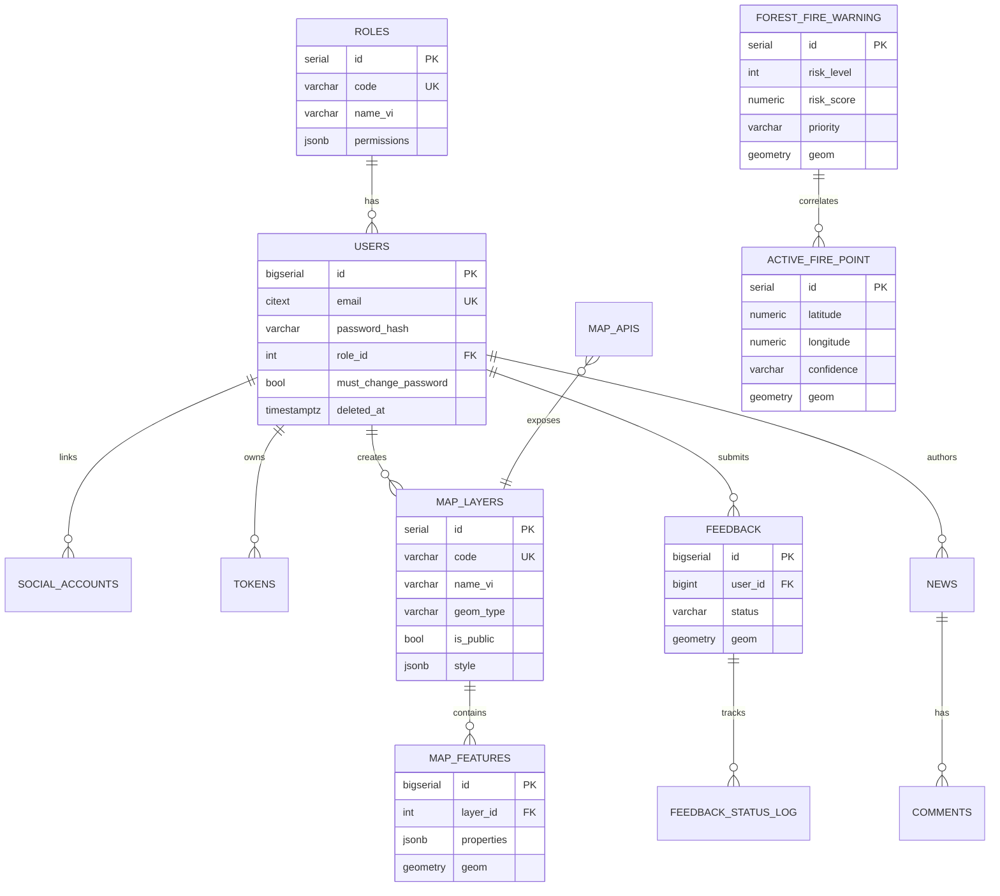

# 05 — Database Design (Thiết kế CSDL PostgreSQL/PostGIS)

> Bám theo migrations hiện có (001–010) và mở rộng cho các module GIS. Tất cả bảng không gian dùng SRID **4326 (WGS84)**.

## 1. Tổ chức schema

| Schema | Mục đích | Trạng thái |
|--------|----------|-----------|
| `auth` | Người dùng, vai trò, token, social, email verify | ✅ đã có |
| `gis` | Lớp dữ liệu bản đồ, map API, cache thời tiết, ảnh vệ tinh | ⬜ thiết kế mới |
| `fire` | Nguy cơ cháy, điểm cháy FIRMS | ⬜ thiết kế mới |
| `cms` | Tin tức, văn bản, bản đồ PDF, bình luận | ⬜ thiết kế mới |
| `field` | Phản ánh hiện trường, cập nhật MobileGIS | ⬜ thiết kế mới |

Extension: `CREATE EXTENSION IF NOT EXISTS postgis;` (đã có ở migration 009).

## 2. ERD tổng thể



## 3. Schema `auth` (tóm tắt — đã hiện thực)

- `auth.roles` — 4 vai trò seed: `system_admin`, `ubnd_tinh`, `so_nnmt`, `citizen`; quyền chi tiết trong `permissions JSONB`.
- `auth.users` — email (index lower/citext), password_hash, role_id, `must_change_password`, `deleted_at` (soft delete).
- `auth.social_accounts` — liên kết Google (provider, provider_user_id).
- `auth.tokens` — refresh/verify token (hashed), expires_at; cron dọn.
- `auth.password_reset` + `auth.oauth_codes` — reset & OAuth code ngắn hạn.
- `auth.email_verification` — token xác thực email.

## 4. Schema `gis` (đề xuất migration mới)

### 4.1 `gis.map_layers` — metadata lớp dữ liệu
```sql
CREATE TABLE IF NOT EXISTS gis.map_layers (
    id           SERIAL PRIMARY KEY,
    code         VARCHAR(60) UNIQUE NOT NULL,
    name_vi      VARCHAR(150) NOT NULL,
    name_en      VARCHAR(150),
    description  TEXT,
    geom_type    VARCHAR(20) NOT NULL,          -- POINT/LINESTRING/POLYGON/RASTER
    category     VARCHAR(50),                    -- rung, hanh_chinh, tram_kiem_lam...
    is_public    BOOLEAN NOT NULL DEFAULT false,
    min_zoom     INT DEFAULT 0,
    max_zoom     INT DEFAULT 22,
    style        JSONB NOT NULL DEFAULT '{}',    -- style hiển thị (màu, opacity)
    source_type  VARCHAR(20) DEFAULT 'postgis',  -- postgis | geoserver | external
    geoserver_layer VARCHAR(120),
    created_by   BIGINT REFERENCES auth.users(id),
    created_at   TIMESTAMPTZ NOT NULL DEFAULT NOW(),
    updated_at   TIMESTAMPTZ NOT NULL DEFAULT NOW()
);
```

### 4.2 `gis.map_features` — đối tượng không gian generic
```sql
CREATE TABLE IF NOT EXISTS gis.map_features (
    id         BIGSERIAL PRIMARY KEY,
    layer_id   INT NOT NULL REFERENCES gis.map_layers(id) ON DELETE CASCADE,
    properties JSONB NOT NULL DEFAULT '{}',
    geom       GEOMETRY(Geometry, 4326) NOT NULL,
    created_at TIMESTAMPTZ NOT NULL DEFAULT NOW()
);
CREATE INDEX IF NOT EXISTS idx_map_features_geom ON gis.map_features USING GIST (geom);
CREATE INDEX IF NOT EXISTS idx_map_features_layer ON gis.map_features (layer_id);
CREATE INDEX IF NOT EXISTS idx_map_features_props ON gis.map_features USING GIN (properties);
```
> Lưu ý: với lớp lớn/chuyên biệt (ranh giới rừng, tiểu khu) nên tạo **bảng riêng** thay vì generic để query tối ưu. `map_features` phù hợp lớp nhỏ/linh hoạt.

### 4.3 `gis.map_apis` — API bản đồ chia sẻ
```sql
CREATE TABLE IF NOT EXISTS gis.map_apis (
    id         SERIAL PRIMARY KEY,
    name       VARCHAR(120) NOT NULL,
    layer_id   INT REFERENCES gis.map_layers(id),
    api_key    VARCHAR(64) UNIQUE NOT NULL,
    scope      JSONB NOT NULL DEFAULT '{}',      -- quyền: read/bbox-limit/rate
    is_active  BOOLEAN NOT NULL DEFAULT true,
    created_at TIMESTAMPTZ NOT NULL DEFAULT NOW()
);
```

### 4.4 `gis.weather_cache` — cache thời tiết
```sql
CREATE TABLE IF NOT EXISTS gis.weather_cache (
    id          BIGSERIAL PRIMARY KEY,
    source      VARCHAR(30),                     -- openweather/open-meteo/era5
    variable    VARCHAR(30),                     -- temp/rain/wind/cloud
    observed_at TIMESTAMPTZ NOT NULL,
    payload     JSONB NOT NULL,                  -- lưới/giá trị
    geom        GEOMETRY(Point, 4326),
    created_at  TIMESTAMPTZ NOT NULL DEFAULT NOW()
);
CREATE INDEX IF NOT EXISTS idx_weather_geom ON gis.weather_cache USING GIST (geom);
```

### 4.5 `gis.satellite_image` — metadata ảnh đã xử lý
```sql
CREATE TABLE IF NOT EXISTS gis.satellite_image (
    id           SERIAL PRIMARY KEY,
    name         VARCHAR(150),
    source       VARCHAR(30) DEFAULT 'sentinel-2',
    index_type   VARCHAR(20),                    -- NDVI/NDMI/NBR
    captured_from DATE,
    captured_to   DATE,
    cloud_pct    NUMERIC,
    tile_url     TEXT,                            -- URL tile GEE
    is_public    BOOLEAN NOT NULL DEFAULT false,
    bbox         GEOMETRY(Polygon, 4326),
    created_at   TIMESTAMPTZ NOT NULL DEFAULT NOW()
);
```

## 5. Schema `fire` (theo tài liệu nghiệp vụ)

### 5.1 `fire.forest_fire_warning`
```sql
CREATE TABLE IF NOT EXISTS fire.forest_fire_warning (
    id           SERIAL PRIMARY KEY,
    risk_level   INTEGER NOT NULL,               -- 1..5
    risk_score   NUMERIC(4,3),                   -- 0..1
    priority     VARCHAR(10) DEFAULT 'normal',   -- normal | high
    lst          NUMERIC,                         -- nhiệt độ bề mặt
    ndmi         NUMERIC,
    wind_kmh     NUMERIC,
    rainfall_7d  NUMERIC,
    source       VARCHAR(50) DEFAULT 'gee',
    province     VARCHAR(100) DEFAULT 'Kon Tum',
    district     VARCHAR(100),
    commune      VARCHAR(100),
    forest_type  VARCHAR(100),
    warning_time TIMESTAMPTZ NOT NULL DEFAULT NOW(),
    geom         GEOMETRY(Polygon, 4326) NOT NULL
);
CREATE INDEX IF NOT EXISTS idx_ffw_geom ON fire.forest_fire_warning USING GIST (geom);
CREATE INDEX IF NOT EXISTS idx_ffw_time ON fire.forest_fire_warning (warning_time DESC);
CREATE INDEX IF NOT EXISTS idx_ffw_level ON fire.forest_fire_warning (risk_level);
```

### 5.2 `fire.active_fire_point`
```sql
CREATE TABLE IF NOT EXISTS fire.active_fire_point (
    id          SERIAL PRIMARY KEY,
    latitude    NUMERIC NOT NULL,
    longitude   NUMERIC NOT NULL,
    brightness  NUMERIC,
    confidence  VARCHAR(50),
    satellite   VARCHAR(50),                      -- VIIRS/MODIS
    acq_date    DATE,
    acq_time    VARCHAR(10),
    geom        GEOMETRY(Point, 4326) NOT NULL,
    ingested_at TIMESTAMPTZ NOT NULL DEFAULT NOW(),
    UNIQUE (latitude, longitude, acq_date, acq_time, satellite)  -- chống trùng
);
CREATE INDEX IF NOT EXISTS idx_afp_geom ON fire.active_fire_point USING GIST (geom);
CREATE INDEX IF NOT EXISTS idx_afp_date ON fire.active_fire_point (acq_date DESC);
```

## 6. Schema `cms`
```sql
CREATE TABLE IF NOT EXISTS cms.news (
    id SERIAL PRIMARY KEY,
    title VARCHAR(255) NOT NULL,
    slug  VARCHAR(280) UNIQUE NOT NULL,
    content TEXT,
    cover_url TEXT,
    status VARCHAR(20) DEFAULT 'draft',          -- draft | published
    author_id BIGINT REFERENCES auth.users(id),
    published_at TIMESTAMPTZ,
    search_tsv tsvector,                          -- full-text search
    created_at TIMESTAMPTZ NOT NULL DEFAULT NOW()
);
CREATE INDEX IF NOT EXISTS idx_news_search ON cms.news USING GIN (search_tsv);

CREATE TABLE IF NOT EXISTS cms.comments (
    id BIGSERIAL PRIMARY KEY,
    news_id INT REFERENCES cms.news(id) ON DELETE CASCADE,
    user_id BIGINT REFERENCES auth.users(id),
    content TEXT NOT NULL,
    is_approved BOOLEAN DEFAULT false,
    created_at TIMESTAMPTZ NOT NULL DEFAULT NOW()
);

CREATE TABLE IF NOT EXISTS cms.documents (
    id SERIAL PRIMARY KEY,
    title VARCHAR(255) NOT NULL,
    doc_type VARCHAR(50),                         -- bao_cao | van_ban | pdf_map
    file_url TEXT NOT NULL,
    is_public BOOLEAN DEFAULT false,
    uploaded_by BIGINT REFERENCES auth.users(id),
    created_at TIMESTAMPTZ NOT NULL DEFAULT NOW()
);
```

## 7. Schema `field` (phản ánh & MobileGIS)
```sql
CREATE TABLE IF NOT EXISTS field.feedback (
    id BIGSERIAL PRIMARY KEY,
    user_id BIGINT REFERENCES auth.users(id),     -- null nếu ẩn danh (x-anonymous-id)
    anonymous_id VARCHAR(64),
    category VARCHAR(50),                          -- chay_rung | vi_pham | hien_trang
    title VARCHAR(255),
    description TEXT,
    media_urls JSONB DEFAULT '[]',                 -- ảnh/video
    status VARCHAR(20) NOT NULL DEFAULT 'new',     -- new | in_progress | resolved
    assigned_to BIGINT REFERENCES auth.users(id),
    geom GEOMETRY(Point, 4326),
    created_at TIMESTAMPTZ NOT NULL DEFAULT NOW(),
    updated_at TIMESTAMPTZ NOT NULL DEFAULT NOW()
);
CREATE INDEX IF NOT EXISTS idx_feedback_geom ON field.feedback USING GIST (geom);
CREATE INDEX IF NOT EXISTS idx_feedback_status ON field.feedback (status);

CREATE TABLE IF NOT EXISTS field.feedback_status_log (
    id BIGSERIAL PRIMARY KEY,
    feedback_id BIGINT REFERENCES field.feedback(id) ON DELETE CASCADE,
    from_status VARCHAR(20),
    to_status VARCHAR(20),
    note TEXT,
    changed_by BIGINT REFERENCES auth.users(id),
    changed_at TIMESTAMPTZ NOT NULL DEFAULT NOW()
);
```

## 8. Quy ước & chuẩn
- Migration **idempotent** (`IF NOT EXISTS`), đặt tên `0xx_mo_ta.sql` nối tiếp 010.
- Mọi cột thời gian dùng `TIMESTAMPTZ`; trigger `update_updated_at_column` tái sử dụng từ schema auth.
- Mọi cột geom có **GIST index**; SRID 4326 đồng nhất.
- Soft delete bằng `deleted_at` cho dữ liệu nghiệp vụ quan trọng.
- Tên cột song ngữ `_vi`/`_en` cho dữ liệu hiển thị.

## 9. Chiến lược chỉ mục & hiệu năng
- GIST cho geom; GIN cho `properties`/`tsvector`.
- Bảng cảnh báo lớn: partition theo tháng (`warning_time`) nếu tăng nhanh.
- Truy vấn bản đồ luôn kèm `ST_Intersects(geom, ST_MakeEnvelope(bbox,4326))` + LIMIT theo zoom.
- Cân nhắc materialized view cho thống kê diện tích theo huyện.
