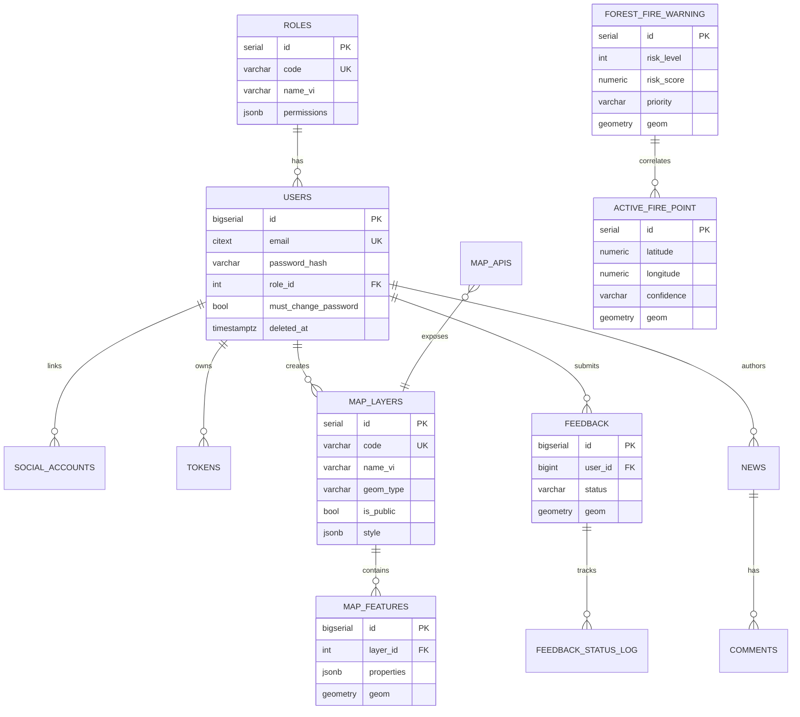
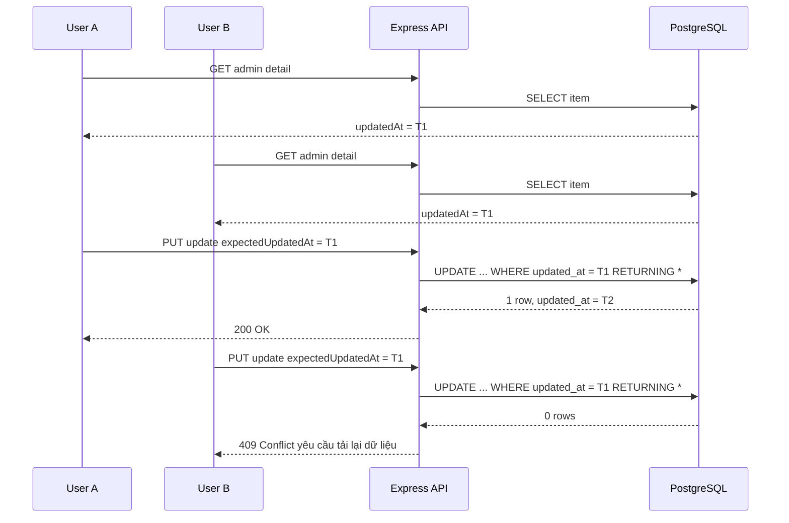

# 05 — Database Design (Thiết kế CSDL PostgreSQL/PostGIS)

> Bám theo migrations hiện có (001–010) và mở rộng cho các module GIS. Tất cả bảng không gian dùng SRID **4326 (WGS84)**.

## 1. Tổ chức schema

| Schema | Mục đích | Trạng thái |
|--------|----------|-----------|
| `auth` | Người dùng, vai trò, token, social, email verify | ✅ đã có |
| `gis` | Lớp dữ liệu bản đồ, map API, cache thời tiết, ảnh vệ tinh | ⬜ thiết kế mới |
| `fire` | Nguy cơ cháy, điểm cháy FIRMS | ⬜ thiết kế mới |
| `cms` | Tin tức, văn bản, bản đồ PDF, bình luận | ✅ đã có phần CMS |
| `field` | Phản ánh hiện trường, cập nhật MobileGIS | ✅ đã có `feedback` |

Extension: `CREATE EXTENSION IF NOT EXISTS postgis;` dùng cho các bảng không gian SRID 4326.

## 2. ERD tổng thể



## 3. Schema `auth` (tóm tắt — đã hiện thực)

- `auth.roles` — 4 vai trò seed: `system_admin`, `ubnd_tinh`, `so_nnmt`, `citizen`; quyền chi tiết trong `permissions JSONB`.
- `auth.users` — email (index lower/citext), password_hash, role_id, `must_change_password`, `deleted_at` (soft delete).
- `auth.social_accounts` — liên kết Google (provider, provider_user_id).
- `auth.tokens` — refresh/verify token (hashed), expires_at; cron dọn.
- `auth.password_reset` + `auth.oauth_codes` — reset & OAuth code ngắn hạn.
- `auth.email_verification` — token xác thực email.

### 3.1 RBAC permissions JSONB

`auth.roles.permissions` dùng format:

```jsonc
{
  "resource": {
    "action": true
  }
}
```

Middleware chính: `requirePermission(resource, action)` đọc từ `req.user.role_permissions`.
`system_admin` được bypass trong middleware nhưng vẫn seed đủ quyền để đồng bộ UI/quản trị.

| Resource | Bảng liên quan | Actions |
|---|---|---|
| `users` | `auth.users` | `read`, `create`, `update`, `delete`, `read_own`, `update_own`, `reset_password`, `change_role`, `change_status` |
| `roles` | `auth.roles` | `read`, `update`, `manage` |
| `notifications` | `core.notifications` | `read`, `read_own`, `create`, `update`, `delete`, `delete_own`, `send` |
| `notification_reads` | `core.notification_reads` | `read_own`, `create`, `update_own` |
| `device_tokens` | `core.device_tokens` | `read`, `read_own`, `create_own`, `delete`, `delete_own` |
| `news` | `cms.news` | `read`, `create`, `update`, `delete`, `publish` |
| `news_translations` | `cms.news_translations` | `read`, `create`, `update`, `delete` |
| `comments` | `cms.comments` | `read`, `create`, `delete`, `delete_own`, `approve` |
| `documents` | `cms.documents` | `read`, `create`, `update`, `delete`, `publish` |
| `document_translations` | `cms.document_translations` | `read`, `create`, `update`, `delete` |
| `feedback` | `field.feedback`, `field.feedback_status_log` | `read`, `create`, `update`, `delete`, `read_own`, `create_own`, `update_status`, `map` |

Role seed hiện tại:

- `system_admin`: toàn quyền các resource trên, gồm phản ánh hiện trường.
- `so_nnmt`: quản trị user giới hạn, quản lý CMS, duyệt/xóa comment, gửi notification, đọc/xử lý feedback và xem bản đồ feedback.
- `ubnd_tinh`: quyền đọc/giám sát, đọc feedback và xem bản đồ feedback.
- `citizen`: đọc nội dung public, tạo/xóa bình luận của mình, tạo/xem feedback của mình, cập nhật profile/thiết bị/thông báo của mình.

## 4. Schema `gis` (đề xuất migration mới)

### 4.1 `gis.map_layers` — metadata lớp dữ liệu
```sql
CREATE TABLE IF NOT EXISTS gis.map_layers (
    id           SERIAL PRIMARY KEY,
    code         VARCHAR(60) UNIQUE NOT NULL,
    name_vi      VARCHAR(150) NOT NULL,
    name_en      VARCHAR(150),
    description  TEXT,
    geom_type    VARCHAR(20) NOT NULL,          -- POINT/LINESTRING/POLYGON/RASTER
    category     VARCHAR(50),                    -- rung, hanh_chinh, tram_kiem_lam...
    is_public    BOOLEAN NOT NULL DEFAULT false,
    min_zoom     INT DEFAULT 0,
    max_zoom     INT DEFAULT 22,
    style        JSONB NOT NULL DEFAULT '{}',    -- style hiển thị (màu, opacity)
    source_type  VARCHAR(20) DEFAULT 'postgis',  -- postgis | geoserver | external
    geoserver_layer VARCHAR(120),
    created_by   BIGINT REFERENCES auth.users(id),
    created_at   TIMESTAMPTZ NOT NULL DEFAULT NOW(),
    updated_at   TIMESTAMPTZ NOT NULL DEFAULT NOW()
);
```

### 4.2 `gis.map_features` — đối tượng không gian generic
```sql
CREATE TABLE IF NOT EXISTS gis.map_features (
    id         BIGSERIAL PRIMARY KEY,
    layer_id   INT NOT NULL REFERENCES gis.map_layers(id) ON DELETE CASCADE,
    properties JSONB NOT NULL DEFAULT '{}',
    geom       GEOMETRY(Geometry, 4326) NOT NULL,
    created_at TIMESTAMPTZ NOT NULL DEFAULT NOW()
);
CREATE INDEX IF NOT EXISTS idx_map_features_geom ON gis.map_features USING GIST (geom);
CREATE INDEX IF NOT EXISTS idx_map_features_layer ON gis.map_features (layer_id);
CREATE INDEX IF NOT EXISTS idx_map_features_props ON gis.map_features USING GIN (properties);
```
> Lưu ý: với lớp lớn/chuyên biệt (ranh giới rừng, tiểu khu) nên tạo **bảng riêng** thay vì generic để query tối ưu. `map_features` phù hợp lớp nhỏ/linh hoạt.

### 4.3 `gis.map_apis` — API bản đồ chia sẻ
```sql
CREATE TABLE IF NOT EXISTS gis.map_apis (
    id         SERIAL PRIMARY KEY,
    name       VARCHAR(120) NOT NULL,
    layer_id   INT REFERENCES gis.map_layers(id),
    api_key    VARCHAR(64) UNIQUE NOT NULL,
    scope      JSONB NOT NULL DEFAULT '{}',      -- quyền: read/bbox-limit/rate
    is_active  BOOLEAN NOT NULL DEFAULT true,
    created_at TIMESTAMPTZ NOT NULL DEFAULT NOW()
);
```

### 4.4 `gis.weather_cache` — cache thời tiết
```sql
CREATE TABLE IF NOT EXISTS gis.weather_cache (
    id          BIGSERIAL PRIMARY KEY,
    source      VARCHAR(30),                     -- openweather/open-meteo/era5
    variable    VARCHAR(30),                     -- temp/rain/wind/cloud
    observed_at TIMESTAMPTZ NOT NULL,
    payload     JSONB NOT NULL,                  -- lưới/giá trị
    geom        GEOMETRY(Point, 4326),
    created_at  TIMESTAMPTZ NOT NULL DEFAULT NOW()
);
CREATE INDEX IF NOT EXISTS idx_weather_geom ON gis.weather_cache USING GIST (geom);
```

### 4.5 `gis.satellite_image` — metadata ảnh đã xử lý
```sql
CREATE TABLE IF NOT EXISTS gis.satellite_image (
    id           SERIAL PRIMARY KEY,
    name         VARCHAR(150),
    source       VARCHAR(30) DEFAULT 'sentinel-2',
    index_type   VARCHAR(20),                    -- NDVI/NDMI/NBR
    captured_from DATE,
    captured_to   DATE,
    cloud_pct    NUMERIC,
    tile_url     TEXT,                            -- URL tile GEE
    is_public    BOOLEAN NOT NULL DEFAULT false,
    bbox         GEOMETRY(Polygon, 4326),
    created_at   TIMESTAMPTZ NOT NULL DEFAULT NOW()
);
```

## 5. Schema `fire` (theo tài liệu nghiệp vụ)

### 5.1 `fire.forest_fire_warning`
```sql
CREATE TABLE IF NOT EXISTS fire.forest_fire_warning (
    id           SERIAL PRIMARY KEY,
    risk_level   INTEGER NOT NULL,               -- 1..5
    risk_score   NUMERIC(4,3),                   -- 0..1
    priority     VARCHAR(10) DEFAULT 'normal',   -- normal | high
    lst          NUMERIC,                         -- nhiệt độ bề mặt
    ndmi         NUMERIC,
    wind_kmh     NUMERIC,
    rainfall_7d  NUMERIC,
    source       VARCHAR(50) DEFAULT 'gee',
    province     VARCHAR(100) DEFAULT 'Kon Tum',
    district     VARCHAR(100),
    commune      VARCHAR(100),
    forest_type  VARCHAR(100),
    warning_time TIMESTAMPTZ NOT NULL DEFAULT NOW(),
    geom         GEOMETRY(Polygon, 4326) NOT NULL
);
CREATE INDEX IF NOT EXISTS idx_ffw_geom ON fire.forest_fire_warning USING GIST (geom);
CREATE INDEX IF NOT EXISTS idx_ffw_time ON fire.forest_fire_warning (warning_time DESC);
CREATE INDEX IF NOT EXISTS idx_ffw_level ON fire.forest_fire_warning (risk_level);
```

### 5.2 `fire.active_fire_point`
```sql
CREATE TABLE IF NOT EXISTS fire.active_fire_point (
    id          SERIAL PRIMARY KEY,
    latitude    NUMERIC NOT NULL,
    longitude   NUMERIC NOT NULL,
    brightness  NUMERIC,
    confidence  VARCHAR(50),
    satellite   VARCHAR(50),                      -- VIIRS/MODIS
    acq_date    DATE,
    acq_time    VARCHAR(10),
    geom        GEOMETRY(Point, 4326) NOT NULL,
    ingested_at TIMESTAMPTZ NOT NULL DEFAULT NOW(),
    UNIQUE (latitude, longitude, acq_date, acq_time, satellite)  -- chống trùng
);
CREATE INDEX IF NOT EXISTS idx_afp_geom ON fire.active_fire_point USING GIST (geom);
CREATE INDEX IF NOT EXISTS idx_afp_date ON fire.active_fire_point (acq_date DESC);
```

## 6. Schema `cms`
```sql
CREATE TABLE IF NOT EXISTS cms.news (
    id SERIAL PRIMARY KEY,
    title VARCHAR(255) NOT NULL,
    slug  VARCHAR(280) UNIQUE NOT NULL,
    content TEXT,
    cover_url TEXT,
    status VARCHAR(20) DEFAULT 'draft',          -- draft | published
    author_id BIGINT REFERENCES auth.users(id),
    published_at TIMESTAMPTZ,
    search_tsv tsvector,                          -- full-text search
    created_at TIMESTAMPTZ NOT NULL DEFAULT NOW()
);
CREATE INDEX IF NOT EXISTS idx_news_search ON cms.news USING GIN (search_tsv);

CREATE TABLE IF NOT EXISTS cms.comments (
    id BIGSERIAL PRIMARY KEY,
    news_id INT REFERENCES cms.news(id) ON DELETE CASCADE,
    user_id BIGINT REFERENCES auth.users(id),
    content TEXT NOT NULL,
    is_approved BOOLEAN DEFAULT false,
    created_at TIMESTAMPTZ NOT NULL DEFAULT NOW()
);

CREATE TABLE IF NOT EXISTS cms.documents (
    id SERIAL PRIMARY KEY,
    title VARCHAR(255) NOT NULL,
    doc_type VARCHAR(50),                         -- bao_cao | van_ban | pdf_map
    file_url TEXT NOT NULL,
    is_public BOOLEAN DEFAULT false,
    uploaded_by BIGINT REFERENCES auth.users(id),
    created_at TIMESTAMPTZ NOT NULL DEFAULT NOW()
);
```

### 6.1 Chống ghi đè khi nhiều người cùng cập nhật News/Document

Module CMS áp dụng **Optimistic Locking** cho 2 nhóm dữ liệu có quyền ghi:

- `cms.news` — bản tin.
- `cms.documents` — tài liệu/văn bản/bản đồ PDF.

Mục tiêu là tránh trường hợp:

> User A và User B cùng mở một bản tin/tài liệu. User A lưu trước, sau đó User B lưu sau bằng dữ liệu cũ và vô tình ghi đè thay đổi của User A.

#### Nguyên tắc version

Không tạo thêm cột `version`; hệ thống dùng chính cột `updated_at` làm version hiện tại của bản ghi.

- Khi frontend mở màn hình sửa, API admin detail trả về `updatedAt`.
- Frontend phải giữ giá trị này và gửi lại khi cập nhật bằng field `expectedUpdatedAt`.
- Backend chỉ update nếu `updated_at` trong DB vẫn bằng `expectedUpdatedAt` client gửi lên.
- Khi update thành công, PostgreSQL set lại `updated_at = NOW()`.

Ví dụ request update:

```json
{
  "status": "published",
  "expectedUpdatedAt": "2026-06-19T10:00:00.000Z",
  "translations": {
    "vi": {
      "title": "Tiêu đề mới",
      "summary": "Tóm tắt mới",
      "content": "Nội dung mới"
    }
  }
}
```

#### Điều kiện UPDATE bắt buộc

Repository update metadata phải có điều kiện version:

```sql
UPDATE cms.news
SET status = $1,
    updated_at = NOW()
WHERE id = $2
  AND deleted_at IS NULL
  AND updated_at = $3::timestamptz
RETURNING *;
```

Tương tự với `cms.documents`:

```sql
UPDATE cms.documents
SET doc_type = $1,
    updated_at = NOW()
WHERE id = $2
  AND deleted_at IS NULL
  AND updated_at = $3::timestamptz
RETURNING *;
```

Nếu câu `UPDATE ... RETURNING *` không trả về dòng nào, nghĩa là một trong các trường hợp sau đã xảy ra:

- Bản ghi không còn tồn tại hoặc đã bị soft delete.
- `updated_at` trong DB đã khác `expectedUpdatedAt` client gửi lên.
- Có user/process khác đã cập nhật bản ghi trước đó.

Với luồng update đã kiểm tra tồn tại trước đó, trường hợp không trả row được xử lý là **conflict dữ liệu**.

#### Luồng xử lý khi 2 người cùng update



#### Quy tắc response khi conflict

Khi phát hiện dữ liệu stale, backend trả `Api409Error`:

```http
HTTP/1.1 409 Conflict
Content-Type: application/json
```

Ví dụ message:

```json
{
  "message": "Bản tin đã được cập nhật bởi người dùng khác. Vui lòng tải lại dữ liệu mới nhất."
}
```

Hoặc với tài liệu:

```json
{
  "message": "Tài liệu đã được cập nhật bởi người dùng khác. Vui lòng tải lại dữ liệu mới nhất."
}
```

Frontend khi nhận `409 Conflict` phải:

1. Không tiếp tục ghi đè dữ liệu cũ.
2. Hiển thị cảnh báo cho user.
3. Yêu cầu user tải lại dữ liệu mới nhất.
4. Sau khi reload, dùng `updatedAt` mới làm `expectedUpdatedAt` cho lần lưu tiếp theo.

#### Transaction cho update gộp metadata + translations

Các API update toàn bộ News/Document có thể cập nhật đồng thời:

- Metadata ở bảng cha: `cms.news` hoặc `cms.documents`.
- Bản dịch ở bảng con: `cms.news_translations` hoặc `cms.document_translations`.

Vì vậy backend phải chạy trong transaction:

```text
BEGIN
  UPDATE metadata với expectedUpdatedAt
  Nếu UPDATE metadata trả 0 rows -> ROLLBACK + 409 Conflict
  UPSERT translations
COMMIT
```

Điều này đảm bảo nếu metadata bị conflict thì translations không bị ghi nửa chừng bằng dữ liệu cũ.

#### Endpoint/API contract liên quan

Các API update CMS News/Document phải yêu cầu `expectedUpdatedAt`:

| Module | API update | Field bắt buộc | Conflict |
|---|---|---|---|
| News | Update metadata | `expectedUpdatedAt` | `409 Conflict` |
| News | Update full metadata + translations | `expectedUpdatedAt` | `409 Conflict` |
| Document | Update metadata | `expectedUpdatedAt` | `409 Conflict` |
| Document | Update full metadata + translations | `expectedUpdatedAt` | `409 Conflict` |

> Lưu ý: `expectedUpdatedAt` phải là ISO timestamp hợp lệ và tương ứng với `updatedAt` mà frontend nhận từ API detail trước đó.

## 7. Schema `field` (phản ánh & MobileGIS)

### 7.1 `field.feedback` — phản ánh hiện trường đã hiện thực
```sql
CREATE TABLE IF NOT EXISTS field.feedback (
    id BIGSERIAL PRIMARY KEY,
    user_id BIGINT REFERENCES auth.users(id) ON DELETE SET NULL,
    anonymous_id VARCHAR(100),                    -- bắt buộc nếu không có JWT user
    client_uuid VARCHAR(80),                      -- chống gửi trùng từ mobile/offline
    category VARCHAR(30) NOT NULL,                -- chay_rung | vi_pham | hien_trang
    title VARCHAR(255) NOT NULL,
    description TEXT,
    status VARCHAR(30) NOT NULL DEFAULT 'new',    -- new | in_progress | resolved | rejected
    priority VARCHAR(20) NOT NULL DEFAULT 'normal', -- low | normal | high | urgent
    media_urls JSONB NOT NULL DEFAULT '[]',       -- ảnh/video/document đã upload
    lng DOUBLE PRECISION NOT NULL,
    lat DOUBLE PRECISION NOT NULL,
    geom GEOMETRY(Point, 4326),                   -- trigger set từ lng/lat
    created_by BIGINT REFERENCES auth.users(id) ON DELETE SET NULL,
    updated_by BIGINT REFERENCES auth.users(id) ON DELETE SET NULL,
    resolved_at TIMESTAMPTZ,
    deleted_at TIMESTAMPTZ,
    created_at TIMESTAMPTZ NOT NULL DEFAULT NOW(),
    updated_at TIMESTAMPTZ NOT NULL DEFAULT NOW()
);
CREATE INDEX IF NOT EXISTS idx_feedback_geom ON field.feedback USING GIST (geom);
CREATE INDEX IF NOT EXISTS idx_feedback_status ON field.feedback (status) WHERE deleted_at IS NULL;
CREATE INDEX IF NOT EXISTS idx_feedback_category ON field.feedback (category) WHERE deleted_at IS NULL;
CREATE UNIQUE INDEX IF NOT EXISTS uniq_feedback_user_client_uuid
    ON field.feedback (user_id, client_uuid)
    WHERE user_id IS NOT NULL AND client_uuid IS NOT NULL AND deleted_at IS NULL;
CREATE UNIQUE INDEX IF NOT EXISTS uniq_feedback_anon_client_uuid
    ON field.feedback (anonymous_id, client_uuid)
    WHERE anonymous_id IS NOT NULL AND client_uuid IS NOT NULL AND deleted_at IS NULL;
```

### 7.2 `field.feedback_status_log` — lịch sử xử lý trạng thái
```sql
CREATE TABLE IF NOT EXISTS field.feedback_status_log (
    id BIGSERIAL PRIMARY KEY,
    feedback_id BIGINT NOT NULL REFERENCES field.feedback(id) ON DELETE CASCADE,
    from_status VARCHAR(30),
    to_status VARCHAR(30) NOT NULL,
    note TEXT,
    changed_by BIGINT REFERENCES auth.users(id) ON DELETE SET NULL,
    changed_at TIMESTAMPTZ NOT NULL DEFAULT NOW()
);
```

Luồng trạng thái mặc định: `new -> in_progress|rejected`, `in_progress -> resolved|rejected`. `system_admin` có thể override luồng khi cần vận hành.

## 8. Quy ước & chuẩn
- Migration **idempotent** (`IF NOT EXISTS`), đặt tên `0xx_mo_ta.sql` nối tiếp 010.
- Mọi cột thời gian dùng `TIMESTAMPTZ`; trigger `update_updated_at_column` tái sử dụng từ schema auth.
- Mọi cột geom có **GIST index**; SRID 4326 đồng nhất.
- Soft delete bằng `deleted_at` cho dữ liệu nghiệp vụ quan trọng.
- Tên cột song ngữ `_vi`/`_en` cho dữ liệu hiển thị.

## 9. Chiến lược chỉ mục & hiệu năng
- GIST cho geom; GIN cho `properties`/`tsvector`.
- Bảng cảnh báo lớn: partition theo tháng (`warning_time`) nếu tăng nhanh.
- Truy vấn bản đồ luôn kèm `ST_Intersects(geom, ST_MakeEnvelope(bbox,4326))` + LIMIT theo zoom.
- Cân nhắc materialized view cho thống kê diện tích theo huyện.
