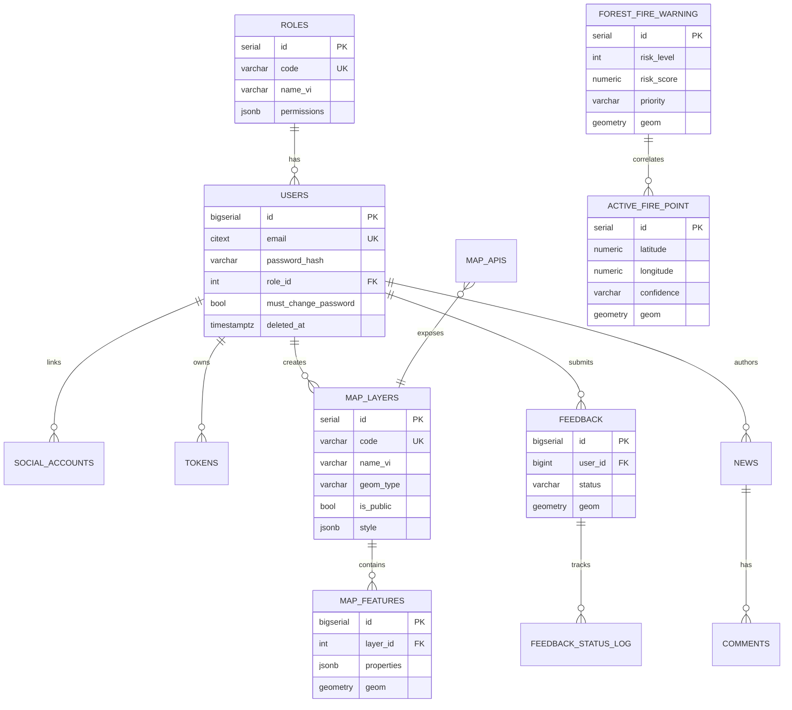
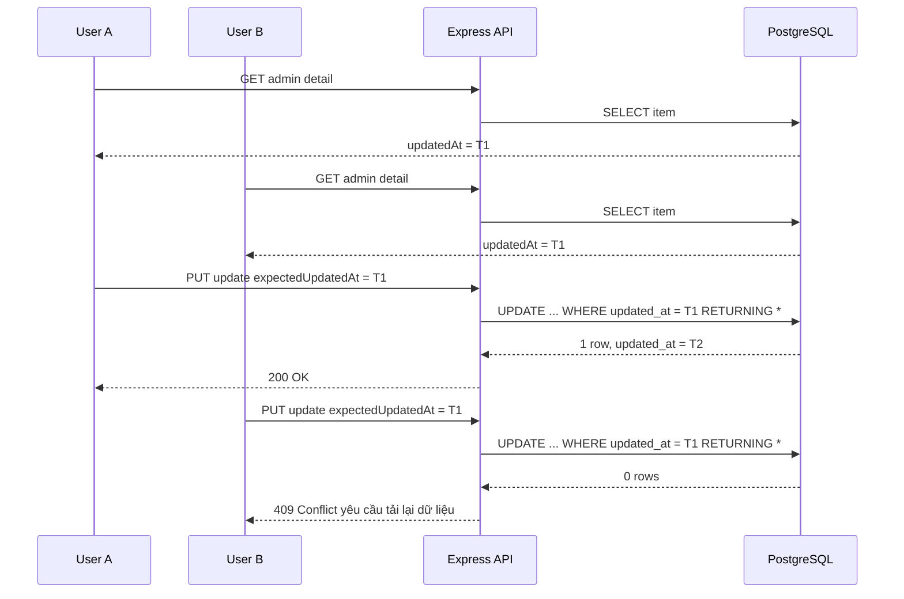

# 05 — Database Design (Thiết kế CSDL PostgreSQL/PostGIS)

> Bám theo migrations hiện có (001–010) và mở rộng cho các module GIS. Tất cả bảng không gian dùng SRID **4326 (WGS84)**.

## 1. Tổ chức schema

| Schema | Mục đích | Trạng thái |
|--------|----------|-----------|
| `auth` | Người dùng, vai trò, token, social, email verify | ✅ đã có |
| `gis` | Lớp dữ liệu bản đồ, map API, cache thời tiết, ảnh vệ tinh | ⬜ thiết kế mới |
| `fire` | Nguy cơ cháy, điểm cháy FIRMS | ⬜ thiết kế mới |
| `cms` | Tin tức, văn bản, bản đồ PDF, bình luận | ✅ đã có phần CMS |
| `field` | Phản ánh hiện trường, cập nhật MobileGIS | ✅ đã có `feedback` |

Extension: `CREATE EXTENSION IF NOT EXISTS postgis;` dùng cho các bảng không gian SRID 4326.

## 2. ERD tổng thể



## 3. Schema `auth` (tóm tắt — đã hiện thực)

- `auth.roles` — 4 vai trò seed: `system_admin`, `ubnd_tinh`, `so_nnmt`, `citizen`; quyền chi tiết trong `permissions JSONB`.
- `auth.users` — email (index lower/citext), password_hash, role_id, `must_change_password`, `deleted_at` (soft delete).
- `auth.social_accounts` — liên kết Google (provider, provider_user_id).
- `auth.tokens` — refresh/verify token (hashed), expires_at; cron dọn.
- `auth.password_reset` + `auth.oauth_codes` — reset & OAuth code ngắn hạn.
- `auth.email_verification` — token xác thực email.

### 3.1 RBAC permissions JSONB

`auth.roles.permissions` dùng format:

```jsonc
{
  "resource": {
    "action": true
  }
}
```

Middleware chính: `requirePermission(resource, action)` đọc từ `req.user.role_permissions`.
`system_admin` được bypass trong middleware nhưng vẫn seed đủ quyền để đồng bộ UI/quản trị.

| Resource | Bảng liên quan | Actions |
|---|---|---|
| `users` | `auth.users` | `read`, `create`, `update`, `delete`, `read_own`, `update_own`, `reset_password`, `change_role`, `change_status` |
| `roles` | `auth.roles` | `read`, `update`, `manage` |
| `notifications` | `core.notifications` | `read`, `read_own`, `create`, `update`, `delete`, `delete_own`, `send` |
| `notification_reads` | `core.notification_reads` | `read_own`, `create`, `update_own` |
| `device_tokens` | `core.device_tokens` | `read`, `read_own`, `create_own`, `delete`, `delete_own` |
| `news` | `cms.news` | `read`, `create`, `update`, `delete`, `publish` |
| `news_translations` | `cms.news_translations` | `read`, `create`, `update`, `delete` |
| `comments` | `cms.comments` | `read`, `create`, `delete`, `delete_own`, `approve` |
| `documents` | `cms.documents` | `read`, `create`, `update`, `delete`, `publish` |
| `document_translations` | `cms.document_translations` | `read`, `create`, `update`, `delete` |
| `feedback` | `field.feedback`, `field.feedback_status_log` | `read`, `create`, `update`, `delete`, `read_own`, `create_own`, `update_status`, `map` |

Role seed hiện tại:

- `system_admin`: toàn quyền các resource trên, gồm phản ánh hiện trường.
- `so_nnmt`: quản trị user giới hạn, quản lý CMS, duyệt/xóa comment, gửi notification, đọc/xử lý feedback và xem bản đồ feedback.
- `ubnd_tinh`: quyền đọc/giám sát, đọc feedback và xem bản đồ feedback.
- `citizen`: đọc nội dung public, tạo/xóa bình luận của mình, tạo/xem feedback của mình, cập nhật profile/thiết bị/thông báo của mình.

## 4. Schema `gis` (Quản lý lớp GIS ở Admin — "Layer Registry" Pattern)

Với dự án có nhiều lớp dữ liệu GIS (ao hồ, đường bộ, ranh giới hành chính, rừng…), thay vì xây UI riêng cho từng bảng, hệ thống áp dụng **bảng registry trung tâm** để admin quản lý thống nhất.

### Kiến trúc tổng thể

```
gis.layer_registry          ← "danh bạ" toàn bộ lớp — admin quản lý ở đây
gis.ao_ho                   ← bảng vật lý, spatial data thực sự
gis.duong_bo                ← bảng vật lý
gis.rung                    ← bảng vật lý
gis.layer_import_jobs       ← hàng đợi import shapefile/GeoJSON
gis.layer_edit_history      ← audit trail chỉnh sửa feature
```

### 4-B.1 `gis.layer_registry` — bảng đăng ký lớp trung tâm

```sql
CREATE TABLE IF NOT EXISTS gis.layer_registry (
    id              SERIAL PRIMARY KEY,
    code            VARCHAR(60) UNIQUE NOT NULL,       -- 'ao_ho', 'duong_bo', 'ranh_gioi'
    name_vi         VARCHAR(200) NOT NULL,
    name_en         VARCHAR(200),
    description_vi  TEXT,

    -- Kỹ thuật — trỏ tới bảng vật lý
    schema_name     VARCHAR(60) NOT NULL DEFAULT 'gis',
    table_name      VARCHAR(120) NOT NULL,
    geometry_type   VARCHAR(30) NOT NULL
                    CHECK (geometry_type IN (
                        'POINT','MULTIPOINT',
                        'LINESTRING','MULTILINESTRING',
                        'POLYGON','MULTIPOLYGON',
                        'GEOMETRY'
                    )),
    epsg_code       INT NOT NULL DEFAULT 4326,

    -- Hiển thị bản đồ
    default_style   JSONB NOT NULL DEFAULT '{}',        -- màu, stroke, fill, icon
    min_zoom        INT NOT NULL DEFAULT 1,
    max_zoom        INT NOT NULL DEFAULT 22,
    label_field     VARCHAR(60),                        -- field dùng làm nhãn

    -- Quản lý
    category        VARCHAR(60),                        -- 'thuy_van','giao_thong','hanh_chinh'
    sort_order      INT NOT NULL DEFAULT 0,
    is_active       BOOLEAN NOT NULL DEFAULT true,
    is_public       BOOLEAN NOT NULL DEFAULT false,     -- hiển thị cho citizen?
    is_editable     BOOLEAN NOT NULL DEFAULT true,

    -- Phân quyền per-layer (override global RBAC)
    layer_permissions JSONB NOT NULL DEFAULT '{}',
    -- VD: { "so_nnmt":  { "read":true,"create":true,"update":true,"delete":true },
    --       "ubnd_tinh": { "read":true },
    --       "citizen":   { "read_public":true } }

    -- Thống kê cache
    feature_count   BIGINT DEFAULT 0,
    last_updated_at TIMESTAMPTZ,
    bbox            GEOMETRY(POLYGON, 4326),             -- extent tổng thể lớp

    created_by      BIGINT REFERENCES auth.users(id) ON DELETE SET NULL,
    created_at      TIMESTAMPTZ NOT NULL DEFAULT NOW(),
    updated_at      TIMESTAMPTZ NOT NULL DEFAULT NOW()
);
```

### 4-B.2 `gis.layer_import_jobs` — lịch sử & trạng thái import

```sql
CREATE TABLE IF NOT EXISTS gis.layer_import_jobs (
    id              BIGSERIAL PRIMARY KEY,
    layer_id        INT NOT NULL REFERENCES gis.layer_registry(id) ON DELETE CASCADE,

    source_format   VARCHAR(30) NOT NULL
                    CHECK (source_format IN ('shapefile','geojson','csv','kml','wfs','postgis_dump')),
    source_info     JSONB NOT NULL DEFAULT '{}',        -- tên file, URL, options

    import_mode     VARCHAR(20) NOT NULL DEFAULT 'append'
                    CHECK (import_mode IN ('append','overwrite','upsert')),
    srid_input      INT DEFAULT 4326,
    encoding        VARCHAR(20) DEFAULT 'UTF-8',

    -- Strategy khi import gặp lỗi bản ghi lẻ
    strategy        VARCHAR(20) NOT NULL DEFAULT 'best_effort'
                    CHECK (strategy IN ('best_effort', 'all_or_nothing')),

    status          VARCHAR(20) NOT NULL DEFAULT 'pending'
                    CHECK (status IN ('pending','processing','completed','failed','cancelled')),
    progress        NUMERIC(5,2) DEFAULT 0,
    total_features  INT,
    imported_count  INT,
    failed_count    INT,
    error_log       TEXT,                               -- lưu lỗi chi tiết (nếu best_effort)
    result_summary  JSONB DEFAULT '{}',

    created_by      BIGINT REFERENCES auth.users(id) ON DELETE SET NULL,
    started_at      TIMESTAMPTZ,
    completed_at    TIMESTAMPTZ,
    created_at      TIMESTAMPTZ NOT NULL DEFAULT NOW()
);
```

### 4-B.3 `gis.layer_edit_history` — audit trail chỉnh sửa feature

> **Chiến lược tối ưu dung lượng (2 tầng)**:
> 1. **Import/Thao tác bulk**: Chỉ ghi **1 dòng summary** vào đây, link qua `import_job_id` hoặc gom qua `operation_id` (UUID), `feature_id` để `NULL`. Không log từng feature đơn lẻ tránh phình DB.
> 2. **Sửa tay đơn lẻ qua UI**: Log 1 dòng kèm snapshot `old_data`/`new_data`.
> 3. **Loại bỏ Geometry khỏi snapshot**: Chỉ snapshot các thuộc tính phi không gian (`attributes`), thuộc tính geometry (`geom`) chỉ lưu lại dạng `geometry_changed: true` và bounding box (`old_bbox`/`new_bbox`) để tránh phình dung lượng.

```sql
CREATE TABLE IF NOT EXISTS gis.layer_edit_history (
    id              BIGSERIAL PRIMARY KEY,
    layer_id        INT NOT NULL REFERENCES gis.layer_registry(id) ON DELETE CASCADE,
    
    -- Gom nhóm các thay đổi trong cùng 1 transaction/batch API
    operation_id    UUID NOT NULL DEFAULT gen_random_uuid(),

    -- Nguồn thay đổi
    source          VARCHAR(20) NOT NULL DEFAULT 'manual'
                    CHECK (source IN (
                        'manual',   -- admin sửa tay từng feature qua UI
                        'import',   -- import bulk (QGIS / shapefile / GeoJSON)
                        'api',      -- API bên ngoài push dữ liệu
                        'system'    -- hệ thống tự cập nhật (cron/job)
                    )),

    -- Link về import job (chỉ khi source = 'import')
    import_job_id   BIGINT REFERENCES gis.layer_import_jobs(id) ON DELETE SET NULL,

    -- Feature cụ thể (NULL khi thao tác bulk / import)
    feature_id      BIGINT,

    -- Loại thao tác
    action          VARCHAR(20) NOT NULL
                    CHECK (action IN (
                        'insert',        -- thêm 1 feature thủ công
                        'update',        -- sửa 1 feature thủ công
                        'delete',        -- xóa 1 feature thủ công
                        'bulk_insert',   -- import thêm mới (append)
                        'bulk_update',   -- cập nhật hàng loạt qua tool/API
                        'bulk_delete',   -- xóa hàng loạt feature
                        'overwrite'      -- import chế độ ghi đè (xóa cũ + thêm mới)
                    )),

    -- Snapshot thuộc tính (chỉ dùng cho manual/single update, loại bỏ cột hình học geom)
    old_data        JSONB,   -- { "attributes": { "name": "QL14" }, "geometry_changed": false }
    new_data        JSONB,   -- { "attributes": { "name": "QL14B" }, "geometry_changed": true, "new_bbox": [...] }

    -- Tóm tắt khi thao tác bulk
    summary         JSONB NOT NULL DEFAULT '{}',
    -- VD: { "total": 1523, "inserted": 1520, "failed": 3, "source_file": "duong_bo_2024.geojson" }

    changed_by      BIGINT REFERENCES auth.users(id) ON DELETE SET NULL,
    changed_at      TIMESTAMPTZ NOT NULL DEFAULT NOW()
);

-- Index theo layer + thời gian (query lịch sử theo lớp)
CREATE INDEX IF NOT EXISTS idx_leh_layer_changed
    ON gis.layer_edit_history (layer_id, changed_at DESC);

-- Index theo feature (xem lịch sử 1 feature cụ thể)
CREATE INDEX IF NOT EXISTS idx_leh_feature
    ON gis.layer_edit_history (layer_id, feature_id)
    WHERE feature_id IS NOT NULL;

-- Index theo import_job (trace từ job → edit history)
CREATE INDEX IF NOT EXISTS idx_leh_import_job
    ON gis.layer_edit_history (import_job_id)
    WHERE import_job_id IS NOT NULL;

-- Index theo operation_id
CREATE INDEX IF NOT EXISTS idx_leh_operation
    ON gis.layer_edit_history (operation_id);
```

#### Ví dụ — Import lớp đường bộ từ QGIS (10.000 features)

```
1 dòng trong layer_import_jobs  →  chi tiết job: file, mode, count, errors
1 dòng trong layer_edit_history →  action='overwrite', source='import',
                                    import_job_id=42, feature_id=NULL,
                                    summary={ total:10000, inserted:9997, failed:3, ... }
```

#### Ví dụ — Admin sửa tay tên 1 đoạn đường

```
1 dòng trong layer_edit_history →  action='update', source='manual',
                                    feature_id=8821,
                                    old_data={ "attributes": { "name": "QL14 cũ" }, "geometry_changed": false },
                                    new_data={ "attributes": { "name": "QL14B" }, "geometry_changed": false }
```

### 4-B.4 Bảng vật lý — import từ QGIS + bổ sung cột quản lý

> **Nguyên tắc:** Các bảng dữ liệu GIS (ao hồ, đường bộ, rừng…) được **import trực tiếp từ QGIS** vào schema `gis`. Migration **KHÔNG** tạo các bảng này. Hệ thống chỉ bổ sung thêm các cột quản lý vào bảng đã có.

#### Quy trình thêm lớp mới:

```
1. Người dùng import bảng từ QGIS vào schema gis (vd: gis."AoHo")
2. Admin gọi API đăng ký bảng mới vào layer_registry
3. Hệ thống tự phát hiện cấu trúc cột qua information_schema
4. Migration bổ sung cột quản lý (nếu chưa có)
```

#### Bổ sung cột quản lý cho bảng QGIS đã có

Sau khi import từ QGIS, chạy ALTER TABLE để thêm các cột tích hợp:

```sql
-- Ví dụ: Bảng "AoHo" đã import từ QGIS
-- (tên bảng giữ nguyên từ QGIS, có thể viết hoa/camelCase → cần dùng dấu ngoặc kép)

ALTER TABLE gis."AoHo" ADD COLUMN IF NOT EXISTS source_job_id BIGINT
    REFERENCES gis.layer_import_jobs(id) ON DELETE SET NULL;

ALTER TABLE gis."AoHo" ADD COLUMN IF NOT EXISTS external_id VARCHAR(120);

ALTER TABLE gis."AoHo" ADD COLUMN IF NOT EXISTS version INT NOT NULL DEFAULT 1;

ALTER TABLE gis."AoHo" ADD COLUMN IF NOT EXISTS is_active BOOLEAN NOT NULL DEFAULT true;

ALTER TABLE gis."AoHo" ADD COLUMN IF NOT EXISTS created_by BIGINT
    REFERENCES auth.users(id) ON DELETE SET NULL;

ALTER TABLE gis."AoHo" ADD COLUMN IF NOT EXISTS created_at TIMESTAMPTZ DEFAULT NOW();

ALTER TABLE gis."AoHo" ADD COLUMN IF NOT EXISTS updated_at TIMESTAMPTZ DEFAULT NOW();

-- Index cho truy vấn nhanh
CREATE INDEX IF NOT EXISTS idx_aoho_external
    ON gis."AoHo" (external_id) WHERE external_id IS NOT NULL;
```

> **Ý nghĩa các cột bổ sung:**
> - `source_job_id`: Liên kết đến Import Job gần nhất cập nhật bản ghi này.
> - `external_id`: Khóa ID gốc từ QGIS / Shapefile / API ngoài (phục vụ upsert khi import lại).
> - `version`: Optimistic Locking — tránh xung đột khi nhiều admin sửa cùng lúc.
> - `is_active`: Bật/tắt hiển thị feature đơn lẻ (phân biệt với `layer_registry.is_active` là bật/tắt cả lớp).

#### Auto-detect cấu trúc bảng QGIS (dùng trong API đăng ký layer)

```sql
-- Lấy danh sách cột + kiểu dữ liệu của bảng QGIS
SELECT column_name, data_type, udt_name
FROM information_schema.columns
WHERE table_schema = 'gis' AND table_name = 'AoHo'
ORDER BY ordinal_position;

-- Lấy kiểu geometry + SRID
SELECT f_geometry_column, type, srid
FROM geometry_columns
WHERE f_table_schema = 'gis' AND f_table_name = 'AoHo';

-- Đếm features + bounding box
SELECT COUNT(*) AS feature_count,
       ST_AsGeoJSON(ST_Extent(geom))::jsonb AS bbox
FROM gis."AoHo";
```

### 4-B.5 Chính sách dọn dẹp và lưu trữ lịch sử (Retention Policy)

Để đảm bảo hiệu năng Postgres khi vận hành lâu năm:
1. **Lịch sử sửa tay (`layer_edit_history` với `source = 'manual'`)**: Lưu trữ vĩnh viễn phục vụ kiểm toán.
2. **Chi tiết lỗi và log của Job (`layer_import_jobs.error_log`)**: Tự động clear hoặc archive sau **180 ngày**.
3. **Các file GIS gốc tải lên**: Sau khi import thành công, file file Shapefile/GeoJSON gốc trên server phải bị xóa (chỉ giữ file archive trên S3/MinIO nếu cấu hình lưu trữ ngoài, không lưu byte dữ liệu file trong Postgres).


### 4-B.5 Seed layer_registry

```sql
INSERT INTO gis.layer_registry
    (code, name_vi, table_name, geometry_type, category, sort_order,
     is_public, default_style, layer_permissions)
VALUES
    ('ranh_gioi_tinh','Ranh giới tỉnh','ranh_gioi_tinh','MULTIPOLYGON','hanh_chinh',1,true,
     '{"fillColor":"#f0f0f0","fillOpacity":0.1,"strokeColor":"#333","strokeWidth":2}',
     '{"so_nnmt":{"read":true},"ubnd_tinh":{"read":true},"citizen":{"read_public":true}}'
    ),
    ('ao_ho','Ao, Hồ','ao_ho','MULTIPOLYGON','thuy_van',4,true,
     '{"fillColor":"#4fc3f7","fillOpacity":0.6,"strokeColor":"#0277bd","strokeWidth":1}',
     '{"so_nnmt":{"read":true,"create":true,"update":true,"delete":true},"ubnd_tinh":{"read":true},"citizen":{"read_public":true}}'
    ),
    ('duong_bo','Đường bộ','duong_bo','MULTILINESTRING','giao_thong',5,true,
     '{"strokeColor":"#f57c00","strokeWidth":2}',
     '{"so_nnmt":{"read":true,"update":true},"ubnd_tinh":{"read":true},"citizen":{"read_public":true}}'
    ),
    ('rung','Lớp rừng','rung','MULTIPOLYGON','thuc_vat',3,true,
     '{"fillColor":"#228B22","fillOpacity":0.5,"strokeColor":"#145a14","strokeWidth":1}',
     '{"so_nnmt":{"read":true,"create":true,"update":true,"delete":true},"ubnd_tinh":{"read":true}}'
    ),
    ('tram_quan_trac','Trạm quan trắc','tram_quan_trac','POINT','giam_sat',6,true,
     '{"iconUrl":"/icons/station.svg","iconSize":[24,24]}',
     '{"so_nnmt":{"read":true,"create":true,"update":true,"delete":true},"ubnd_tinh":{"read":true},"citizen":{"read_public":true}}'
    )
ON CONFLICT (code) DO NOTHING;
```

### 4-B.6 Phân quyền per-layer (Middleware)

Middleware kiểm tra quyền kết hợp global RBAC (`auth.roles.permissions`) và `layer_registry.layer_permissions`:

```
Kiểm tra quyền truy cập lớp GIS
├── system_admin → bypass, qua luôn
├── Lấy layer_permissions từ gis.layer_registry WHERE code = :layerCode
├── Tìm quyền của role hiện tại trong JSONB
└── Nếu không có action → 403 Forbidden
```

> **Bảo mật truy vấn động**: `schema_name` và `table_name` **phải** được lấy từ DB (`layer_registry`), không bao giờ nhận trực tiếp từ request để tránh SQL injection.

### 4-B.7 API Endpoints admin GIS

```
GET    /api/admin/gis/layers                     — Danh sách layer registry
GET    /api/admin/gis/layers/:id                 — Chi tiết 1 layer
PATCH  /api/admin/gis/layers/:id                 — Cập nhật metadata/style/trạng thái
GET    /api/admin/gis/layers/:id/features        — Danh sách features
POST   /api/admin/gis/layers/:id/features        — Thêm feature mới
PATCH  /api/admin/gis/layers/:id/features/:fid   — Sửa feature
DELETE /api/admin/gis/layers/:id/features/:fid   — Xóa feature
POST   /api/admin/gis/layers/:id/import          — Upload shapefile/GeoJSON
GET    /api/admin/gis/layers/:id/import/jobs     — Xem tiến trình import
GET    /api/admin/gis/layers/:id/export          — Export GeoJSON
GET    /api/admin/gis/layers/:id/history         — Lịch sử chỉnh sửa
PATCH  /api/admin/gis/layers/:id/permissions     — Cập nhật per-layer permissions
```

## 5. Schema `fire` (theo tài liệu nghiệp vụ)

### 5.1 `fire.forest_fire_warning`
```sql
CREATE TABLE IF NOT EXISTS fire.forest_fire_warning (
    id           SERIAL PRIMARY KEY,
    risk_level   INTEGER NOT NULL,               -- 1..5
    risk_score   NUMERIC(4,3),                   -- 0..1
    priority     VARCHAR(10) DEFAULT 'normal',   -- normal | high
    lst          NUMERIC,                         -- nhiệt độ bề mặt
    ndmi         NUMERIC,
    wind_kmh     NUMERIC,
    rainfall_7d  NUMERIC,
    source       VARCHAR(50) DEFAULT 'gee',
    province     VARCHAR(100) DEFAULT 'Kon Tum',
    district     VARCHAR(100),
    commune      VARCHAR(100),
    forest_type  VARCHAR(100),
    warning_time TIMESTAMPTZ NOT NULL DEFAULT NOW(),
    geom         GEOMETRY(Polygon, 4326) NOT NULL
);
CREATE INDEX IF NOT EXISTS idx_ffw_geom ON fire.forest_fire_warning USING GIST (geom);
CREATE INDEX IF NOT EXISTS idx_ffw_time ON fire.forest_fire_warning (warning_time DESC);
CREATE INDEX IF NOT EXISTS idx_ffw_level ON fire.forest_fire_warning (risk_level);
```

### 5.2 `fire.active_fire_point`
```sql
CREATE TABLE IF NOT EXISTS fire.active_fire_point (
    id          SERIAL PRIMARY KEY,
    latitude    NUMERIC NOT NULL,
    longitude   NUMERIC NOT NULL,
    brightness  NUMERIC,
    confidence  VARCHAR(50),
    satellite   VARCHAR(50),                      -- VIIRS/MODIS
    acq_date    DATE,
    acq_time    VARCHAR(10),
    geom        GEOMETRY(Point, 4326) NOT NULL,
    ingested_at TIMESTAMPTZ NOT NULL DEFAULT NOW(),
    UNIQUE (latitude, longitude, acq_date, acq_time, satellite)  -- chống trùng
);
CREATE INDEX IF NOT EXISTS idx_afp_geom ON fire.active_fire_point USING GIST (geom);
CREATE INDEX IF NOT EXISTS idx_afp_date ON fire.active_fire_point (acq_date DESC);
```

## 6. Schema `cms`
```sql
CREATE TABLE IF NOT EXISTS cms.news (
    id SERIAL PRIMARY KEY,
    title VARCHAR(255) NOT NULL,
    slug  VARCHAR(280) UNIQUE NOT NULL,
    content TEXT,
    cover_url TEXT,
    status VARCHAR(20) DEFAULT 'draft',          -- draft | published
    author_id BIGINT REFERENCES auth.users(id),
    published_at TIMESTAMPTZ,
    search_tsv tsvector,                          -- full-text search
    created_at TIMESTAMPTZ NOT NULL DEFAULT NOW()
);
CREATE INDEX IF NOT EXISTS idx_news_search ON cms.news USING GIN (search_tsv);

CREATE TABLE IF NOT EXISTS cms.comments (
    id BIGSERIAL PRIMARY KEY,
    news_id INT REFERENCES cms.news(id) ON DELETE CASCADE,
    user_id BIGINT REFERENCES auth.users(id),
    content TEXT NOT NULL,
    is_approved BOOLEAN DEFAULT false,
    created_at TIMESTAMPTZ NOT NULL DEFAULT NOW()
);

CREATE TABLE IF NOT EXISTS cms.documents (
    id SERIAL PRIMARY KEY,
    title VARCHAR(255) NOT NULL,
    doc_type VARCHAR(50),                         -- bao_cao | van_ban | pdf_map
    file_url TEXT NOT NULL,
    is_public BOOLEAN DEFAULT false,
    uploaded_by BIGINT REFERENCES auth.users(id),
    created_at TIMESTAMPTZ NOT NULL DEFAULT NOW()
);
```

### 6.1 Chống ghi đè khi nhiều người cùng cập nhật News/Document

Module CMS áp dụng **Optimistic Locking** cho 2 nhóm dữ liệu có quyền ghi:

- `cms.news` — bản tin.
- `cms.documents` — tài liệu/văn bản/bản đồ PDF.

Mục tiêu là tránh trường hợp:

> User A và User B cùng mở một bản tin/tài liệu. User A lưu trước, sau đó User B lưu sau bằng dữ liệu cũ và vô tình ghi đè thay đổi của User A.

#### Nguyên tắc version

Không tạo thêm cột `version`; hệ thống dùng chính cột `updated_at` làm version hiện tại của bản ghi.

- Khi frontend mở màn hình sửa, API admin detail trả về `updatedAt`.
- Frontend phải giữ giá trị này và gửi lại khi cập nhật bằng field `expectedUpdatedAt`.
- Backend chỉ update nếu `updated_at` trong DB vẫn bằng `expectedUpdatedAt` client gửi lên.
- Khi update thành công, PostgreSQL set lại `updated_at = NOW()`.

Ví dụ request update:

```json
{
  "status": "published",
  "expectedUpdatedAt": "2026-06-19T10:00:00.000Z",
  "translations": {
    "vi": {
      "title": "Tiêu đề mới",
      "summary": "Tóm tắt mới",
      "content": "Nội dung mới"
    }
  }
}
```

#### Điều kiện UPDATE bắt buộc

Repository update metadata phải có điều kiện version:

```sql
UPDATE cms.news
SET status = $1,
    updated_at = NOW()
WHERE id = $2
  AND deleted_at IS NULL
  AND updated_at = $3::timestamptz
RETURNING *;
```

Tương tự với `cms.documents`:

```sql
UPDATE cms.documents
SET doc_type = $1,
    updated_at = NOW()
WHERE id = $2
  AND deleted_at IS NULL
  AND updated_at = $3::timestamptz
RETURNING *;
```

Nếu câu `UPDATE ... RETURNING *` không trả về dòng nào, nghĩa là một trong các trường hợp sau đã xảy ra:

- Bản ghi không còn tồn tại hoặc đã bị soft delete.
- `updated_at` trong DB đã khác `expectedUpdatedAt` client gửi lên.
- Có user/process khác đã cập nhật bản ghi trước đó.

Với luồng update đã kiểm tra tồn tại trước đó, trường hợp không trả row được xử lý là **conflict dữ liệu**.

#### Luồng xử lý khi 2 người cùng update



#### Quy tắc response khi conflict

Khi phát hiện dữ liệu stale, backend trả `Api409Error`:

```http
HTTP/1.1 409 Conflict
Content-Type: application/json
```

Ví dụ message:

```json
{
  "message": "Bản tin đã được cập nhật bởi người dùng khác. Vui lòng tải lại dữ liệu mới nhất."
}
```

Hoặc với tài liệu:

```json
{
  "message": "Tài liệu đã được cập nhật bởi người dùng khác. Vui lòng tải lại dữ liệu mới nhất."
}
```

Frontend khi nhận `409 Conflict` phải:

1. Không tiếp tục ghi đè dữ liệu cũ.
2. Hiển thị cảnh báo cho user.
3. Yêu cầu user tải lại dữ liệu mới nhất.
4. Sau khi reload, dùng `updatedAt` mới làm `expectedUpdatedAt` cho lần lưu tiếp theo.

#### Transaction cho update gộp metadata + translations

Các API update toàn bộ News/Document có thể cập nhật đồng thời:

- Metadata ở bảng cha: `cms.news` hoặc `cms.documents`.
- Bản dịch ở bảng con: `cms.news_translations` hoặc `cms.document_translations`.

Vì vậy backend phải chạy trong transaction:

```text
BEGIN
  UPDATE metadata với expectedUpdatedAt
  Nếu UPDATE metadata trả 0 rows -> ROLLBACK + 409 Conflict
  UPSERT translations
COMMIT
```

Điều này đảm bảo nếu metadata bị conflict thì translations không bị ghi nửa chừng bằng dữ liệu cũ.

#### Endpoint/API contract liên quan

Các API update CMS News/Document phải yêu cầu `expectedUpdatedAt`:

| Module | API update | Field bắt buộc | Conflict |
|---|---|---|---|
| News | Update metadata | `expectedUpdatedAt` | `409 Conflict` |
| News | Update full metadata + translations | `expectedUpdatedAt` | `409 Conflict` |
| Document | Update metadata | `expectedUpdatedAt` | `409 Conflict` |
| Document | Update full metadata + translations | `expectedUpdatedAt` | `409 Conflict` |

> Lưu ý: `expectedUpdatedAt` phải là ISO timestamp hợp lệ và tương ứng với `updatedAt` mà frontend nhận từ API detail trước đó.

## 7. Schema `field` (phản ánh & MobileGIS)

### 7.1 `field.feedback` — phản ánh hiện trường đã hiện thực
```sql
CREATE TABLE IF NOT EXISTS field.feedback (
    id BIGSERIAL PRIMARY KEY,
    user_id BIGINT REFERENCES auth.users(id) ON DELETE SET NULL,
    anonymous_id VARCHAR(100),                    -- bắt buộc nếu không có JWT user
    client_uuid VARCHAR(80),                      -- chống gửi trùng từ mobile/offline
    category VARCHAR(30) NOT NULL,                -- chay_rung | vi_pham | hien_trang
    title VARCHAR(255) NOT NULL,
    description TEXT,
    status VARCHAR(30) NOT NULL DEFAULT 'new',    -- new | in_progress | resolved | rejected
    priority VARCHAR(20) NOT NULL DEFAULT 'normal', -- low | normal | high | urgent
    media_urls JSONB NOT NULL DEFAULT '[]',       -- ảnh/video/document đã upload
    lng DOUBLE PRECISION NOT NULL,
    lat DOUBLE PRECISION NOT NULL,
    geom GEOMETRY(Point, 4326),                   -- trigger set từ lng/lat
    created_by BIGINT REFERENCES auth.users(id) ON DELETE SET NULL,
    updated_by BIGINT REFERENCES auth.users(id) ON DELETE SET NULL,
    resolved_at TIMESTAMPTZ,
    deleted_at TIMESTAMPTZ,
    created_at TIMESTAMPTZ NOT NULL DEFAULT NOW(),
    updated_at TIMESTAMPTZ NOT NULL DEFAULT NOW()
);
CREATE INDEX IF NOT EXISTS idx_feedback_geom ON field.feedback USING GIST (geom);
CREATE INDEX IF NOT EXISTS idx_feedback_status ON field.feedback (status) WHERE deleted_at IS NULL;
CREATE INDEX IF NOT EXISTS idx_feedback_category ON field.feedback (category) WHERE deleted_at IS NULL;
CREATE UNIQUE INDEX IF NOT EXISTS uniq_feedback_user_client_uuid
    ON field.feedback (user_id, client_uuid)
    WHERE user_id IS NOT NULL AND client_uuid IS NOT NULL AND deleted_at IS NULL;
CREATE UNIQUE INDEX IF NOT EXISTS uniq_feedback_anon_client_uuid
    ON field.feedback (anonymous_id, client_uuid)
    WHERE anonymous_id IS NOT NULL AND client_uuid IS NOT NULL AND deleted_at IS NULL;
```

### 7.2 `field.feedback_status_log` — lịch sử xử lý trạng thái
```sql
CREATE TABLE IF NOT EXISTS field.feedback_status_log (
    id BIGSERIAL PRIMARY KEY,
    feedback_id BIGINT NOT NULL REFERENCES field.feedback(id) ON DELETE CASCADE,
    from_status VARCHAR(30),
    to_status VARCHAR(30) NOT NULL,
    note TEXT,
    changed_by BIGINT REFERENCES auth.users(id) ON DELETE SET NULL,
    changed_at TIMESTAMPTZ NOT NULL DEFAULT NOW()
);
```

Luồng trạng thái mặc định: `new -> in_progress|rejected`, `in_progress -> resolved|rejected`. `system_admin` có thể override luồng khi cần vận hành.

## 8. Quy ước & chuẩn
- Migration **idempotent** (`IF NOT EXISTS`), đặt tên `0xx_mo_ta.sql` nối tiếp 010.
- Mọi cột thời gian dùng `TIMESTAMPTZ`; trigger `update_updated_at_column` tái sử dụng từ schema auth.
- Mọi cột geom có **GIST index**; SRID 4326 đồng nhất.
- Soft delete bằng `deleted_at` cho dữ liệu nghiệp vụ quan trọng.
- Tên cột song ngữ `_vi`/`_en` cho dữ liệu hiển thị.

## 9. Chiến lược chỉ mục & hiệu năng
- GIST cho geom; GIN cho `properties`/`tsvector`.
- Bảng cảnh báo lớn: partition theo tháng (`warning_time`) nếu tăng nhanh.
- Truy vấn bản đồ luôn kèm `ST_Intersects(geom, ST_MakeEnvelope(bbox,4326))` + LIMIT theo zoom.
- Cân nhắc materialized view cho thống kê diện tích theo huyện.
