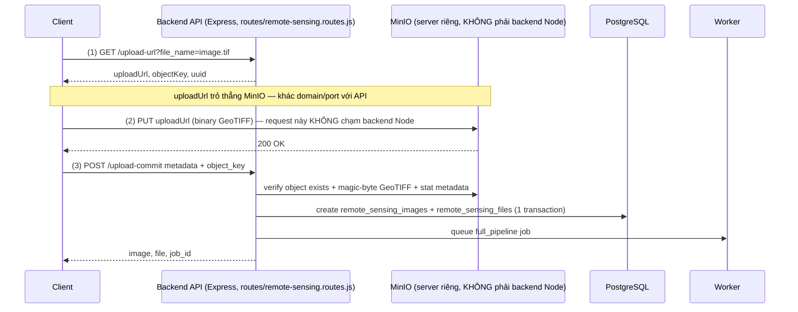
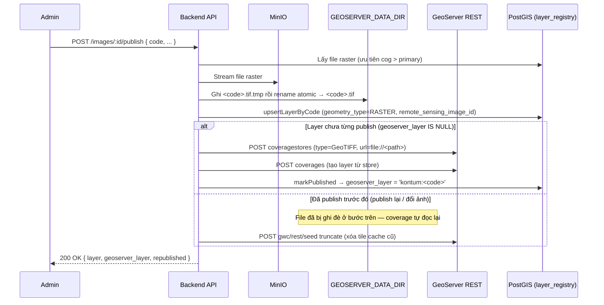

# Flow upload ảnh GeoTIFF lớn

Base path: `/api/v1/remote-sensing`

## Khi nào dùng flow này

- File GeoTIFF lớn hơn giới hạn multipart trực tiếp (`UPLOAD_RASTER_MULTIPART_MAX_MB`, mặc định **100MB**).
- `POST /remote-sensing/images` dùng multer memory storage (nạp nguyên file vào RAM) nên bị giới hạn ở mức đó; file lớn hơn sẽ bị từ chối (`FILE_TOO_LARGE`) và phải dùng flow này.
- Client upload trực tiếp lên MinIO bằng presigned PUT URL, server chỉ commit metadata sau khi object đã tồn tại.

> **Lưu ý quan trọng:** Backend Node (`routes/remote-sensing.routes.js`) chỉ định nghĩa 2 route cho flow này — `GET /upload-url` và `POST /upload-commit`. **Không có route PUT nào trên backend.** Request `PUT` ở bước 2 đi thẳng tới **MinIO** (`data.uploadUrl` do MinIO tự ký qua `client.presignedPutObject(...)` trong [minio.service.js](../../src/services/minio.service.js)), không đi qua Express app — vì vậy sẽ không tìm thấy route PUT nào trong code backend, đó là chủ đích của thiết kế (tránh Node phải nhận nguyên file GeoTIFF lớn qua RAM).

## Quy trình chuẩn



Tóm tắt 3 request, 2 method khác nhau, 2 server khác nhau:

| # | Method | Gửi tới | Route xử lý |
|---|--------|---------|-------------|
| 1 | `GET` | Backend Node | `GET /upload-url` |
| 2 | `PUT` | **MinIO** (không phải backend) | không có route trên backend — MinIO tự nhận |
| 3 | `POST` | Backend Node | `POST /upload-commit` |

## 1. Lấy presigned upload URL

`GET /api/v1/remote-sensing/upload-url?file_name=sentinel2-large.tif&lang=vi`

Auth: Bearer token  
Permission: `remote_sensing.create`

Response:

```json
{
  "success": true,
  "message": "Tạo URL upload thành công.",
  "data": {
    "uploadUrl": "http://minio.example.com/remote-sensing-images/raster/...?...",
    "objectKey": "raster/uuid/sentinel2-large.tif",
    "uuid": "8b6e...",
    "expiresIn": 3600,
    "instructions": "Dùng HTTP PUT với URL này để upload file trực tiếp lên MinIO. Đính kèm header: Content-Type: image/tiff"
  }
}
```

Lưu lại `data.uploadUrl` và `data.objectKey`.

## 2. PUT file trực tiếp lên MinIO (không phải route của backend Node)

`uploadUrl` trỏ thẳng tới **MinIO**, ví dụ `http://minio-host:9000/remote-sensing-images/raster/...?X-Amz-Signature=...` — khác domain/port với API `/api/v1/...`. Đây là presigned URL MinIO tự sinh chữ ký, không có Express route nào xử lý request này ở phía backend.

```bash
curl -X PUT "<uploadUrl>" \
  -H "Content-Type: image/tiff" \
  --upload-file ./sentinel2-large.tif
```

Lưu ý:

- Không gửi Bearer token vào MinIO URL (token JWT của app không có ý nghĩa với MinIO — MinIO tự xác thực bằng chữ ký trong query string của `uploadUrl`).
- Header `Content-Type` nên là `image/tiff` (không bắt buộc — server không tin header này mà tự đọc magic-byte của object khi commit).
- Nếu URL hết hạn, gọi lại bước 1.
- Nếu PUT chưa xong mà commit, API trả lỗi object chưa tồn tại.
- `object_key` phải giữ nguyên đúng key được cấp ở bước 1 (dạng `raster/YYYY/MM/<uuid>/<tên file>`) — server từ chối key không khớp định dạng này hoặc `bucket` tự khai.

## 3. Commit metadata sau khi PUT thành công

`POST /api/v1/remote-sensing/upload-commit?lang=vi`

Auth: Bearer token  
Permission: `remote_sensing.create`  
Content-Type: `application/json`

Body:

```json
{
  "object_key": "raster/uuid/sentinel2-large.tif",
  "original_name": "sentinel2-large.tif",
  "mime_type": "image/tiff",
  "name": "Sentinel-2 Kon Tum 2024",
  "satellite": "sentinel_2",
  "image_type": "geotiff_raw",
  "acquisition_date": "2024-06-01",
  "bbox": [107.0, 14.0, 108.0, 15.0],
  "province_code": "62",
  "cloud_percent": 12.5,
  "resolution_m": 10,
  "epsg_code": 4326,
  "band_count": 4,
  "is_public": true,
  "description": "Ảnh GeoTIFF upload qua presigned PUT",
  "extra_metadata": {
    "source": "manual_upload"
  }
}
```

Response `201 Created`:

```json
{
  "success": true,
  "message": "Hoàn tất upload thành công.",
  "data": {
    "image": { "id": 123, "status": "pending" },
    "file": { "id": 456, "file_role": "primary" },
    "job_id": 789
  }
}
```

Sau commit, worker xử lý job `full_pipeline` để tạo COG/thumbnail/statistics.

## Field bắt buộc khi commit

| Field | Type | Ghi chú |
|---|---|---|
| `object_key` | string | Lấy từ bước 1 |
| `name` | string | Tên hiển thị |
| `satellite` | enum | Ví dụ `sentinel_2`, `landsat_8` |
| `image_type` | enum | Với file gốc dùng `geotiff_raw` |
| `acquisition_date` | ISO date | Không được lớn hơn ngày hiện tại |

## Lỗi thường gặp

| HTTP | Lỗi | Cách xử lý |
|---|---|---|
| 400 | `FILE_NAME_REQUIRED` | Gửi đúng query `file_name` khi lấy URL |
| 400 | `OBJECT_NOT_FOUND` | PUT file lên MinIO xong rồi mới commit |
| 400 | `INVALID_OBJECT_KEY` | `object_key` không đúng key được cấp ở bước 1 |
| 400 | `NOT_GEOTIFF` | Nội dung object không phải TIFF hợp lệ (sai magic-byte) — PUT lại đúng file GeoTIFF |
| 400 | Validate metadata | Kiểm tra `satellite`, `image_type`, `acquisition_date`, `bbox` |
| 401/403 | Thiếu quyền | Token cần permission `remote_sensing.create` |

## Flow cũ

`POST /remote-sensing/images` multipart vẫn dùng được cho file nhỏ (≤ `UPLOAD_RASTER_MULTIPART_MAX_MB`, mặc định 100MB).
Với file lớn hơn, bắt buộc dùng flow mới: `upload-url` → `PUT MinIO` → `upload-commit`.

## Publish lên GeoServer

`POST /api/v1/remote-sensing/images/:id/publish`

Auth: Bearer token
Permission: `map_layers.publish` (dùng chung quyền publish của map_layers, khác với `remote_sensing.create` ở bước upload)
Content-Type: `application/json`

### Điều kiện trước khi publish

- Ảnh đã có ít nhất 1 file raster gắn với `remote_sensing_images` (`file_role = 'cog'` hoặc `'primary'`) — tức bước upload ở trên đã commit thành công.
- Biến môi trường `GEOSERVER_DATA_DIR` phải trỏ tới thư mục mà **chính process GeoServer** đọc được (thường là volume Docker mount chung giữa Node và GeoServer container).
- `GEOSERVER_URL`, `GEOSERVER_USER`, `GEOSERVER_PASSWORD` đã cấu hình đúng ([configs/geoserver.js](../../src/configs/geoserver.js)); workspace `GEOSERVER_WORKSPACE` (mặc định `kontum`) đã tồn tại trên GeoServer.

### Body (mọi field đều tùy chọn — mặc định lấy từ record ảnh)

```json
{
  "code": "sentinel2_kontum_2024",
  "name_vi": "Sentinel-2 Kon Tum 2024",
  "description_vi": "Ảnh viễn thám phủ rừng Kon Tum",
  "category": "remote_sensing",
  "layer_group": "vien_tham",
  "data_year": 2024,
  "is_public": true
}
```

| Field | Type | Ghi chú |
|---|---|---|
| `code` | string | Regex `^[a-z][a-z0-9_]{1,59}$`. Vừa là tên CoverageStore trên GeoServer vừa là tên file trên đĩa (`<code>.tif`). Không truyền → mặc định `rs_img_<id>`. |
| `name_vi` | string | Mặc định `image.name` |
| `description_vi` | string | Mặc định `image.description` |
| `category` | string | Mặc định `remote_sensing` |
| `data_year` | number | Mặc định lấy năm từ `acquisition_date` |
| `is_public` | boolean | Mặc định `image.is_public` |

### Quy trình xử lý (backend)



Chi tiết từng bước ([remote-sensing.service.js](../../src/services/remote-sensing.service.js) — `publishImageToGeoServer`):

1. **Lấy file nguồn**: ưu tiên file đã convert `cog` (nếu worker `full_pipeline` đã chạy xong), fallback `primary` (file gốc mới commit). Không có file nào → lỗi `remote_sensing_publish_no_raster`.
2. **Ghi ra đĩa cho GeoServer đọc**: GeoServer `GeoTIFF` coverage store cần đường dẫn file cục bộ (`file://...`), không đọc trực tiếp từ MinIO. Server stream object từ MinIO ra file tạm `.tmp` rồi `rename` atomic sang `<code>.tif` — tránh GeoServer đọc phải file dở dang nếu stream lỗi giữa chừng; file `.tmp` được dọn nếu ghi thất bại.
3. **Upsert `gis.layer_registry`**: tên file cố định theo `code` nên publish lại (re-publish) chỉ ghi đè file, GeoServer store/URL không đổi. `remote_sensing_image_id` liên kết ngược layer map với ảnh viễn thám (migration `022_remote_sensing_geoserver_publish.sql`).
4. **Publish lần đầu** (`geoserver_layer` chưa có): gọi GeoServer REST tạo CoverageStore rồi Coverage (`publishRasterLayer` trong [geoserver.client.js](../../src/utils/geoserver.client.js)) → layer thành `<workspace>:<code>`. Nếu tạo trên GeoServer xong mà ghi DB (`markPublished`) lỗi, hệ thống tự gỡ layer vừa tạo trên GeoServer (compensating action) để hai bên không lệch trạng thái — lần publish lại sau sẽ tạo sạch từ đầu.
5. **Publish lại** (`geoserver_layer` đã có sẵn): không tạo lại CoverageStore/Coverage — chỉ gọi `truncateGwcLayer` xóa tile cache GeoWebCache cũ để client thấy ảnh mới ngay (bỏ qua nếu layer chưa có cache).

### Response `200 OK`

```json
{
  "success": true,
  "message": "Publish thành công.",
  "data": {
    "layer": { "id": 45, "code": "sentinel2_kontum_2024", "geoserver_layer": "kontum:sentinel2_kontum_2024" },
    "geoserver_layer": "kontum:sentinel2_kontum_2024",
    "republished": false
  }
}
```

`republished: true` nghĩa là layer đã tồn tại từ trước, lần gọi này chỉ ghi đè file + xóa cache.

### Dùng layer sau khi publish

Frontend build URL WMS trực tiếp tới GeoServer (Node không proxy tile), xem chi tiết ở [12-geoserver-integration-design.md](../modules/12-geoserver-integration-design.md):

```
GET {GEOSERVER_PUBLIC_URL}/{workspace}/wms?service=WMS&version=1.3.0&request=GetMap
    &layers=kontum:sentinel2_kontum_2024&bbox={bbox-epsg-3857}&width=256&height=256
    &crs=EPSG:3857&format=image/png&transparent=true
```

### Lỗi thường gặp

| HTTP | Lỗi | Cách xử lý |
|---|---|---|
| 400 | `RASTER_DIR_MISSING` | Thiếu env `GEOSERVER_DATA_DIR` trên server — báo admin cấu hình |
| 404 | `remote_sensing_not_found` | Sai `id`/`uuid` ảnh |
| 400 | Ảnh chưa có file raster để publish | Ảnh chưa commit xong upload, hoặc file `cog`/`primary` bị xóa |
| 400 | Validate `code` | Chỉ chữ thường/số/`_`, bắt đầu bằng chữ, tối đa 60 ký tự |
| 401/403 | Thiếu quyền | Token cần permission `map_layers.publish` |
| 502/504 | Lỗi/timeout GeoServer REST | Kiểm tra GeoServer sống, `GEOSERVER_URL` đúng, workspace tồn tại (`GeoServerError`, timeout mặc định `GEOSERVER_TIMEOUT_MS=15000`) |
