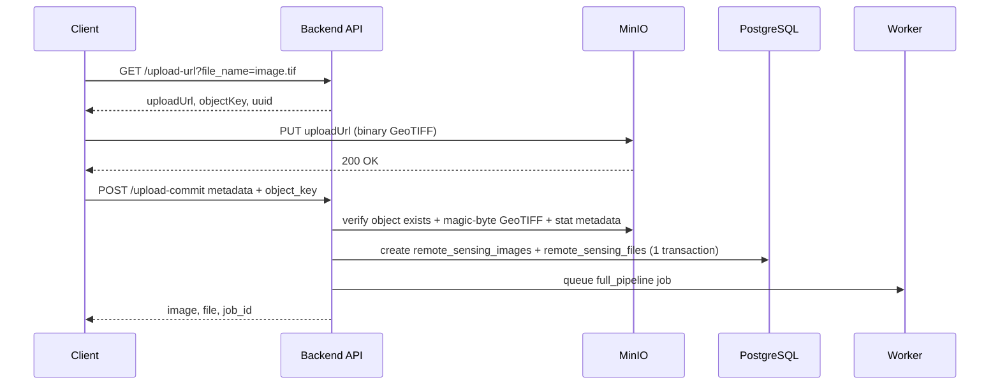

# Flow upload ảnh GeoTIFF lớn

Base path: `/api/v1/remote-sensing`

## Khi nào dùng flow này

- File GeoTIFF lớn hơn giới hạn multipart trực tiếp (`UPLOAD_RASTER_MULTIPART_MAX_MB`, mặc định **300MB**).
- `POST /remote-sensing/images` dùng multer memory storage (nạp nguyên file vào RAM) nên bị giới hạn ở mức đó; file lớn hơn sẽ bị từ chối (`FILE_TOO_LARGE`) và phải dùng flow này.
- Client upload trực tiếp lên MinIO bằng presigned PUT URL, server chỉ commit metadata sau khi object đã tồn tại.

## Quy trình chuẩn



## 1. Lấy presigned upload URL

`GET /api/v1/remote-sensing/upload-url?file_name=sentinel2-large.tif&lang=vi`

Auth: Bearer token  
Permission: `remote_sensing.create`

Response:

```json
{
  "success": true,
  "message": "Tạo URL upload thành công.",
  "data": {
    "uploadUrl": "http://minio.example.com/remote-sensing-images/raster/...?...",
    "objectKey": "raster/uuid/sentinel2-large.tif",
    "uuid": "8b6e...",
    "expiresIn": 3600,
    "instructions": "Dùng HTTP PUT với URL này để upload file trực tiếp lên MinIO. Đính kèm header: Content-Type: image/tiff"
  }
}
```

Lưu lại `data.uploadUrl` và `data.objectKey`.

## 2. PUT file trực tiếp lên MinIO

```bash
curl -X PUT "<uploadUrl>" \
  -H "Content-Type: image/tiff" \
  --upload-file ./sentinel2-large.tif
```

Lưu ý:

- Không gửi Bearer token vào MinIO URL.
- Header `Content-Type` nên là `image/tiff` (không bắt buộc — server không tin header này mà tự đọc magic-byte của object khi commit).
- Nếu URL hết hạn, gọi lại bước 1.
- Nếu PUT chưa xong mà commit, API trả lỗi object chưa tồn tại.
- `object_key` phải giữ nguyên đúng key được cấp ở bước 1 (dạng `raster/YYYY/MM/<uuid>/<tên file>`) — server từ chối key không khớp định dạng này hoặc `bucket` tự khai.

## 3. Commit metadata sau khi PUT thành công

`POST /api/v1/remote-sensing/upload-commit?lang=vi`

Auth: Bearer token  
Permission: `remote_sensing.create`  
Content-Type: `application/json`

Body:

```json
{
  "object_key": "raster/uuid/sentinel2-large.tif",
  "original_name": "sentinel2-large.tif",
  "mime_type": "image/tiff",
  "name": "Sentinel-2 Kon Tum 2024",
  "satellite": "sentinel_2",
  "image_type": "geotiff_raw",
  "acquisition_date": "2024-06-01",
  "bbox": [107.0, 14.0, 108.0, 15.0],
  "province_code": "62",
  "cloud_percent": 12.5,
  "resolution_m": 10,
  "epsg_code": 4326,
  "band_count": 4,
  "is_public": true,
  "description": "Ảnh GeoTIFF upload qua presigned PUT",
  "extra_metadata": {
    "source": "manual_upload"
  }
}
```

Response `201 Created`:

```json
{
  "success": true,
  "message": "Hoàn tất upload thành công.",
  "data": {
    "image": { "id": 123, "status": "pending" },
    "file": { "id": 456, "file_role": "primary" },
    "job_id": 789
  }
}
```

Sau commit, worker xử lý job `full_pipeline` để tạo COG/thumbnail/statistics.

## Field bắt buộc khi commit

| Field | Type | Ghi chú |
|---|---|---|
| `object_key` | string | Lấy từ bước 1 |
| `name` | string | Tên hiển thị |
| `satellite` | enum | Ví dụ `sentinel_2`, `landsat_8` |
| `image_type` | enum | Với file gốc dùng `geotiff_raw` |
| `acquisition_date` | ISO date | Không được lớn hơn ngày hiện tại |

## Lỗi thường gặp

| HTTP | Lỗi | Cách xử lý |
|---|---|---|
| 400 | `FILE_NAME_REQUIRED` | Gửi đúng query `file_name` khi lấy URL |
| 400 | `OBJECT_NOT_FOUND` | PUT file lên MinIO xong rồi mới commit |
| 400 | `INVALID_OBJECT_KEY` | `object_key` không đúng key được cấp ở bước 1 |
| 400 | `NOT_GEOTIFF` | Nội dung object không phải TIFF hợp lệ (sai magic-byte) — PUT lại đúng file GeoTIFF |
| 400 | Validate metadata | Kiểm tra `satellite`, `image_type`, `acquisition_date`, `bbox` |
| 401/403 | Thiếu quyền | Token cần permission `remote_sensing.create` |

## Flow cũ

`POST /remote-sensing/images` multipart vẫn dùng được cho file nhỏ (≤ `UPLOAD_RASTER_MULTIPART_MAX_MB`, mặc định 300MB).
Với file lớn hơn, bắt buộc dùng flow mới: `upload-url` → `PUT MinIO` → `upload-commit`.

## Publish lên GeoServer

Sau khi ảnh xử lý xong và cần đưa lên bản đồ:

1. Gọi `POST /api/v1/remote-sensing/images/:id/publish`.
2. Backend tạo GeoServer coverage/layer.
3. `gis.layer_registry.remote_sensing_image_id` liên kết layer map với ảnh viễn thám.
