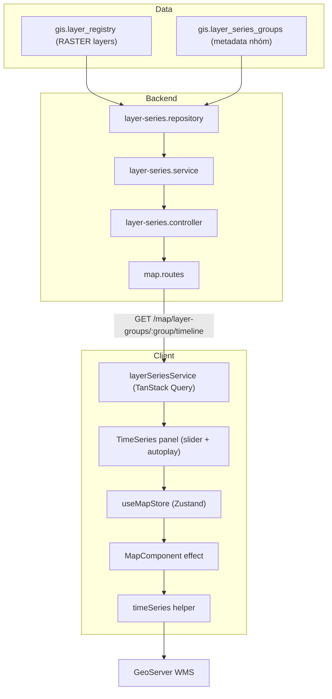
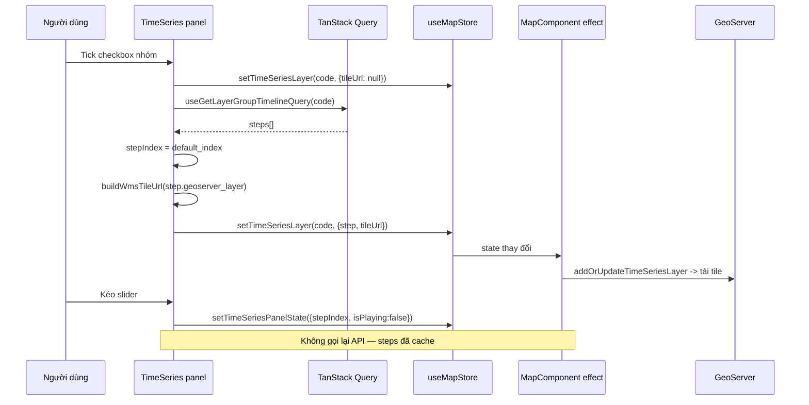
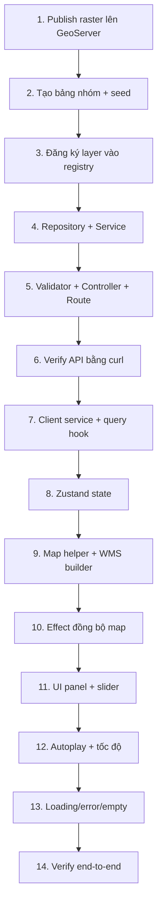

# Time-series raster: hướng dẫn port từ Server sang Client

> Runbook để mang tính năng **ảnh raster theo thời gian** (Lớp phủ, Nhiệt độ bề mặt, Biến động lớp phủ, Diễn biến nhiệt độ) sang một dự án WebGIS tương tự.
>
> Tài liệu bám theo **code đang chạy**, không theo thiết kế cũ. Snapshot API live: **29/08/2026**.

---

## 1. Phạm vi và kiến trúc runtime

Tính năng cho phép người dùng chọn một **nhóm chuỗi thời gian**, kéo slider theo năm và xem raster tương ứng đổi trên bản đồ, kèm autoplay.

Nguyên tắc cốt lõi của implementation hiện tại:

- Mỗi mốc thời gian là **một WMS layer rời** đã publish trên GeoServer.
- Backend **không** dùng ImageMosaic và **không** dùng WMS `TIME` dimension.
- Backend nhóm các layer rời lại thành timeline bằng cách đọc `layer_group` trong `gis.layer_registry`.
- Client đổi ảnh bằng cách **thay tile URL của raster source**, giữ nguyên camera.



> [!IMPORTANT]
> Client **không dùng** `step.tile_url` do server sinh. Client tự dựng WMS URL từ `step.geoserver_layer` + `VITE_GEOSERVER_URL`. Xem [§13](#13-known-gotchas).

---

## 2. Kiểm kê chuỗi thời gian đang hoạt động

Snapshot từ `GET /api/v1/map/layer-groups?lang=vi` ngày 29/08/2026.

| Mã nhóm | Tên hiển thị | Số bước | Khoảng năm |
|---|---|---:|---|
| `lop_phu` | Lớp phủ | 3 | 1991–2023 |
| `nhiet_do_be_mat` | Nhiệt độ bề mặt | 9 | 1991–2023 |
| `bien_dong_lop_phu` | Biến động lớp phủ | 1 | 2014–2023 |
| `dien_bien_nhiet_do` | Diễn biến nhiệt độ | 2 | 1991–2023 |

Tổng: **4 nhóm / 15 raster step**.

Chi tiết từng step (layer GeoServer thực tế):

````carousel
**`lop_phu` — 3 step, `default_index: 2`**

| Label | `layer_code` | `geoserver_layer` | `sort_order` |
|---|---|---|---:|
| 1991 | `lop_phu_1991` | `kontum:lop_phu_1991` | 0 |
| 2014 | `lop_phu_2014` | `kontum:lop_phu_2014` | 0 |
| 2023 | `lop_phu_2023` | `kontum:lop_phu_2023` | 0 |

`sort_order = 0` nghĩa là nhóm này **chưa reorder thủ công**; thứ tự đến từ fallback theo năm.
<!-- slide -->
**`nhiet_do_be_mat` — 9 step, `default_index: 8`**

| Label | `layer_code` | `sort_order` |
|---|---|---:|
| 1991 | `nhietdobemat_1991` | 10 |
| 2000 | `nhietdobemat_2000` | 20 |
| 2010 | `nhietdobemat_2010` | 30 |
| 2014 | `nhietdobemat_2014` | 40 |
| 2015 | `nhietdobemat_2015` | 50 |
| 2020 | `nhietdobemat_2020` | 60 |
| 2021 | `nhietdobemat_2021` | 70 |
| 2022 | `nhietdobemat_2022` | 80 |
| 2023 | `nhietdobemat_2023` | 90 |

Nhóm này **đã reorder**: `sort_order` bước 10, đúng quy ước của `reorderSourceLayers`.
<!-- slide -->
**Nhóm khoảng năm (label có dấu gạch nối)**

`bien_dong_lop_phu` — 1 step:

| Label | `layer_code` | `year_from` | `year_to` |
|---|---|---:|---:|
| 2014–2023 | `biendonglopphu_2014_2023` | 2014 | 2023 |

`dien_bien_nhiet_do` — 2 step:

| Label | `layer_code` | `year_from` | `year_to` |
|---|---|---:|---:|
| 1991–2014 | `dienbiennhietdo_1991_2014` | 1991 | 2014 |
| 2014–2023 | `dienbiennhietdo_2014_2023` | 2014 | 2023 |
````

> [!NOTE]
> `dien_bien_nhiet_do` là nhóm duy nhất gộp **2 `layer_group`** ở tầng service: `dien_bien_nhiet_do` và `bien_dong_nhiet_do`. Đây là alias xử lý dữ liệu lịch sử đặt tên khác nhau.

---

## 3. Hợp đồng dữ liệu ở tầng DB

Runtime đọc **hai bảng**.

### 3.1 `gis.layer_series_groups` — metadata nhóm

Chỉ dùng để định nghĩa nhóm và điều khiển hiển thị. **Không** chứa các mốc thời gian.

| Cột | Vai trò trong runtime |
|---|---|
| `code` | Khóa nghiệp vụ; phải khớp `layer_registry.layer_group` |
| `name_vi`, `name_en` | Nhãn hiển thị |
| `is_active`, `is_public` | Điều khiển visibility với người dùng ẩn danh |
| `geoserver_store`, `geoserver_layer`, `geoserver_style` | Chỉ là metadata tham chiếu; **không dùng để render** |

### 3.2 `gis.layer_registry` — nguồn thật của các bước thời gian

Một dòng = một mốc thời gian. Điều kiện lọc trong repository:

```sql
WHERE geometry_type = 'RASTER'
  AND geoserver_layer IS NOT NULL
  AND deleted_at IS NULL
  AND layer_group = ANY($1::text[])
  AND is_active = true
  AND ($2::boolean = true OR is_public = true)
ORDER BY sort_order ASC, data_year ASC NULLS LAST, code ASC
```

Các cột quyết định hành vi timeline: `code`, `geoserver_layer`, `default_style`, `data_year`, `layer_group`, `sort_order`.

> [!WARNING]
> Migration `045_layer_series.sql` còn tạo bảng `gis.layer_series_granules` với `time_value`/`file_name` cho hướng ImageMosaic. **Runtime hiện tại không đọc bảng này.** Khi port sang dự án mới, có thể bỏ hẳn bảng granules.

### 3.3 Quy tắc suy ra năm

Service không tin tuyệt đối vào `data_year`; nó **parse năm từ tên**:

```js
const years = String(layer.code || layer.geoserver_layer || '').match(/(?:19|20)\d{2}/g)?.map(Number) || [];
```

- ≥ 2 năm trong tên → lấy **hai năm cuối** làm `year_from`/`year_to`, label dạng `2014–2023`.
- 1 năm → `year_from = year_to`, label dạng `2023`.
- Không có năm nào → fallback `data_year`; nếu vẫn rỗng, **step bị loại khỏi timeline**.

> [!CAUTION]
> Đây là ràng buộc đặt tên bắt buộc. Layer đặt tên không chứa năm và không có `data_year` sẽ **im lặng biến mất** khỏi timeline. Đặt tên theo mẫu `<chude>_<nam>` hoặc `<chude>_<namdau>_<namcuoi>`.

---

## 4. Backend pipeline

Bốn file, dependency theo chiều dưới lên.

| Lớp | File | Trách nhiệm |
|---|---|---|
| Route | [map.routes.js](file:///D:/Code/@kt_web_GIS/server/src/routes/map.routes.js) | Mount endpoint + middleware quyền |
| Controller | [layer-series.controller.js](file:///D:/Code/@kt_web_GIS/server/src/controllers/layer-series.controller.js) | Validate param, gọi service, chuẩn hóa response |
| Validator | [layer-series.validator.js](file:///D:/Code/@kt_web_GIS/server/src/validators/layer-series.validator.js) | Joi schema cho param và body |
| Service | [layer-series.service.js](file:///D:/Code/@kt_web_GIS/server/src/services/layer-series.service.js) | Nghiệp vụ: dựng step, parse năm, sort, visibility |
| Repository | [layer-series.repository.js](file:///D:/Code/@kt_web_GIS/server/src/repositories/layer-series.repository.js) | SQL thuần |

### 4.1 Định tuyến

```js
router.get('/layer-groups', optionalAuth, asyncHandler(layerSeriesController.listGroups));
router.get('/layer-groups/:group/timeline', optionalAuth, asyncHandler(layerSeriesController.getTimeline));
```

Router `map.routes` được mount tại `/map` trong `routes/index.js`, và toàn bộ router mount tại `/api/v1` trong `app.js`.

### 4.2 Visibility

```js
const ADMIN_ROLES = new Set(['system_admin', 'so_nnmt']);
```

| Người gọi | Thấy nhóm private/inactive | Thấy layer con private |
|---|---|---|
| Ẩn danh / `citizen` / `ubnd_tinh` | Không | Không |
| `system_admin`, `so_nnmt` | Có | Có |

Nhóm không thỏa điều kiện → **404**, không phải 403. Đây là hành vi cố ý để không lộ sự tồn tại của nhóm.

Mã lỗi đã xác minh trên API live:

| Request | Mã | Nguồn |
|---|---:|---|
| `/layer-groups/lop_phu/timeline` | 200 | Service |
| `/layer-groups/khong_ton_tai/timeline` | 404 | Service — không tìm thấy hoặc không đủ quyền xem |
| `/layer-groups/invalid-group!/timeline` | 400 | Validator — `code` không khớp `^[a-zA-Z_][a-zA-Z0-9_]*$` |

> [!NOTE]
> Validator chạy **trước** service, nên mã chứa ký tự ngoài `[a-zA-Z0-9_]` không bao giờ chạm tới DB. Nếu dự án mới cho phép dấu `-` trong mã nhóm, phải nới regex ở validator, nếu không mọi request sẽ dừng ở 400.


### 4.3 Quy tắc sắp xếp step

```js
steps.sort((a, b) =>
    (a.sort_order - b.sort_order)
    || (a.year_to - b.year_to)
    || (a.year_from - b.year_from)
    || a.layer_code.localeCompare(b.layer_code)
);
```

`sort_order` do admin kéo thả thắng trước; khi tất cả bằng `0` (chưa reorder) thì fallback theo năm.

`default_index` = **step cuối cùng** (mới nhất), hoặc `null` nếu timeline rỗng.

---

## 5. API contract

### 5.1 Danh sách nhóm

```http
GET /api/v1/map/layer-groups?lang=vi
```

```json
{
  "message": "Lấy danh sách nhóm lớp theo thời gian thành công",
  "status": 200,
  "data": {
    "items": [
      {
        "id": 1,
        "code": "lop_phu",
        "name_vi": "Lớp phủ",
        "name_en": "Land cover",
        "is_active": true,
        "is_public": true,
        "step_count": 3,
        "min_year": 1991,
        "max_year": 2023
      }
    ]
  },
  "metadata": { "count": 4 }
}
```

`step_count` / `min_year` / `max_year` là **giá trị tính toán**, không phải cột DB — dùng để render dòng phụ `"3 ảnh · 1991–2023"` mà không cần gọi timeline.

### 5.2 Timeline của một nhóm

```http
GET /api/v1/map/layer-groups/lop_phu/timeline?lang=vi
```

```json
{
  "status": 200,
  "data": {
    "group": {
      "code": "lop_phu",
      "name_vi": "Lớp phủ",
      "name_en": "Land cover",
      "geoserver_layer": "kontum:lop_phu",
      "default_style": null
    },
    "mode": "discrete",
    "snap": "nearest",
    "default_index": 2,
    "min_year": 1991,
    "max_year": 2023,
    "steps": [
      {
        "id": 16,
        "layer_code": "lop_phu_2023",
        "geoserver_layer": "kontum:lop_phu_2023",
        "year_from": 2023,
        "year_to": 2023,
        "label": "2023",
        "sort_order": 0,
        "tile_url": "http://localhost:8080/geoserver/kontum/wms?...&bbox={bbox-epsg-3857}"
      }
    ]
  }
}
```

Trường quan trọng với FE: **`geoserver_layer`**, `label`, `default_index`, `steps.length`.

`mode: "discrete"` và `snap: "nearest"` là hằng số cố định — slider là **index rời**, không nội suy.

### 5.3 Endpoint quản trị (tùy chọn)

Không cần cho public client. Port sau nếu cần màn hình admin.

| Method | Path | Quyền |
|---|---|---|
| `POST` | `/map/layer-groups` | `map_layers.create` |
| `PATCH` | `/map/layer-groups/:group` | `map_layers.update` |
| `PATCH` | `/map/layer-groups/:group/reorder` | `map_layers.update` |
| `DELETE` | `/map/layer-groups/:group` | `map_layers.delete` |

`reorder` nhận `{ "order": ["layer_code_1", "layer_code_2"] }` và ghi lại `sort_order` theo bước 10, trong transaction, chỉ với layer thuộc đúng `layer_group`.

---

## 6. GeoServer / WMS contract

Mỗi step phải là một layer WMS truy cập được công khai. URL tile client dựng ra:

```
{GEOSERVER}/{workspace}/wms
  ?service=WMS
  &version=1.3.0
  &request=GetMap
  &layers=kontum:lop_phu_2023
  &styles=
  &width=256&height=256
  &crs=EPSG:3857
  &format=image/png
  &transparent=true
  &tiled=true
  &bbox={bbox-epsg-3857}
```

`{bbox-epsg-3857}` là **placeholder của Mapbox GL**, không phải giá trị thật — Mapbox thay thế theo từng tile.

Yêu cầu bắt buộc:

- GeoServer bật **CORS** cho origin của client.
- Layer public (không yêu cầu Basic Auth), vì browser gọi trực tiếp.
- Hỗ trợ `EPSG:3857` và `image/png` nền trong suốt.

---

## 7. Client pipeline

| Lớp | File | Trách nhiệm |
|---|---|---|
| HTTP | [request.js](file:///D:/Code/@kt_web_GIS/client/src/services/apiClient/request.js) | `apiRequest`, `withQuery`, refresh token |
| Query | [useApi.js](file:///D:/Code/@kt_web_GIS/client/src/services/apiClient/useApi.js) | `useApiQuery` wrapper |
| Service | [layerSeriesService.js](file:///D:/Code/@kt_web_GIS/client/src/services/layerSeriesService.js) | 2 query hook + query key |
| State | [useMapStore.js](file:///D:/Code/@kt_web_GIS/client/src/stores/Map/useMapStore.js) | `timeSeriesLayersData`, `timeSeriesPanelState` |
| UI | [TimeSeries/index.jsx](file:///D:/Code/@kt_web_GIS/client/src/components/Map/Sidebar/elements/TimeSeries/index.jsx) | Danh sách nhóm, slider, autoplay |
| Map helper | [timeSeries.js](file:///D:/Code/@kt_web_GIS/client/src/helper/Map/geoserver/timeSeries.js) | Add/update/remove raster source + layer |
| WMS builder | [wms.js](file:///D:/Code/@kt_web_GIS/client/src/helper/Map/geoserver/wms.js) | `buildWmsTileUrl` |
| Map sync | [MapComponent.jsx](file:///D:/Code/@kt_web_GIS/client/src/components/Map/MapComponent.jsx) | Effect đồng bộ store → map |
| Đăng ký | [sidebarData.js](file:///D:/Code/@kt_web_GIS/client/src/constant/sidebarData.js) | Gắn panel vào sidebar |

### 7.1 Phân chia state — điểm thiết kế quan trọng

Store tách **hai** object, cố ý:

```js
// Dữ liệu để RENDER lên map
timeSeriesLayersData: {},   // { [groupCode]: { group, step, tileUrl, opacity } }

// Trạng thái ĐIỀU KHIỂN của panel — sống sót qua chuyển tab sidebar
timeSeriesPanelState: {},   // { [groupCode]: { stepIndex, isPlaying, intervalMs } }
```

Tách như vậy vì panel bị unmount khi người dùng chuyển tab sidebar, nhưng raster phải **tiếp tục hiển thị** và autoplay phải nhớ vị trí. `removeTimeSeriesLayer` xóa cả hai cùng lúc để không rò trạng thái.

### 7.2 Vòng đời một lượt tương tác



> [!TIP]
> Kéo slider **không** phát sinh request API. Toàn bộ `steps` đã nằm trong cache TanStack Query với `staleTime: 5 phút`; chỉ tile ảnh mới được tải.

### 7.3 Placeholder khi bật nhóm

Khi tick checkbox, panel ghi ngay một entry rỗng:

```js
setTimeSeriesLayer(group.code, { group, step: null, tileUrl: null });
```

Mục đích: checkbox phản hồi **tức thì**, đồng thời `enabledGroups` có phần tử để render `TimelinePanel` — chính panel đó mới fetch timeline. Effect đồng bộ map bỏ qua entry `tileUrl: null` nên chưa vẽ gì.

### 7.4 Autoplay

```js
useEffect(() => {
  if (!isPlaying || steps.length < 2) return undefined;
  const id = window.setInterval(() => {
    const { timeSeriesPanelState } = useMapStore.getState();
    const prev = timeSeriesPanelState[group.code]?.stepIndex;
    const base = prev == null ? defaultIndex : prev;
    patchPanel({ stepIndex: (base + 1) % steps.length });
  }, intervalMs);
  return () => window.clearInterval(id);
}, [isPlaying, steps.length, intervalMs, defaultIndex, group.code, patchPanel]);
```

Hai chi tiết bắt buộc giữ lại khi port:

1. Đọc `stepIndex` qua `useMapStore.getState()` **bên trong** interval, không qua closure — nếu không, index sẽ đóng băng ở giá trị lúc tạo timer.
2. `clearInterval` trong cleanup — bắt buộc, nếu không sẽ chồng timer khi đổi tốc độ.

Preset tốc độ: `500 / 800 / 1400 / 2500 / 4000` ms, mặc định `1400`.

### 7.5 Thay raster trên Mapbox

```js
const existingSource = map.getSource(sourceId);
if (existingSource && existingSource.tiles?.[0] !== tileUrl) {
  if (map.getLayer(layerId)) map.removeLayer(layerId);
  map.removeSource(sourceId);
}
if (!map.getSource(sourceId)) {
  map.addSource(sourceId, { type: 'raster', tiles: [tileUrl], tileSize: 256 });
}
```

> [!CAUTION]
> **Không dùng `source.setTiles()`.** Nó không ổn định trên mọi phiên bản Mapbox/MapLibre và có trường hợp không ép fetch tile mới. Cách chắc chắn là remove + add lại. ID được khóa theo `groupCode` nên không tích lũy source rác.

ID sinh ra: `ts-src-{groupCode}` và `ts-src-{groupCode}-raster`.

### 7.6 Ba trường hợp đồng bộ map

`MapComponent` xử lý cả ba, thiếu bất kỳ cái nào cũng gây bug:

| Tình huống | Cơ chế |
|---|---|
| Store đổi | `useEffect` so `currentKeys` với `prevTimeSeriesKeysRef` |
| Đổi basemap style | `once("style.load")` → vẽ lại từ `timeSeriesLayersDataRef.current` |
| Split/compare map | Áp cùng thao tác lên `mapRef.current.split` |

> [!WARNING]
> Đổi map style sẽ **xóa sạch** mọi custom source/layer. Bắt buộc đăng ký lại trong `style.load`, và phải đọc từ `ref` chứ không từ closure state — nếu không sẽ khôi phục dữ liệu cũ.

---

## 8. Danh sách file cần mang sang

### Bắt buộc — backend

| File | Ghi chú khi port |
|---|---|
| `src/repositories/layer-series.repository.js` | Đổi tên schema/bảng nếu khác |
| `src/services/layer-series.service.js` | Sửa `ADMIN_ROLES`, alias nhóm |
| `src/controllers/layer-series.controller.js` | Khớp helper response của dự án |
| `src/validators/layer-series.validator.js` | Nới regex nếu `code` cho phép dấu `-` |
| Route trong `src/routes/map.routes.js` | Copy 2 dòng public; 4 dòng admin tùy chọn |

### Bắt buộc — client

| File | Ghi chú khi port |
|---|---|
| `src/services/layerSeriesService.js` | Khớp API client sẵn có |
| `src/helper/Map/geoserver/timeSeries.js` | Copy gần như nguyên xi |
| `src/helper/Map/geoserver/wms.js` + `common.js` | Cần cho `buildWmsTileUrl` |
| Phần time-series trong `useMapStore.js` | 4 action + 2 state |
| `src/components/Map/Sidebar/elements/TimeSeries/index.jsx` | Thay component UI theo design system |
| Effect time-series trong `MapComponent.jsx` | Gắn vào vòng đời map của dự án |

### Cần thích nghi

- Middleware `optionalAuth` và `requirePermission`.
- Hàm i18n `t()` và key thông báo.
- Lớp response `OK` / `CREATED`.
- Component `Slider`, `Checkbox`, `Select`, `Button`, `Tooltip`.

### Tùy chọn / có thể bỏ

- Toàn bộ CRUD admin và trang `admin/src/pages/LayerSeries`.
- Bảng `gis.layer_series_granules`.
- Hỗ trợ split/compare map.

---

## 9. Thứ tự tích hợp



Không nhảy sang bước 7 trước khi bước 6 trả đúng `steps[]` — gần như mọi lỗi tích hợp đều nằm ở tầng dữ liệu, không nằm ở UI.

---

## 10. Cấu hình môi trường

### Backend

| Biến | Vai trò |
|---|---|
| `GEOSERVER_PUBLIC_URL` | Base URL công khai để sinh `tile_url` |
| `GEOSERVER_URL` | Endpoint nội bộ (fallback) |
| `GEOSERVER_WORKSPACE` | Mặc định `kontum` |
| `GEOSERVER_DATASTORE` | Chỉ dùng khi tạo nhóm |

Service chuẩn hóa root bằng cách bỏ dấu `/` cuối và cắt hậu tố `/wms` hoặc `/wcs`:

```js
configured.trim().replace(/\/+$/, '').replace(/\/(?:wms|wcs)$/i, '');
```

### Client

| Biến | Vai trò |
|---|---|
| `VITE_BASE_URL_BE` | Base API, **đã gồm** `/api/v1` |
| `VITE_GEOSERVER_URL` | Base GeoServer cho `buildWmsTileUrl` |
| `VITE_GEOSERVER_WORKSPACE` | Fallback workspace khi tên layer không có `:` |

> [!CAUTION]
> Chỉ đặt giá trị công khai trong `VITE_*`. Không đưa `GEOSERVER_USER` / `GEOSERVER_PASSWORD` xuống browser.

---

## 11. Seed nhóm và đăng ký step

### Tạo nhóm

```sql
INSERT INTO gis.layer_series_groups
    (code, name_vi, name_en, geoserver_store, geoserver_layer, geoserver_style)
VALUES
    ('lop_phu', 'Lớp phủ', 'Land cover', 'lop_phu', 'kontum:lop_phu', NULL)
ON CONFLICT (code) DO NOTHING;
```

### Thêm một mốc thời gian mới

Publish GeoTIFF theo luồng layer hiện có, đảm bảo:

| Trường | Giá trị bắt buộc |
|---|---|
| `layer_group` | Đúng bằng `code` của nhóm |
| `geometry_type` | `'RASTER'` |
| `geoserver_layer` | Tên layer WMS đã publish |
| `data_year` | Năm dữ liệu (dự phòng khi tên không có năm) |
| `is_active` | `true` |
| `is_public` | `true` nếu công khai |
| `code` | Chứa năm, ví dụ `lop_phu_2024` hoặc `biendonglopphu_2023_2025` |

Timeline **tự nhận** layer mới ở request kế tiếp. Không có script backfill, không cần restart.

---

## 12. Kiểm thử

### API

```bash
curl "$BASE/map/layer-groups?lang=vi"
curl "$BASE/map/layer-groups/lop_phu/timeline?lang=vi"
```

Kiểm tra: `steps.length` khớp `step_count`; mọi step có `geoserver_layer` khác null; `default_index` nằm trong `[0, steps.length-1]`.

### WMS

Mở trực tiếp URL `GetMap` với `bbox` thật (thay placeholder) trong tab trình duyệt — phải trả ảnh PNG, không phải XML `ServiceException`.

### UI checklist

| Kiểm tra | Mong đợi |
|---|---|
| Tick nhóm | Panel hiện, raster vẽ ở năm mới nhất |
| Kéo slider | Ảnh đổi, camera **không** dịch chuyển |
| Kéo liên tục | Không có request API mới trong Network tab |
| Play | Chạy vòng qua các bước, quay lại đầu |
| Đổi tốc độ | Timer cũ bị hủy, không chồng nhau |
| Kéo slider khi đang play | Tự động dừng play |
| Chuyển tab sidebar rồi quay lại | `stepIndex` và trạng thái play được giữ |
| Ẩn lớp | Source + layer bị gỡ khỏi map |
| Đổi basemap | Raster được vẽ lại đúng bước hiện tại |
| Nhóm rỗng | Hiện thông báo, không crash |
| Nhóm 1 step | Nút Play bị disable |

---

## 13. Known gotchas

> [!CAUTION]
> **`tile_url` từ server có thể là URL nội bộ.** API live đang trả `http://localhost:8080/geoserver/...` do `GEOSERVER_PUBLIC_URL` ở môi trường sinh không khớp URL công khai. Client vì vậy **chủ động bỏ qua** `tile_url` và tự dựng URL từ `geoserver_layer`.
>
> Khi port, chọn **một** hướng và giữ nhất quán:
> - **Tin server:** sửa `GEOSERVER_PUBLIC_URL` cho đúng, client dùng thẳng `step.tile_url`. Đơn giản hơn, style do server kiểm soát.
> - **Tin client (hiện tại):** client dựng URL từ `VITE_GEOSERVER_URL`. Linh hoạt theo môi trường, nhưng `default_style` từ server bị bỏ qua.

Các bẫy khác:

| Vấn đề | Nguyên nhân | Xử lý |
|---|---|---|
| Layer biến mất khỏi timeline | Tên không có năm và `data_year` null | Đặt tên theo `<chude>_<nam>` |
| Thứ tự step sai | `sort_order` toàn `0` | Gọi endpoint reorder, hoặc dựa vào fallback theo năm |
| Ảnh không đổi khi kéo | Dùng `setTiles()` | Remove + add lại source |
| Raster mất sau khi đổi basemap | Thiếu handler `style.load` | Đăng ký lại từ `ref` |
| Autoplay đứng ở một bước | Đọc index từ closure | Đọc qua `getState()` trong interval |
| Nhiều timer chạy song song | Thiếu cleanup | `clearInterval` trong return của effect |
| Tile lỗi CORS | GeoServer chưa mở CORS | Cấu hình CORS cho origin client |
| Nhóm trả 404 với người dùng thường | `is_active`/`is_public` false | Bật cờ, hoặc chấp nhận là hành vi đúng |

---

## 14. Definition of Done

- [ ] Cả hai endpoint public trả 200 với dữ liệu đúng.
- [ ] `steps.length` khớp `step_count` cho mọi nhóm.
- [ ] Người dùng ẩn danh chỉ thấy nhóm active + public.
- [ ] Nhóm không tồn tại trả 404 kèm mã lỗi.
- [ ] Tile WMS tải được từ browser, không lỗi CORS.
- [ ] Kéo slider không phát sinh request API.
- [ ] Camera giữ nguyên khi đổi bước.
- [ ] Autoplay chạy vòng và dọn timer khi unmount.
- [ ] Source/layer được gỡ sạch khi ẩn lớp.
- [ ] Raster khôi phục sau khi đổi basemap.
- [ ] Có đủ trạng thái loading / error / empty.
- [ ] Không hardcode host, không hardcode màu UI ngoài palette dữ liệu.
- [ ] Không `console.log` trong production code.
- [ ] Lint và build của app liên quan chạy sạch.
