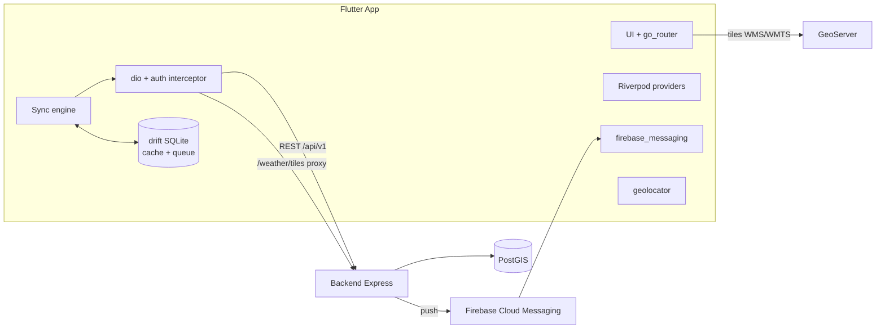

# 01 — Tổng quan & Kiến trúc App MobileGIS Kon Tum (Flutter)

## 1. Mục tiêu
Ứng dụng di động phục vụ quản lý, giám sát tài nguyên rừng tỉnh Kon Tum:
- **Người dân**: xem bản đồ công khai, định vị GPS, tìm đường, chụp ảnh gửi phản ánh hiện trạng, đọc tin tức/văn bản, nhận thông báo đẩy.
- **Kiểm lâm (Sở NN&MT)**: đo đạc GPS, cập nhật đối tượng hiện trường (field-update), chụp ảnh cập nhật hiện trạng rừng, tra cứu văn bản.
- **UBND tỉnh**: theo dõi dữ liệu hiện trường, xem báo cáo/thống kê, đọc tin tức.
- **Quản trị hệ thống**: theo dõi dữ liệu gửi lên (xử lý chính vẫn trên web admin; app chỉ cung cấp view giám sát).

## 2. Vai trò & ma trận chức năng (từ tài liệu nghiệp vụ)

| Nhóm chức năng | system_admin | ubnd_tinh | so_nnmt (kiểm lâm) | citizen (người dân) |
|---|---|---|---|---|
| Đăng nhập / Đăng ký | Đăng nhập | Đăng nhập | Đăng nhập | Đăng nhập, Đăng ký |
| MobileGIS – tương tác bản đồ | Quản trị ứng dụng | Theo dõi dữ liệu hiện trường | Sử dụng GPS, đo đạc, cập nhật đối tượng | Xem bản đồ, GPS, tìm đường |
| MobileGIS – giám sát hiện trạng | Theo dõi dữ liệu gửi lên | Xem báo cáo hiện trường | Chụp ảnh, cập nhật hiện trạng rừng | Chụp ảnh, gửi hiện trạng |
| MobileGIS – tin tức / văn bản | Quản trị nội dung (web) | Đọc | Đọc, tra cứu | Đọc, tra cứu |
| Cảnh báo cháy / thông báo đẩy | ✅ | ✅ | ✅ | ✅ |

Role lấy từ JWT (`GET /auth/me` → `role`). App render menu/tab theo role — **một codebase, gate theo quyền**, không build nhiều flavor theo role.

Chế độ **ẩn danh (guest)**: chưa đăng nhập vẫn xem được bản đồ công khai, tin tức, văn bản, gửi phản ánh với header `x-anonymous-id` (UUID sinh và lưu cục bộ).

## 3. Tech stack

| Hạng mục | Lựa chọn | Lý do |
|---|---|---|
| Framework | Flutter 3.x (Dart 3), Material 3 | 1 codebase Android + iOS |
| State management | Riverpod 2 (`riverpod_generator`) | testable, DI sẵn, ít boilerplate |
| Điều hướng | go_router | deep-link (mở bản đồ từ push), guard theo auth/role |
| HTTP | dio + interceptor | refresh token, retry, log, multipart upload |
| Bản đồ | `maplibre_gl` (chính) — raster/WMS từ GeoServer + vector tiles; fallback `flutter_map` nếu maplibre gặp lỗi thiết bị | server đã phát hành layer qua GeoServer WMS/WMTS |
| Định vị | geolocator + permission_handler | GPS, theo dõi vị trí, đo đạc |
| Camera/ảnh | image_picker + flutter_image_compress | nén ảnh trước upload (server giới hạn `UPLOAD_IMAGE_MAX_MB=5`) |
| Offline DB | drift (SQLite) | hàng đợi feedback/field-update, cache tin tức, type-safe |
| Secure storage | flutter_secure_storage | access/refresh token (Keychain/Keystore) |
| Push | firebase_messaging + flutter_local_notifications | FCM, deep-link vào bản đồ |
| Đăng nhập Google | google_sign_in → `POST /auth/google/mobile` (idToken) | server đã hỗ trợ |
| Charts | fl_chart | thống kê cho UBND |
| i18n | flutter_localizations + ARB (vi mặc định, sẵn khung en) | đồng bộ i18n server |
| Codegen | freezed + json_serializable | model từ API JSON |
| Test | flutter_test, mocktail, integration_test | xem 04-task-breakdown M-EP-10 |

## 4. Kiến trúc app (Clean Architecture rút gọn, feature-first)

```
lib/
├── main.dart                    # bootstrap: flavor, Firebase, ProviderScope
├── app/
│   ├── router/                  # go_router, guards, deep-link
│   ├── theme/                   # Material 3 theme, màu thương hiệu
│   └── l10n/                    # ARB vi/en
├── core/
│   ├── network/                 # dio client, interceptors (auth, retry, log)
│   ├── storage/                 # secure storage, shared prefs, drift database
│   ├── sync/                    # offline queue engine (dùng chung feedback + field-update)
│   ├── location/                # wrapper geolocator, stream vị trí
│   ├── permissions/             # role/permission helper (gate UI)
│   ├── error/                   # AppException, mapper lỗi API → message i18n
│   └── utils/                   # format ngày, toạ độ, diện tích...
├── features/
│   ├── auth/        (data/domain/presentation)
│   ├── map/                     # bản đồ, layer catalog, identify, đo đạc
│   ├── weather/                 # overlay thời tiết, điểm thời tiết
│   ├── feedback/                # phản ánh hiện trạng (citizen + kiểm lâm)
│   ├── field_update/            # cập nhật đối tượng (kiểm lâm)
│   ├── news/                    # tin tức + bình luận
│   ├── documents/               # văn bản, pdf-maps
│   ├── notifications/           # danh sách thông báo, FCM
│   ├── stats/                   # dashboard thống kê (UBND/admin)
│   ├── fire_alert/              # ⛔ chờ server EP-06
│   └── profile/                 # tài khoản, đổi mật khẩu, cài đặt
└── widgets/                     # shared widgets (empty state, shimmer, badge trạng thái...)
```

Nguyên tắc mỗi feature:
- `data/`: DTO (freezed) + repository gọi API/drift.
- `domain/`: entity + use-case mỏng (chỉ tách khi logic phức tạp, không over-engineer).
- `presentation/`: providers (Riverpod) + screens + widgets.

## 5. Sơ đồ tổng thể client–server



## 6. Môi trường & flavor

| Flavor | API base URL | Ghi chú |
|---|---|---|
| dev | `http://10.0.2.2:3000/api/v1` (emulator) / LAN IP | log verbose, banner DEV |
| staging | server staging | test push thật |
| prod | domain chính thức HTTPS | store release |

Cấu hình qua `--dart-define-from-file=env/{flavor}.json`: `API_BASE_URL`, `GEOSERVER_URL`, `SENTRY_DSN` (nếu dùng), `GOOGLE_CLIENT_ID`.

## 7. Quyết định thiết kế quan trọng
1. **Offline-first cho ghi dữ liệu**: mọi thao tác gửi (feedback, field-update) đi qua hàng đợi drift → sync engine đẩy lên khi có mạng; client sinh `client_uuid` để server dedupe (server đã hỗ trợ trong `POST /mobile/field-updates`).
2. **Bản đồ dùng dữ liệu động**: danh sách layer lấy từ `GET /map/layers` (kèm metadata GeoServer), không hard-code layer trong app.
3. **Token**: access token ngắn hạn trong memory + secure storage; refresh xoay vòng qua `POST /auth/refresh` trong dio interceptor (queue request khi đang refresh).
4. **`enforcePasswordChange`**: server có thể trả lỗi bắt đổi mật khẩu — app phải chặn điều hướng vào màn đổi mật khẩu (`POST /auth/change-password` / `set-password`).
5. **Ảnh**: nén còn ≤ 1920px cạnh dài, chất lượng ~80%, đảm bảo < 5MB; giữ EXIF GPS nếu người dùng cho phép.
6. **Tách feature cảnh báo cháy** thành module riêng `fire_alert/` để không block release 1 khi server EP-06 chưa xong.
