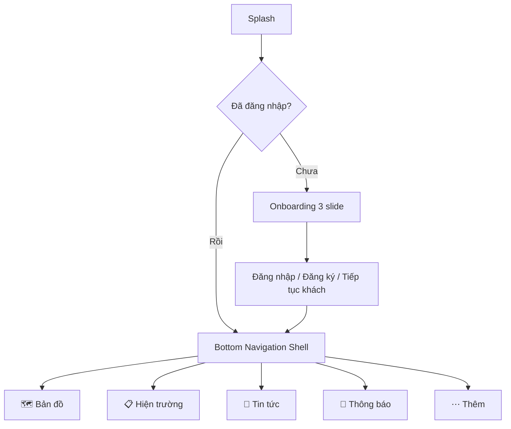

# 02 — Danh sách màn hình & Luồng điều hướng

## 1. Bản đồ điều hướng tổng thể

Tab hiển thị theo role:

| Tab | guest | citizen | so_nnmt | ubnd_tinh | system_admin |
|---|---|---|---|---|---|
| Bản đồ | ✅ | ✅ | ✅ (kèm công cụ đo đạc) | ✅ | ✅ |
| Hiện trường | gửi phản ánh (ẩn danh) | phản ánh của tôi | field-update + phản ánh | xem báo cáo hiện trường | theo dõi dữ liệu gửi lên |
| Tin tức | ✅ | ✅ | ✅ + tra cứu văn bản | ✅ | ✅ |
| Thông báo | ❌ (mời đăng nhập) | ✅ | ✅ | ✅ | ✅ |
| Thêm | đăng nhập | hồ sơ, cài đặt | hồ sơ, cài đặt | + Thống kê | + Thống kê |

## 2. Danh sách màn hình chi tiết

### Nhóm A — Khởi động & Auth
| ID | Màn hình | Mô tả | API |
|---|---|---|---|
| SCR-A01 | Splash | logo, kiểm tra token, điều hướng | `GET /auth/me` |
| SCR-A02 | Onboarding | 3 slide giới thiệu (bản đồ, phản ánh, cảnh báo), chỉ hiện lần đầu | — |
| SCR-A03 | Đăng nhập | email+mật khẩu, nút Google, "Tiếp tục với tư cách khách", link quên MK | `POST /auth/login`, `POST /auth/google/mobile` |
| SCR-A04 | Đăng ký | họ tên, email, mật khẩu (chỉ citizen) | `POST /auth/register` |
| SCR-A05 | Xác thực email | nhập mã/mở deep-link, nút gửi lại | `POST /auth/verify-email`, `/auth/resend-verification` |
| SCR-A06 | Quên mật khẩu | 2 bước: nhập email → nhập mã + MK mới | `POST /auth/forgot-password`, `/auth/reset-password` |
| SCR-A07 | Bắt buộc đổi mật khẩu | hiện khi server trả cờ `must_change_password` | `POST /auth/change-password`, `/auth/set-password` |

### Nhóm B — Bản đồ (tab chính)
| ID | Màn hình | Mô tả | API |
|---|---|---|---|
| SCR-B01 | Bản đồ chính | MapLibre full-screen; FAB: định vị GPS, chọn lớp, đo đạc (role), tìm đường; hiển thị lớp nền + overlay | `GET /map/layers`, GeoServer WMS/WMTS |
| SCR-B02 | Bottom sheet chọn lớp | nhóm lớp theo `group`, bật/tắt, chỉnh opacity, chú giải (legend từ GeoServer GetLegendGraphic) | `GET /map/layers`, `GET /map/layers/:code` |
| SCR-B03 | Bottom sheet thông tin đối tượng | tap bản đồ → GetFeatureInfo/`/map-data/features` → thuộc tính đối tượng; nút "Cập nhật đối tượng này" (so_nnmt) | WMS GetFeatureInfo |
| SCR-B04 | Tìm đường | nhập/chọn điểm đến trên bản đồ, vẽ tuyến (OSRM/OpenRouteService public), khoảng cách + thời gian | dịch vụ routing ngoài |
| SCR-B05 | Đo đạc (so_nnmt) | chế độ vẽ điểm/đường/vùng bằng chạm hoặc "đi bộ ghi GPS track"; hiện chiều dài/diện tích | tính client-side (turf-dart) |
| SCR-B06 | Overlay thời tiết | toggle lớp mây/mưa/nhiệt/gió; tap → thời tiết điểm; lớp gió vẽ hạt (particle) từ wind-grid | `GET /weather/layers`, `/weather/tiles/:type/:z/:x/:y`, `/weather/point`, `/weather/wind-grid` |
| SCR-B07 | Bản đồ cảnh báo cháy ⛔ | lớp điểm cháy FIRMS + vùng nguy cơ theo cấp; ⛔ chờ server EP-06 | `/fire-risk/latest` (chưa có) |

### Nhóm C — Hiện trường (feedback + field-update)
| ID | Màn hình | Mô tả | API |
|---|---|---|---|
| SCR-C01 | Danh sách hiện trường | tab con theo role: "Phản ánh của tôi" (citizen) / "Field-update của tôi" + "Phản ánh" (so_nnmt) / "Báo cáo hiện trường" (ubnd, admin — dùng API admin) | `GET /feedback/mine`, `GET /mobile/sync`, `GET /admin/feedback` |
| SCR-C02 | Gửi phản ánh | form: mô tả, loại, chụp/chọn ≤10 ảnh-video, vị trí (GPS hiện tại hoặc chọn trên bản đồ), gửi ẩn danh nếu guest; lưu queue nếu offline | `POST /feedback` (multipart) |
| SCR-C03 | Chi tiết phản ánh | ảnh, vị trí trên minimap, timeline trạng thái `new → in_progress → resolved` | `GET /feedback/:id` |
| SCR-C04 | Tạo field-update (so_nnmt) | chọn layer điểm → lấy GPS (hiện độ chính xác ±m) → nhập thuộc tính động theo layer → ghi chú → lưu queue/gửi | `POST /mobile/field-updates` |
| SCR-C05 | Chi tiết field-update | thuộc tính, trạng thái đồng bộ (pending/synced/error), retry | `GET /mobile/sync` |
| SCR-C06 | Hàng đợi offline | danh sách bản ghi chưa gửi, trạng thái, nút gửi lại/xoá | local drift |
| SCR-C07 | Xử lý phản ánh (so_nnmt có quyền) | đổi trạng thái + ghi chú xử lý | `PATCH /admin/feedback/:id/status` |

### Nhóm D — Tin tức / Văn bản
| ID | Màn hình | Mô tả | API |
|---|---|---|---|
| SCR-D01 | Danh sách tin tức | list + tìm kiếm + lọc chuyên mục, pull-refresh, cache offline | `GET /news` |
| SCR-D02 | Chi tiết tin | HTML render, ảnh, bình luận (đăng nhập mới được viết) | `GET /news/:slug`, `POST /news/:slug/comments` |
| SCR-D03 | Văn bản pháp quy | list + tìm kiếm số hiệu/trích yếu, tải file đính kèm, xem PDF in-app | `GET /documents`, `GET /documents/:id` |
| SCR-D04 | Bản đồ PDF | danh sách bản đồ chuyên đề PDF, xem/tải | `GET /pdf-maps`, `GET /pdf-maps/:id` |

### Nhóm E — Thông báo
| ID | Màn hình | Mô tả | API |
|---|---|---|---|
| SCR-E01 | Danh sách thông báo | phân trang, badge chưa đọc, đánh dấu đã đọc/tất cả, xoá | `GET /notifications`, `PATCH /notifications/:id/read`, `/read-all`, `DELETE /notifications/:id` |
| SCR-E02 | Cài đặt thông báo | bật/tắt push, đăng ký cảnh báo gần vị trí (⛔ EP-06) | `POST /notifications/devices`, `DELETE /notifications/devices` |

### Nhóm F — Thống kê (ubnd_tinh, system_admin)
| ID | Màn hình | Mô tả | API |
|---|---|---|---|
| SCR-F01 | Dashboard thống kê | card tổng quan: diện tích rừng, độ che phủ theo huyện; biểu đồ cột/tròn | `GET /stats/administrative-units`, `GET /stats/landcover` |
| SCR-F02 | Biến động rừng | chọn 2 mốc thời gian → bảng + chart thay đổi | `GET /spatial/forest-change` |
| SCR-F03 | Ảnh viễn thám | danh sách ảnh, xem COG overlay trên bản đồ | `GET /remote-sensing/images`, `/images/:id/cog-url` |

### Nhóm G — Hồ sơ & Cài đặt
| ID | Màn hình | Mô tả | API |
|---|---|---|---|
| SCR-G01 | Tab Thêm | avatar + tên + role badge; menu: hồ sơ, thống kê (role), cài đặt, giới thiệu, đăng xuất | `GET /auth/me` |
| SCR-G02 | Hồ sơ cá nhân | sửa tên, SĐT | `PATCH /auth/me` |
| SCR-G03 | Đổi mật khẩu | mật khẩu cũ/mới | `POST /auth/change-password` |
| SCR-G04 | Cài đặt | ngôn ngữ vi/en, đơn vị đo, xoá cache bản đồ, quản lý quyền GPS/camera | local |
| SCR-G05 | Giới thiệu | phiên bản, liên hệ Sở NN&MT, điều khoản & quyền riêng tư | — |

## 3. Deep-link
| Link | Đích |
|---|---|
| `kontumgis://map?lng=&lat=&zoom=` | SCR-B01 focus toạ độ (dùng cho push cảnh báo) |
| `kontumgis://feedback/:id` | SCR-C03 |
| `kontumgis://news/:slug` | SCR-D02 |
| `kontumgis://verify-email?token=` | SCR-A05 |

## 4. Trạng thái UI chuẩn (mọi màn hình list/detail)
- Loading: shimmer skeleton.
- Empty: illustration + call-to-action.
- Error: message i18n + nút thử lại; phân biệt lỗi mạng / lỗi server / 401.
- Offline banner: hiển thị toàn cục khi mất mạng (connectivity_plus), kèm số bản ghi chờ đồng bộ.
