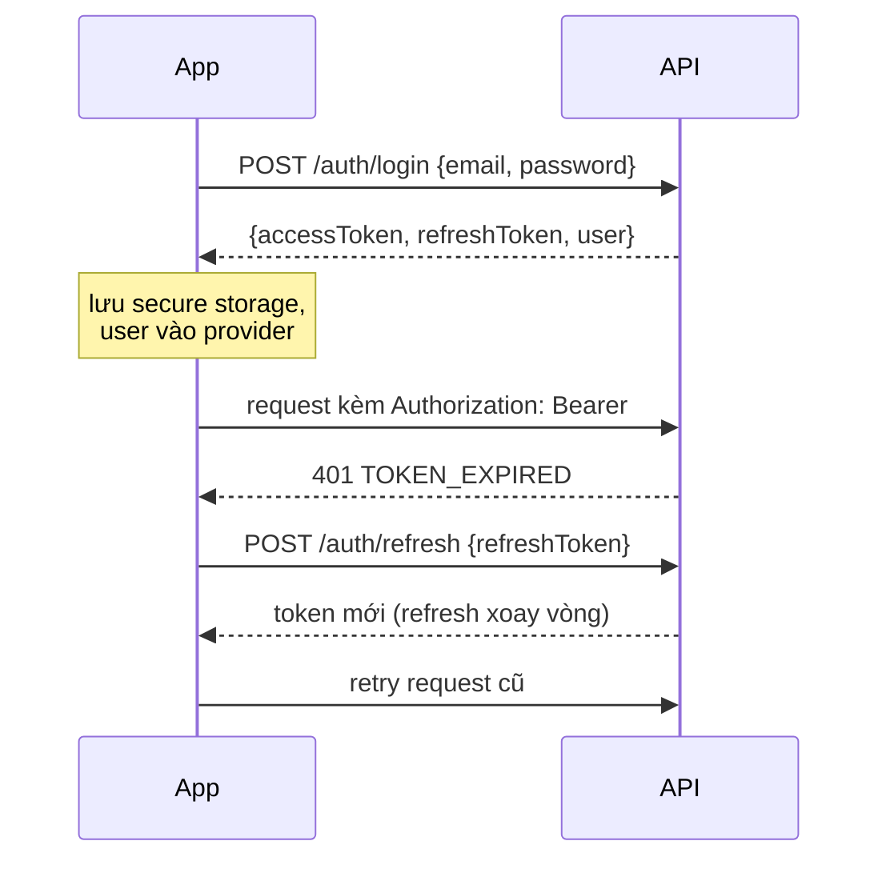

# 03 — Ánh xạ API & Giao thức tích hợp

Base URL: `{API_BASE_URL}` = `https://<host>/api/v1`. Mọi response theo envelope chung của server (`success`, `data`, `message`, `pagination`). Ngôn ngữ lỗi theo header `Accept-Language` (vi/en — server đã có i18n).

## 1. Luồng xác thực

Quy tắc dio interceptor:
1. Gắn `Authorization` nếu có access token; nếu guest → gắn `x-anonymous-id` (UUID v4 sinh lần đầu, lưu vĩnh viễn).
2. Gặp 401: refresh **một lần**, các request song song phải chờ chung 1 future refresh (mutex). Refresh fail → xoá token, điều hướng về đăng nhập (giữ lại anonymous-id).
3. Gặp lỗi bắt đổi mật khẩu (`enforcePasswordChange`) → điều hướng SCR-A07.
4. Google: `google_sign_in` lấy `idToken` → `POST /auth/google/mobile {idToken}` → nhận cặp token như login thường. Tài khoản Google lần đầu có thể cần `POST /auth/set-password`.

## 2. Bảng ánh xạ tính năng ↔ endpoint

### Auth & hồ sơ
| Tính năng app | Endpoint | Ghi chú |
|---|---|---|
| Đăng ký (citizen) | `POST /auth/register` | rate-limit phía server |
| Đăng nhập | `POST /auth/login` | |
| Đăng nhập Google | `POST /auth/google/mobile` | idToken |
| Refresh | `POST /auth/refresh` | rotation |
| Đăng xuất | `POST /auth/logout` | revoke refresh + xoá device token trước đó |
| Quên/đặt lại MK | `POST /auth/forgot-password`, `/auth/reset-password` | |
| Xác thực email | `POST /auth/verify-email`, `/auth/resend-verification` | |
| Hồ sơ | `GET /auth/me`, `PATCH /auth/me` | nguồn role cho UI |
| Đổi MK | `POST /auth/change-password`, `/auth/set-password` | |

### Bản đồ & GIS
| Tính năng | Endpoint | Ghi chú |
|---|---|---|
| Danh mục lớp | `GET /map/layers` | trả metadata: `code`, `name`, `group`, kiểu (WMS/WMTS/vector), URL GeoServer, style, min/max zoom, `is_public` — app render catalog động |
| Chi tiết lớp | `GET /map/layers/:code` | schema thuộc tính (dùng cho form field-update + popup identify) |
| Tile bản đồ | GeoServer WMS/WMTS trực tiếp | cache tile theo `flutter_map_tile_caching` hoặc maplibre cache |
| Identify đối tượng | WMS `GetFeatureInfo` (qua GeoServer) | fallback: `GET /map-data/features?bbox=` với X-Map-Api-Key nếu cần |
| Ảnh viễn thám | `GET /remote-sensing/images`, `/images/:id`, `/images/:id/cog-url`, `/remote-sensing/layers` | overlay COG qua titiler/GeoServer URL server trả về |

### Thời tiết (EP-05)
| Tính năng | Endpoint | Ghi chú |
|---|---|---|
| Danh sách lớp thời tiết | `GET /weather/layers` | mây/mưa/nhiệt/gió |
| Tile overlay | `GET /weather/tiles/:type/:z/:x/:y` | server proxy OpenWeatherMap — app không cần API key |
| Thời tiết điểm | `GET /weather/point?lng=&lat=` | tap bản đồ / vị trí GPS |
| Lưới gió | `GET /weather/wind-grid?bbox=` | vẽ particle animation |

### Phản ánh hiện trạng (feedback)
| Tính năng | Endpoint | Ghi chú |
|---|---|---|
| Gửi phản ánh | `POST /feedback` multipart field `media[]` (≤10 file), body: mô tả, category, `lng/lat`, `client_uuid` | đăng nhập **hoặc** `x-anonymous-id`; ảnh nén ≤5MB/file |
| Phản ánh của tôi | `GET /feedback/mine?page=&status=` | hoạt động với cả anonymous-id |
| Chi tiết | `GET /feedback/:id` | owner |
| (Cán bộ) danh sách/map | `GET /admin/feedback`, `GET /admin/feedback/map` | quyền `feedback.read`/`feedback.map` — dùng cho ubnd/admin view |
| (Cán bộ) đổi trạng thái | `PATCH /admin/feedback/:id/status` | quyền `feedback.update_status`; timeline `new→in_progress→resolved` |

### Field-update & offline sync (EP-10)
| Tính năng | Endpoint | Ghi chú |
|---|---|---|
| Tạo field-update | `POST /mobile/field-updates` | body: `layerCode`, `featureId?`, `lng` (106–109), `lat` (13–16.5), `attributes{}`, `clientUuid`, `note` — chỉ `so_nnmt`/`system_admin` |
| Đồng bộ tăng dần | `GET /mobile/sync?since=<ISO>` | trả field-update của chính user từ mốc `since`; app lưu mốc `last_synced_at` |

### Tin tức / văn bản / bản đồ PDF
| Tính năng | Endpoint |
|---|---|
| Tin tức | `GET /news?page=&search=&category=`, `GET /news/:slug` |
| Bình luận | `POST /news/:slug/comments`, `DELETE /news/:slug/comments/:id` (đăng nhập) |
| Văn bản | `GET /documents?search=`, `GET /documents/:id` |
| Bản đồ PDF | `GET /pdf-maps`, `GET /pdf-maps/:id` |

### Thông báo & FCM
| Tính năng | Endpoint | Ghi chú |
|---|---|---|
| Đăng ký thiết bị | `POST /notifications/devices` {fcmToken, platform} | gọi sau đăng nhập + khi token FCM rotate |
| Huỷ thiết bị | `DELETE /notifications/devices` | gọi khi logout |
| Danh sách | `GET /notifications?page=` | |
| Chưa đọc | `GET /notifications/unread-count` | badge tab |
| Đã đọc | `PATCH /notifications/:id/read`, `PATCH /notifications/read-all` | |
| Xoá | `DELETE /notifications/:id` | |

### Thống kê & phân tích (ubnd/admin)
| Tính năng | Endpoint | Quyền |
|---|---|---|
| Đơn vị hành chính + số liệu | `GET /stats/administrative-units` | public/optionalAuth |
| Hiện trạng lớp phủ | `GET /stats/landcover` | optionalAuth |
| Biến động rừng 2 mốc | `GET /spatial/forest-change?from=&to=` | `spatial.read` |
| Khoảng cách dân cư–rừng | `GET /spatial/residential-distance` | `spatial.analyze` |

### ⛔ Cảnh báo cháy (chờ server EP-06)
| Tính năng | Endpoint dự kiến | Trạng thái |
|---|---|---|
| Lớp cảnh báo mới nhất | `GET /fire-risk/latest` | server chưa có |
| Cảnh báo gần vị trí | `GET /mobile/alerts/nearby?lng=&lat=&radius=` | server chưa có |
| Đăng ký vùng nhận cảnh báo | `POST /fire-risk/subscribe` | server chưa có |

## 3. Giao thức offline queue (client)

Bảng drift `outbox`:

| Cột | Kiểu | Ghi chú |
|---|---|---|
| id | int PK | |
| client_uuid | text unique | UUID v4 — gửi kèm server để dedupe |
| type | text | `feedback` \| `field_update` |
| payload_json | text | body request |
| media_paths | text | đường dẫn file ảnh đã nén (chỉ feedback) |
| status | text | `pending` → `sending` → `synced` \| `error` |
| error_message | text? | lỗi lần gửi cuối |
| retry_count | int | backoff 30s·2^n, tối đa 5 lần tự động, sau đó chờ user bấm gửi lại |
| created_at / synced_at | datetime | |

Quy tắc sync engine:
1. Trigger: app mở, connectivity chuyển online, user pull-refresh, sau khi thêm bản ghi mới.
2. Gửi tuần tự FIFO từng bản ghi (tránh đè băng thông upload ảnh); mỗi bản ghi độc lập — lỗi 1 bản không chặn bản sau trừ lỗi mạng.
3. Lỗi 4xx validation → đánh `error`, hiện trong SCR-C06 để user sửa/xoá; lỗi mạng/5xx → giữ `pending`, retry backoff.
4. Sau khi outbox rỗng → gọi `GET /mobile/sync?since=` cập nhật trạng thái server-side (đối với field-update).
5. Ảnh trong outbox lưu ở thư mục app riêng; xoá file sau khi `synced` 7 ngày.

## 4. Chuẩn xử lý lỗi hiển thị
| Mã/Loại | Hành vi app |
|---|---|
| Mất mạng (SocketException/timeout) | toast "Không có kết nối" + nếu là thao tác ghi → tự lưu vào outbox |
| 400 VALIDATION | hiện message server (đã i18n) dưới field tương ứng |
| 401 | refresh → fail thì logout mềm (giữ dữ liệu guest) |
| 403 | ẩn/disable chức năng theo role ngay từ UI; nếu vẫn gặp → dialog "Không có quyền" |
| 413 / file quá lớn | nén lại mạnh hơn hoặc yêu cầu chọn ảnh khác |
| 429 rate-limit | hiển thị đếm ngược thử lại (auth endpoints) |
| 5xx | error state + retry |
