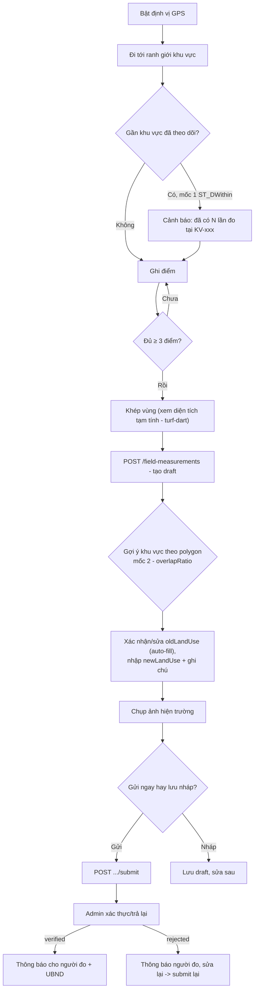

# 07 — Thiết kế App Flutter: Đo đạc thực địa & Theo dõi biến động

> Mobile companion cho `docs/modules/17-change-tracking-design.md` (server, EP mới —
> tạm gọi **EP-11** phía mobile). Đây là tính năng **mới**, KHÔNG phải field-update cũ
> (`POST /mobile/field-updates`) — bảng `field.field_updates` đã bị `DROP` ở migration
> 027, endpoint `/mobile/*` không còn tồn tại trên server. Xem cảnh báo ở
> [04-task-breakdown.md §M-EP-06](./04-task-breakdown.md).

## 1. Tổng quan & phạm vi

Cán bộ Sở NN&MT ra hiện trường, bật định vị GPS, đi bộ men theo ranh giới khu vực nghi
biến động (mất rừng, chuyển đổi mục đích sử dụng đất...), ghi lại từng điểm dừng → khép
thành polygon → gửi lên server để tính diện tích chuẩn (PostGIS), xác định thửa đất bị
ảnh hưởng, đính kèm ảnh hiện trường → gửi báo cáo cho Admin xác thực.

**Vai trò:**
- `so_nnmt` — đo đạc, tạo/sửa/gửi phiên đo, upload ảnh (chức năng chính, mobile-first).
- `system_admin` — xác thực/trả lại phiên đo (có thể làm qua mobile hoặc web admin;
  mobile chỉ cần list + 2 nút hành động, không cần thao tác phức tạp).
- `ubnd_tinh` — chỉ xem (nhận thông báo khi có phiên đo được xác thực), không có màn
  thao tác riêng — dùng chung SCR-H04/H05 ở chế độ read-only.
- `citizen` — không có quyền truy cập nhóm màn hình này.

**Không thuộc phạm vi mobile giai đoạn 1** (theo đúng cắt giảm đã chốt ở server):
versioning/khôi phục dữ liệu lớp bản đồ, so sánh tự động 2 thời điểm toàn lớp, workflow
phê duyệt nhiều cấp, export xlsx (thuộc trách nhiệm web admin — mobile chỉ cần xem/tạo).

## 2. Luồng nghiệp vụ trên app

**Quan trọng — không có endpoint preview riêng:** `POST /field-measurements` tạo bản ghi
`draft` **ngay lập tức** (server đã tính `areaM2`, `affectedFeatures`, auto-fill
`oldLandUse` trong cùng 1 request). App coi bước này là "tạo nháp" — vẫn sửa/xoá được
trước khi bấm "Gửi báo cáo" (`submit`). Không cần dựng luồng "xem trước rồi mới tạo".

## 3. Màn hình chi tiết (Nhóm H — Đo đạc thực địa)

| ID | Màn hình | Mô tả | API |
|---|---|---|---|
| SCR-H01 | Bắt đầu đo | bản đồ full-screen, chấm vị trí GPS hiện tại + vòng accuracy màu (xanh/vàng/đỏ theo ngưỡng cấu hình, mặc định 10m — **không chặn**, chỉ cảnh báo); khi vào màn, gọi `suggest/by-point` mỗi khi vị trí đổi > ngưỡng để cảnh báo sớm nếu đang đứng gần khu vực đã theo dõi | `GET /monitored-areas/suggest/by-point?lng=&lat=&radius_m=` |
| SCR-H02 | Ghi điểm | nút "Ghi điểm" lưu `{lng, lat, accuracy_m, recorded_at}` vào state cục bộ (không gọi server); danh sách điểm đã ghi (sửa/xoá điểm sai); polyline nối các điểm; diện tích tạm tính (turf-dart) khi ≥ 3 điểm; nút "Khép vùng" | local only |
| SCR-H03 | Xác nhận & tạo phiên đo | sau khi khép vùng → gọi `POST /field-measurements` → hiển thị kết quả server: diện tích chuẩn, danh sách thửa bị ảnh hưởng (`affectedFeatures`: feature, loại đất, m² từng phần), gợi ý khu vực theo polygon (`suggest/by-geom`, hiện `overlapRatio`) để gắn `areaId`; form xác nhận/sửa `oldLandUse` (đã auto-fill), nhập `newLandUse`, ghi chú | `POST /field-measurements`, `GET /monitored-areas/suggest/by-geom?geom=` |
| SCR-H04 | Danh sách phiên đo | tab theo trạng thái (draft/submitted/verified/rejected); so_nnmt thấy phiên của mình, admin/ubnd thấy tất cả (read-only với ubnd); pull-refresh | `GET /field-measurements?status=` |
| SCR-H05 | Chi tiết phiên đo | polygon trên minimap, `avgAccuracyM`, ảnh hiện trường (gallery), `reviewNote` nếu bị trả lại; nút Sửa/Xoá (chỉ khi draft/rejected), nút Chụp thêm ảnh, nút Gửi báo cáo | `GET/PATCH/DELETE /field-measurements/:id`, `POST /field-measurements/:id/photos`, `POST /field-measurements/:id/submit` |
| SCR-H06 | Khu vực theo dõi | danh sách khu vực (`KV-2026-xxx`), mở chi tiết thấy **dòng thời gian** các lần đo (diện tích/loại đất/ảnh qua từng mốc) → nhìn ra diễn tiến biến đổi | `GET /monitored-areas`, `GET /monitored-areas/:id` |
| SCR-H07 | Xác thực (system_admin) | danh sách phiên `submitted` chờ duyệt; mở chi tiết (dùng lại SCR-H05) → 2 nút "Xác thực" / "Trả lại" (bắt buộc nhập lý do) | `POST /field-measurements/:id/verify`, `POST /field-measurements/:id/reject` |

Gate quyền theo bảng role §1 — dùng `RoleGate` sẵn có (MB-010).

## 4. Kiến trúc dữ liệu offline

**Tái sử dụng hạ tầng sẵn có** (`core/sync` outbox engine — MB-060), không dựng cơ chế
đồng bộ riêng:

- **Giai đoạn ghi điểm (SCR-H02)** thuần local, không cần mạng: điểm ghi vào 1 bảng
  drift tạm `gps_walk_draft` (chỉ tồn tại trên máy, không đồng bộ) để chống mất dữ liệu
  nếu app bị kill giữa chừng đi bộ (rừng núi Kon Tum thường không có sóng — xem lưu ý
  server §1.1). Xoá bảng tạm này sau khi "Khép vùng" thành công.
- **Giai đoạn tạo phiên đo (SCR-H03)**: "Khép vùng" đẩy 1 bản ghi vào **outbox chung**
  (cùng cơ chế với feedback) — payload là toàn bộ mảng điểm + metadata (`areaId?`,
  `note`, `newLandUse`...). Sync engine POST khi có mạng, giống hệt luồng feedback.
- **Ảnh hiện trường**: dùng lại `image_picker` + nén (MB-061), nhưng **chỉ upload được
  khi phiên đo đã có `id` từ server** (endpoint `/photos` cần `measurementId` thật) —
  nghĩa là ảnh chụp lúc offline phải đợi outbox tạo xong phiên đo rồi mới tự động upload
  tiếp theo (2 bước nối tiếp trong cùng 1 job outbox, không phải 2 job độc lập).
- **Gợi ý khu vực theo dõi (mốc 1 & 2)** cần mạng — nếu offline, bỏ qua bước gợi ý,
  cán bộ vẫn tạo phiên đo bình thường và gắn `areaId` thủ công sau khi có mạng (qua
  PATCH sửa draft).

## 5. Xử lý lỗi & edge case

| Tình huống | Xử lý |
|---|---|
| GPS accuracy > ngưỡng | Không chặn ghi điểm — hiện màu cảnh báo, cho phép đứng chờ tín hiệu tốt hơn rồi ghi lại (khớp server §1.1, ngưỡng nên lấy từ config chung, không hard-code riêng app) |
| Toạ độ ngoài phạm vi Kon Tum | Validate client trước khi gửi (lng 106–109, lat 13–16.5 — khớp Joi validator server) để fail nhanh, không tốn round-trip mạng |
| < 3 điểm khi bấm "Khép vùng" | Disable nút, không cho khép |
| Mất mạng giữa lúc đo | Điểm vẫn ghi được (local); khi khép vùng, phiên đo vào outbox chờ sync — không có gì mất |
| `PATCH` sửa phiên đo khi đã `submitted`/`verified` | Server trả 400 (`field_measurement_invalid_transition`) — app disable nút Sửa/Xoá/Upload ảnh ngay khi status khác `draft`/`rejected`, tránh gọi API vô ích |
| Trả lại (`rejected`) | Bắt buộc `reviewNote` phía admin; so_nnmt nhận thông báo kèm lý do, sửa lại rồi `submit` lại (không cần tạo phiên đo mới) |
| Xoá | Chỉ cho phép khi `draft` — ẩn nút Xoá ở trạng thái khác |

## 6. Ánh xạ API đầy đủ

| Tính năng | Endpoint | Ghi chú |
|---|---|---|
| Tạo phiên đo | `POST /field-measurements` | body: `points[]` ({lng, lat, accuracy_m, recorded_at}), `areaId?`, `layerCode?`, `landUseField?`, `oldLandUse?`, `newLandUse?`, `note?` |
| Danh sách phiên đo | `GET /field-measurements?status=&commune_code=&area_id=&page=&limit=` | |
| Chi tiết | `GET /field-measurements/:id` | kèm `photos[]` |
| Sửa (draft/rejected) | `PATCH /field-measurements/:id` | chỉ gửi field muốn đổi (partial update — đã fix bug server xoá nhầm field không gửi) |
| Xoá (draft only) | `DELETE /field-measurements/:id` | |
| Upload ảnh | `POST /field-measurements/:id/photos` | multipart field `photos[]`, chỉ khi draft/rejected |
| Gửi báo cáo | `POST /field-measurements/:id/submit` | → thông báo `system_admin` |
| Xác thực (admin) | `POST /field-measurements/:id/verify` | → thông báo người đo + `ubnd_tinh` |
| Trả lại (admin) | `POST /field-measurements/:id/reject` | body: `{reviewNote}` bắt buộc → thông báo người đo |
| Tạo khu vực theo dõi | `POST /monitored-areas` | body: `{name?, geom, communeCode?, note?}` |
| Danh sách khu vực | `GET /monitored-areas?commune_code=` | |
| Chi tiết + timeline | `GET /monitored-areas/:id` | |
| Gợi ý mốc 1 (theo điểm) | `GET /monitored-areas/suggest/by-point?lng=&lat=&radius_m=` | dùng ở SCR-H01, gọi khi vị trí đổi đáng kể |
| Gợi ý mốc 2 (theo polygon) | `GET /monitored-areas/suggest/by-geom?geom=<GeoJSON URL-encoded>` | dùng ở SCR-H03 sau khi tạo draft |

> Export (`GET /field-measurements/export?format=xlsx|geojson`) là chức năng báo cáo,
> để cho web admin — không cần màn hình mobile riêng.

## 7. Task breakdown — xem `04-task-breakdown.md` §M-EP-11

Chi tiết task/ước lượng đã thêm vào file backlog chung, không lặp lại ở đây để tránh
2 nguồn sự thật.

## 8. Rủi ro & phối hợp server

1. **`old_land_use`/`new_land_use` là chuỗi tự do** (không phải mã chuẩn hoá) — app chỉ
   cần input text thường, không cần dropdown cố định trừ khi server bổ sung danh mục
   loại đất chuẩn sau này.
2. **`gis.administrative_units` chưa có ranh giới xã/phường thực tế** (chỉ có cấp huyện,
   phần lớn `geom NULL`) — `communeCode` trả về thường là `null`. App không nên coi đây
   là lỗi, chỉ hiển thị "chưa xác định" và cho cán bộ chọn tay nếu cần.
3. **`landUseField`** (tên cột loại đất trong lớp thửa nền) là tham số kỹ thuật — mobile
   **không nên** để cán bộ tự gõ (rủi ro sai tên cột → lỗi 400); nên ẩn tham số này hoặc
   lấy từ cấu hình cố định theo `layerCode` đã biết trước.
4. Bug đã tìm thấy khi test thật (2026-07-13): `PATCH` từng xoá nhầm field không gửi —
   đã fix server-side, cần xác nhận bản deploy app đang gọi API đã có fix trước khi
   tích hợp test E2E offline (MB-124).
