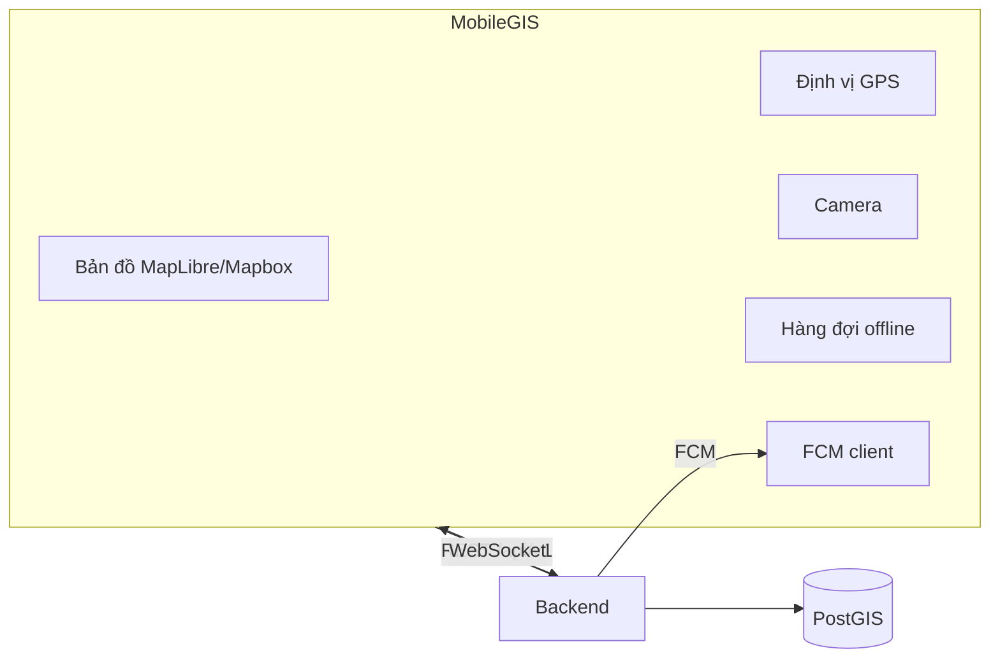
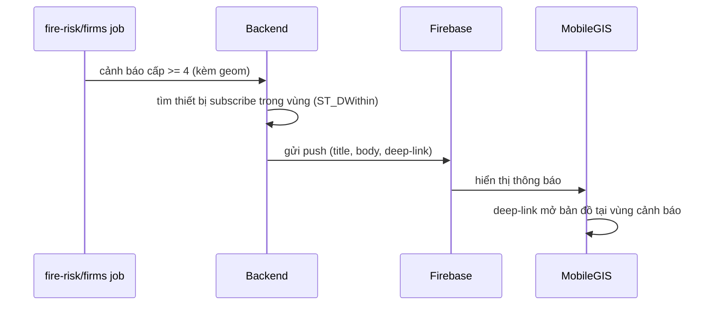

# 09 — Module Design: MobileGIS

> Ứng dụng di động cho người dân và kiểm lâm (Sở NN&MT). Đề xuất React Native hoặc Flutter; dùng chung Backend `/api/v1`.

## 1. Mục tiêu
- Người dân: xem bản đồ công khai, định vị GPS, nhận cảnh báo, gửi phản ánh kèm ảnh.
- Kiểm lâm: đo đạc, cập nhật đối tượng hiện trường, cập nhật hiện trạng rừng.

## 2. Chức năng theo tài liệu nghiệp vụ

| Chức năng | Người dân | Kiểm lâm (so_nnmt) |
|-----------|-----------|--------------------|
| Bản đồ + GPS + tìm đường | ✅ | ✅ |
| Đo đạc, cập nhật đối tượng | — | ✅ |
| Chụp ảnh, gửi hiện trạng | ✅ | ✅ |
| Bản đồ cảnh báo cháy | ✅ | ✅ |
| Cảnh báo gần vị trí GPS | ✅ | ✅ |
| Thông báo đẩy (FCM) | ✅ | ✅ |
| Xác nhận hiện trường (trạng thái) | — | ✅ |
| Tin tức / văn bản | đọc | đọc, tra cứu |

## 3. Kiến trúc client–server

## 4. API sử dụng (đã định nghĩa ở `06-api-design.md`)
- Auth mobile: `POST /auth/google/mobile`, `POST /auth/login`, `POST /auth/refresh`.
- Cảnh báo: `GET /mobile/alerts/nearby?lng=&lat=&radius=`, `GET /fire-risk/latest`.
- Phản ánh: `POST /feedback` (multipart ảnh + GPS), `GET /feedback/mine`.
- Field: `POST /mobile/field-updates`, `GET /mobile/sync?since=`.
- Thiết bị: `POST /mobile/devices/register` (FCM token).

## 5. Offline-first & đồng bộ
- Hàng đợi cục bộ (SQLite/Hive) cho phản ánh & field-update khi mất mạng.
- Đồng bộ tăng dần qua `GET /mobile/sync?since=<timestamp>`.
- Ảnh: nén trước khi upload (tôn trọng `UPLOAD_IMAGE_MAX_MB=5`).
- Chống gửi trùng: client gửi `client_uuid`; server dedupe.

## 6. Thông báo đẩy (FCM)

- Cấu hình qua `FCM_SERVICE_ACCOUNT`.
- Người dùng opt-in vị trí; lưu subscription qua `POST /fire-risk/subscribe`.

## 7. Trạng thái phản ánh hiện trường
`new` → `in_progress` → `resolved` (ghi `field.feedback_status_log`). Kiểm lâm xác nhận hiện trường cập nhật trạng thái.

## 8. Bảo mật & quyền riêng tư
- Token lưu trong secure storage (Keychain/Keystore).
- Vị trí GPS chỉ gửi khi người dùng đồng ý; ẩn danh qua `x-anonymous-id` nếu chưa đăng nhập.
- Refresh token xoay vòng; logout revoke.

## 9. Kiểm thử
- Test offline queue (mất mạng → có mạng đồng bộ đủ, không trùng).
- Test push end-to-end với thiết bị thật (Android + iOS).
- Test độ chính xác GPS & hiển thị cảnh báo gần vị trí.
- Test upload ảnh lớn/giới hạn dung lượng.
