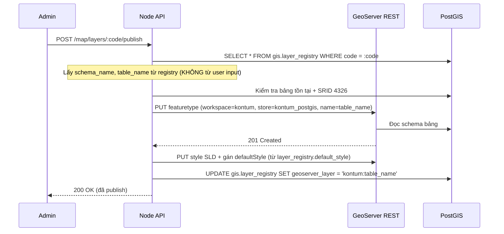
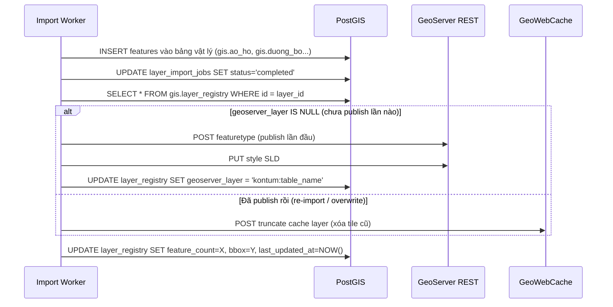
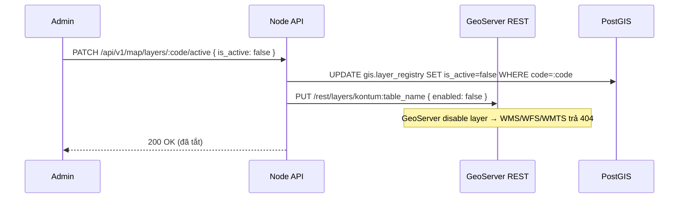
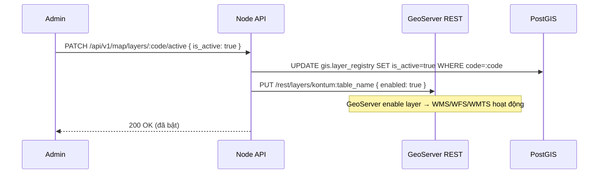

# 12 — Module Design: Tích hợp GeoServer

> Chi tiết hóa US-024 và ADR-3. GeoServer đóng vai trò **map server** chuẩn OGC (WMS/WFS/WMTS/MVT) phục vụ các lớp dữ liệu GIS từ PostGIS/GeoTIFF. Node.js **không proxy tile/geodata**; Node.js chỉ quản lý metadata trong `gis.layer_registry` và gọi GeoServer REST API khi publish/unpublish/bật/tắt layer.
>
> **Cập nhật:** Đồng bộ với **Layer Registry Pattern** (`gis.layer_registry`) — xem chi tiết tại [05-database-design.md §4](../architecture/05-database-design.md).

## 0. Quyết định kiến trúc (đã chốt)

> **Luồng render chính:** `PostGIS/GeoTIFF (lưu trữ) → GeoServer (WMS/WFS/WMTS/MVT) → Frontend Mapbox/MapLibre (render)`.

- Mapbox GL JS / MapLibre là client để vẽ bản đồ trên WebGIS.
- Frontend gọi **trực tiếp GeoServer** cho dữ liệu công khai: WMS bản đồ nền, WMTS/tile cache, WFS chỉ đọc, Vector Tile, raster, ranh giới hành chính, điểm du lịch công khai.
- Node.js chỉ cung cấp API metadata (`/api/v1/map/layers`) và API quản trị publish/unpublish/enable layer qua GeoServer REST API.
- API GeoJSON trực tiếp từ PostGIS (`/map/layers/:code/features`) chỉ giữ cho **lớp rất nhỏ/động hoặc dữ liệu nghiệp vụ đã tính sẵn** (vd popup chi tiết), **không** dùng làm đường render lớp nền.

| Loại lớp | Nguồn cho Mapbox | Kiểu source Mapbox |
|----------|------------------|--------------------|
| Lớp nền nặng / raster (ảnh vệ tinh, nguy cơ cháy raster) | GeoServer **WMS** | `raster` |
| Lớp vector tương tác (ranh giới rừng, tiểu khu, hành chính) | GeoServer **WMTS/MVT** (GeoWebCache) | `vector` |
| Lớp điểm nhỏ/động (FIRMS, phản ánh, trạm kiểm lâm) | GeoServer **WFS** (GeoJSON) | `geojson` |

## 1. Vì sao dùng GeoServer (bên cạnh API GeoJSON/MVT)

| Tình huống | Giải pháp đề xuất |
|------------|-------------------|
| Lớp nhỏ/động, cần thuộc tính linh hoạt | API `/map/layers/:code/features` trả GeoJSON từ PostGIS |
| Lớp nền lớn (ranh giới rừng, tiểu khu, phủ rừng) | **GeoServer WMS/WMTS** (raster tile, có cache) |
| Tải vector lớn về client | **WFS** (GeoJSON) hoặc Vector Tile (WMTS) |
| Render style phía server theo chuẩn OGC | **SLD** trong GeoServer |

> Nguyên tắc: GeoServer lo các lớp nền nặng + cache; API Node lo metadata, phân quyền, lớp động và đối chiếu nghiệp vụ.

## 2. Kiến trúc tích hợp

```mermaid
flowchart LR
    Web[WebGIS Mapbox/MapLibre] -->|WMS/WFS/WMTS/MVT trực tiếp| GS[GeoServer]
    Mobile[MobileGIS] -->|WMS/WFS/WMTS/MVT trực tiếp| GS
    GS --> GWC[GeoWebCache\ntile cache]
    GS -->|JDBC read-only| PG[(PostGIS\nschema gis)]
    Admin[system_admin] -->|publish/unpublish/active| API[/api/v1/map/layers/...]
    API -->|REST API quản trị| GS
    API -->|metadata| PG
```

**Luồng:**
1. Admin import dữ liệu vào PostGIS qua `POST /api/v1/admin/gis/layers/:id/import` → tạo `layer_import_jobs`.
2. Import thành công → API/worker gọi **GeoServer REST API** publish layer (auto-publish) + cập nhật `gis.layer_registry.geoserver_layer`.
3. Admin bật/tắt hiển thị lớp qua `is_active` trong `gis.layer_registry` → Node đồng bộ `enabled` trên GeoServer.
4. Client gọi `GET /api/v1/map/layers` để lấy metadata layer đang active/public, sau đó tự build URL WMS/WFS/WMTS/MVT tới GeoServer.

## 3. Cấu hình GeoServer (theo biến `.env`)

```dotenv
GEOSERVER_URL=http://localhost:8080/geoserver   # chỉ bind nội bộ
GEOSERVER_USER=...
GEOSERVER_PASSWORD=...
GEOSERVER_WORKSPACE=kontum
GEOSERVER_DATASTORE=kontum_postgis
```

| Thành phần | Giá trị |
|-----------|---------|
| Workspace | `kontum` |
| Store | `kontum_postgis` (PostGIS JDBC trỏ schema `gis`) |
| Layer | 1 layer / bảng PostGIS (vd `ranh_gioi_rung`, `tieu_khu`, `tram_kiem_lam`) |
| Style | SLD theo chuyên đề (viền rừng xanh, polygon tiểu khu…) |
| Cache | GeoWebCache cho WMS/WMTS lớp tĩnh |
| SRS | EPSG:4326 (đồng nhất toàn hệ thống) |

## 4. Quy trình publish layer (GeoServer REST API)

### 4.1 Publish thủ công



### 4.2 Auto-publish sau import thành công

Khi `layer_import_jobs.status` chuyển sang `completed`:



> **Quy tắc auto-publish:** Chỉ publish khi `layer_registry.is_active = true`. Nếu admin tắt lớp (`is_active = false`) thì import vẫn hoạt động nhưng không tự publish lên GeoServer.

### 4.3 Bật/tắt hiển thị lớp (is_active) — Luồng xử lý

Cột `gis.layer_registry.is_active` kiểm soát lớp có được hiển thị trên bản đồ hay không.

#### Khi admin **tắt** lớp (`is_active = false`)



#### Khi admin **bật** lớp (`is_active = true`)



#### Code mẫu xử lý bật/tắt (geoserver.client.js)

```js
// src/utils/geoserver.client.js

async function setLayerEnabled(geoserverLayerName, enabled) {
  // geoserverLayerName = 'kontum:ao_ho'
  const url = `${process.env.GEOSERVER_URL}/rest/layers/${geoserverLayerName}`;
  const res = await fetch(url, {
    method: 'PUT',
    headers: {
      'Content-Type': 'application/json',
      'Authorization': 'Basic ' + Buffer.from(
        `${process.env.GEOSERVER_USER}:${process.env.GEOSERVER_PASSWORD}`
      ).toString('base64'),
    },
    body: JSON.stringify({ layer: { enabled } }),
  });
  if (!res.ok) throw new Error(`GeoServer setEnabled failed: ${res.status}`);
}
```

#### Client dùng metadata để build URL GeoServer

Node.js không còn middleware proxy. Trạng thái `is_active` được thực thi bằng 2 lớp:
- API `/api/v1/map/layers` chỉ trả layer được phép hiển thị cho user hiện tại.
- Khi admin tắt layer, service cũng gọi GeoServer REST `enabled=false`, nên request WMS/WFS/WMTS/MVT trực tiếp tới GeoServer sẽ không phục vụ layer đó.

```js
const GEOSERVER_PUBLIC_URL = 'https://geoserver.humgsoftware.pro.vn/geoserver';
const WORKSPACE = 'kontum';

function buildWmsTileUrl(layer) {
  const geoserverLayer = layer.geoserver_layer || `${WORKSPACE}:${layer.table_name}`;
  return `${GEOSERVER_PUBLIC_URL}/${WORKSPACE}/wms?service=WMS&version=1.3.0&request=GetMap` +
    `&layers=${encodeURIComponent(geoserverLayer)}` +
    `&styles=&bbox={bbox-epsg-3857}&width=256&height=256` +
    `&crs=EPSG:3857&format=image/png&transparent=true`;
}
```

#### Client hiển thị danh sách lớp (chỉ lớp active)

Khi client load bản đồ, gọi API lấy danh sách lớp đang bật:

```js
// Frontend - load danh sách lớp từ API
const response = await fetch('/api/v1/map/layers');
const layers = await response.json();
// API chỉ trả các layer có is_active=true (+ is_public=true nếu citizen)

layers.forEach(layer => {
  if (layer.geometry_type.includes('POLYGON')) {
    // Thêm WMS source cho polygon lớn
    map.addSource(layer.code, {
      type: 'raster',
      tiles: [buildWmsTileUrl(layer)],
      tileSize: 256
    });
    map.addLayer({
      id: `${layer.code}-layer`,
      type: 'raster',
      source: layer.code,
      layout: { visibility: 'visible' }  // Toggle bằng UI checkbox
    });
  }
});

// Toggle visibility khi user nhấn checkbox trong Layer Panel
function toggleLayer(layerCode, visible) {
  map.setLayoutProperty(
    `${layerCode}-layer`,
    'visibility',
    visible ? 'visible' : 'none'
  );
}
```

> **Phân biệt 2 cấp ẩn/hiện:**
> | Cấp | Ai kiểm soát | Ảnh hưởng | Cách hoạt động |
> |-----|-------------|-----------|----------------|
> | **is_active** (server) | Admin qua API | Toàn hệ thống — tất cả user | API không trả layer + GeoServer disable layer |
> | **visibility** (client) | User trên bản đồ | Chỉ phiên làm việc của user đó | `map.setLayoutProperty('visibility', 'none')` — dữ liệu vẫn có, chỉ ẩn render |

Các REST endpoint GeoServer dùng (nội bộ):
- `POST /rest/workspaces` — tạo workspace (1 lần).
- `POST /rest/workspaces/kontum/datastores` — tạo PostGIS store (1 lần).
- `POST /rest/workspaces/kontum/datastores/kontum_postgis/featuretypes` — publish 1 layer.
- `POST /rest/styles` + `PUT /rest/layers/{layer}` — gán SLD.
- `PUT /rest/layers/{layer}` — bật/tắt layer (`enabled: true/false`).
- `DELETE /rest/layers/{layer}` — gỡ publish.
- `POST /gwc/rest/seed/{layer}.json` — truncate tile cache.

## 5. API Node phía quản trị metadata/publish (không proxy tile)

| Method | Endpoint | Mô tả |
|--------|----------|-------|
| GET | `/api/v1/map/layers` | Trả metadata layer active/public theo quyền để frontend build URL GeoServer |
| POST | `/api/v1/map/layers/:code/publish` | Admin publish layer PostGIS/GeoTIFF → GeoServer REST |
| DELETE | `/api/v1/map/layers/:code/publish` | Admin gỡ publish khỏi GeoServer + clear metadata |
| PATCH | `/api/v1/map/layers/:code/active` | Admin bật/tắt layer, đồng bộ `gis.layer_registry.is_active` và GeoServer `enabled` |
| POST | `/api/v1/map/rasters/:coverageStore/harvest` | Harvest GeoTIFF mới vào ImageMosaic + truncate GWC nếu cần |
| POST | `/api/v1/remote-sensing/images/:id/publish` | Publish ảnh GeoTIFF từ kho viễn thám (MinIO) → `GEOSERVER_DATA_DIR` → CoverageStore + Coverage. Layer liên kết ngược qua `layer_registry.remote_sensing_image_id` *(migration 022)* |

**Nguyên tắc:**
- Node.js không expose `/api/v1/map/wms`, `/api/v1/map/wfs`, `/api/v1/map/wmts`.
- Frontend gọi trực tiếp GeoServer public URL cho các layer công khai/chỉ đọc.
- Node.js chỉ gọi GeoServer REST API cho tác vụ quản trị: publish, unpublish, enable/disable, harvest, truncate cache.
- Không đưa `GEOSERVER_USER/GEOSERVER_PASSWORD` cho frontend. Public GeoServer nên dùng cấu hình anonymous/read-only hoặc rule security riêng cho layer công khai.

**Ví dụ frontend:**
```js
const metadata = await fetch('/api/v1/map/layers').then((r) => r.json());
const publicGeoServer = 'https://geoserver.humgsoftware.pro.vn/geoserver';
// Build WMS/WFS/WMTS URL từ metadata.data[*].geoserver_layer.
```

## 6. Styling: SLD (GeoServer) vs Mapbox style (client)
- **Lớp WMS render server-side** → dùng **SLD** trong GeoServer (legend nhất quán cho mọi client).
- **Lớp GeoJSON/MVT render client-side** → dùng style trong `gis.layer_registry.default_style` (JSONB) cho Mapbox GL.
- Khuyến nghị: lớp nền nặng dùng WMS+SLD; lớp tương tác/click dùng GeoJSON/MVT + Mapbox style.

## 7. Tích hợp Mapbox GL JS (luồng render chính)

> Mapbox GL JS tile theo **EPSG:3857 (Web Mercator)**. Dữ liệu lưu PostGIS ở 4326; GeoServer tự reproject khi phục vụ tile/feature. Dùng placeholder `{bbox-epsg-3857}` và `srs=EPSG:3857` cho WMS.

### 7.1 Lớp raster qua WMS (lớp nền nặng / ảnh vệ tinh / nguy cơ cháy raster)
```js
map.addSource('rung-wms', {
  type: 'raster',
  tiles: [
    'https://geoserver.humgsoftware.pro.vn/geoserver/kontum/wms?service=WMS&version=1.3.0&request=GetMap' +
    '&layers=kontum:ranh_gioi_rung&styles=' +
    '&bbox={bbox-epsg-3857}&width=256&height=256' +
    '&crs=EPSG:3857&format=image/png&transparent=true'
  ],
  tileSize: 256
});
map.addLayer({ id: 'rung-raster', type: 'raster', source: 'rung-wms' });
```

### 7.2 Lớp vector qua MVT/WMTS (ranh giới rừng, tiểu khu, hành chính — cần click & style động)
> Yêu cầu cài extension **gs-vectortiles** trên GeoServer để xuất `application/vnd.mapbox-vector-tile`.
```js
map.addSource('tieu-khu', {
  type: 'vector',
  tiles: ['https://geoserver.humgsoftware.pro.vn/geoserver/gwc/service/tms/1.0.0/kontum:tieu_khu@EPSG:900913@pbf/{z}/{x}/{y}.pbf'],
  minzoom: 8, maxzoom: 16
});
map.addLayer({
  id: 'tieu-khu-fill', type: 'fill', source: 'tieu-khu',
  'source-layer': 'tieu_khu',                  // = tên layer trong GeoServer
  paint: { 'fill-color': '#2e7d32', 'fill-opacity': 0.3, 'fill-outline-color': '#1b5e20' }
});
// Click popup dùng thuộc tính có sẵn trong vector tile
map.on('click', 'tieu-khu-fill', (e) => {
  const p = e.features[0].properties;
  new mapboxgl.Popup().setLngLat(e.lngLat)
    .setHTML(`Tiểu khu: ${p.ten_tieu_khu}<br>Diện tích: ${p.dien_tich_ha} ha`)
    .addTo(map);
});
```

### 7.3 Lớp điểm nhỏ/động qua WFS GeoJSON (FIRMS, phản ánh, trạm kiểm lâm)
```js
map.addSource('firms', {
  type: 'geojson',
  data: 'https://geoserver.humgsoftware.pro.vn/geoserver/kontum/wfs?service=WFS&version=2.0.0&request=GetFeature' +
        '&typeName=kontum:active_fire_point&outputFormat=application/json&srsName=EPSG:4326'
});
map.addLayer({
  id: 'firms-point', type: 'circle', source: 'firms',
  paint: { 'circle-radius': 5, 'circle-color': '#ff3300' }
});
```

### 7.4 Chọn kiểu nguồn theo lớp
| Lớp | Kiểu | Lý do |
|-----|------|-------|
| Ảnh vệ tinh (NDVI/NDMI), nguy cơ cháy raster | WMS raster | Render server, không tải vector nặng về client |
| Ranh giới rừng, tiểu khu, ranh giới hành chính | MVT vector | Click thuộc tính + style/đổi màu phía client mượt |
| Điểm cháy FIRMS, phản ánh, trạm kiểm lâm | WFS GeoJSON | Số lượng nhỏ, cập nhật thường xuyên |
| Lớp nguy cơ cháy polygon (nghiệp vụ) | MVT hoặc `/fire-risk/latest` GeoJSON | Nếu nhỏ → GeoJSON; nếu lớn → publish MVT |

### 7.5 Lưu ý reprojection & hiệu năng
- GeoServer khai báo SRS gốc 4326 + hỗ trợ phục vụ 3857 (mặc định có). Kiểm tra layer bật cả hai SRS.
- Với MVT: bật GeoWebCache để cache `.pbf` theo `{z}/{x}/{y}`.
- Đặt `minzoom/maxzoom` hợp lý để giảm số tile request.


## 8. Cache (GeoWebCache)
- Bật GWC cho lớp tĩnh (ranh giới hành chính, tiểu khu) → giảm tải PostGIS.
- Seed cache trước cho mức zoom phổ biến (8–14) của vùng Kon Tum.
- Invalidate cache khi layer cập nhật (gọi GWC `truncate` qua REST sau khi import lại).

## 9. Bảo mật (tổng hợp)
- GeoServer public URL chỉ bật anonymous/read-only cho layer công khai; REST admin vẫn phải bảo vệ bằng user/password mạnh và chỉ Node/backend được dùng.
- Đổi mật khẩu admin mặc định; tạo user GeoServer riêng cho Node.js gọi REST quản trị.
- Với layer không công khai, không expose qua anonymous GeoServer; dùng GeoServer security rules hoặc tách workspace/store riêng.
- Tắt các service không dùng (vd OWS không cần) để giảm bề mặt tấn công.

## 10. Triển khai (Docker đề xuất)
```yaml
# docker-compose (trích)
services:
  geoserver:
    image: docker.osgeo.org/geoserver:2.25.x
    expose: ["8080"]          # KHÔNG dùng "ports" để ra ngoài
    environment:
      - GEOSERVER_ADMIN_PASSWORD=${GEOSERVER_PASSWORD}
    networks: [internal]
    volumes: [geoserver_data:/opt/geoserver_data]
  # api node nằm cùng network 'internal' để gọi geoserver
```

## 11. Bổ sung vào Backlog (đề xuất tách US-024)
| ID | Story | SP |
|----|-------|----|
| US-024a | API metadata layer cho frontend build URL GeoServer | 3 |
| US-024b | API publish/unpublish layer PostGIS qua GeoServer REST | 5 |
| US-024c | Cấu hình GeoWebCache + seed/invalidate | 3 |

## 12. Kiểm thử
- `GET /api/v1/map/layers` chỉ trả layer active/public phù hợp quyền user.
- Publish layer mới → `geoserver_layer` được cập nhật và `GetCapabilities` trực tiếp trên GeoServer thấy layer.
- Tắt layer → `gis.layer_registry.is_active=false` và GeoServer `enabled=false`.
- Tile cache trả nhanh + invalidate đúng sau khi cập nhật dữ liệu.
- Credential GeoServer REST không lộ cho frontend/client.
