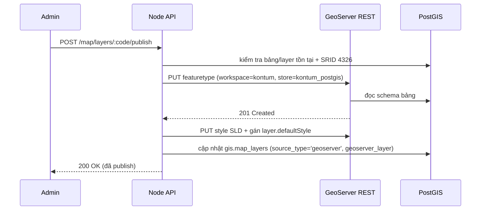

# 12 — Module Design: Tích hợp GeoServer

> Chi tiết hóa US-024 và ADR-3. GeoServer đóng vai trò **map server** chuẩn OGC (WMS/WFS/WMTS) phục vụ các lớp dữ liệu lớn từ PostGIS, đặt sau API proxy và **không expose ra internet** (theo `.env.example`).

## 0. Quyết định kiến trúc (đã chốt)

> **Luồng render chính:** `PostGIS (lưu trữ) → GeoServer (OGC tiles/features) → Node proxy → Mapbox GL JS (render)`.

- Mapbox GL JS là **client duy nhất** để vẽ bản đồ trên WebGIS.
- Mọi lớp dữ liệu lấy qua **GeoServer** (backed by PostGIS), đi qua **Node proxy** (ẩn credential, RBAC).
- API GeoJSON trực tiếp từ PostGIS (`/map/layers/:code/features`) chỉ giữ cho **lớp rất nhỏ/động hoặc dữ liệu nghiệp vụ đã tính sẵn** (vd popup chi tiết), **không** dùng làm đường render lớp nền.

| Loại lớp | Nguồn cho Mapbox | Kiểu source Mapbox |
|----------|------------------|--------------------|
| Lớp nền nặng / raster (ảnh vệ tinh, nguy cơ cháy raster) | GeoServer **WMS** | `raster` |
| Lớp vector tương tác (ranh giới rừng, tiểu khu, hành chính) | GeoServer **WMTS/MVT** (GeoWebCache) | `vector` |
| Lớp điểm nhỏ/động (FIRMS, phản ánh, trạm kiểm lâm) | GeoServer **WFS** (GeoJSON) | `geojson` |

## 1. Vì sao dùng GeoServer (bên cạnh API GeoJSON/MVT)

| Tình huống | Giải pháp đề xuất |
|------------|-------------------|
| Lớp nhỏ/động, cần thuộc tính linh hoạt | API `/map/layers/:code/features` trả GeoJSON từ PostGIS |
| Lớp nền lớn (ranh giới rừng, tiểu khu, phủ rừng) | **GeoServer WMS/WMTS** (raster tile, có cache) |
| Tải vector lớn về client | **WFS** (GeoJSON) hoặc Vector Tile (WMTS) |
| Render style phía server theo chuẩn OGC | **SLD** trong GeoServer |

> Nguyên tắc: GeoServer lo các lớp nền nặng + cache; API Node lo metadata, phân quyền, lớp động và đối chiếu nghiệp vụ.

## 2. Kiến trúc tích hợp

```mermaid
flowchart LR
    Web[WebGIS Mapbox/MapLibre] -->|/api/v1/map/wms| Proxy[Node proxy\ngeoserver.client.js]
    Mobile[MobileGIS] -->|/api/v1/map/wms| Proxy
    Proxy -->|Basic auth nội bộ| GS[GeoServer\n127.0.0.1:8080]
    GS --> GWC[GeoWebCache\ntile cache]
    GS -->|JDBC| PG[(PostGIS\nschema gis)]
    Admin[system_admin] -->|publish layer| API[/api/v1/map/layers/:code/publish]
    API --> REST[GeoServer REST API]
    REST --> GS
```

**Luồng:**
1. Admin import dữ liệu vào PostGIS (US-021).
2. Admin gọi API publish → Node dùng **GeoServer REST API** tạo layer trong workspace `kontum`, datastore `kontum_postgis`.
3. Client gọi `/api/v1/map/wms` → Node proxy thêm credential nội bộ → GeoServer trả ảnh tile/WFS.

## 3. Cấu hình GeoServer (theo biến `.env`)

```dotenv
GEOSERVER_URL=http://localhost:8080/geoserver   # chỉ bind nội bộ
GEOSERVER_USER=...
GEOSERVER_PASSWORD=...
GEOSERVER_WORKSPACE=kontum
GEOSERVER_DATASTORE=kontum_postgis
```

| Thành phần | Giá trị |
|-----------|---------|
| Workspace | `kontum` |
| Store | `kontum_postgis` (PostGIS JDBC trỏ schema `gis`) |
| Layer | 1 layer / bảng PostGIS (vd `ranh_gioi_rung`, `tieu_khu`, `tram_kiem_lam`) |
| Style | SLD theo chuyên đề (viền rừng xanh, polygon tiểu khu…) |
| Cache | GeoWebCache cho WMS/WMTS lớp tĩnh |
| SRS | EPSG:4326 (đồng nhất toàn hệ thống) |

## 4. Quy trình publish layer (GeoServer REST API)



Các REST endpoint GeoServer dùng (nội bộ):
- `POST /rest/workspaces` — tạo workspace (1 lần).
- `POST /rest/workspaces/kontum/datastores` — tạo PostGIS store (1 lần).
- `POST /rest/workspaces/kontum/datastores/kontum_postgis/featuretypes` — publish 1 layer.
- `POST /rest/styles` + `PUT /rest/layers/{layer}` — gán SLD.
- `DELETE /rest/layers/{layer}` — gỡ publish.

## 5. API proxy phía Node (US-024)

| Method | Endpoint | Mô tả |
|--------|----------|-------|
| GET | `/api/v1/map/wms` | Proxy WMS `GetMap/GetFeatureInfo/GetCapabilities` |
| GET | `/api/v1/map/wfs` | Proxy WFS `GetFeature` (GeoJSON) |
| GET | `/api/v1/map/wmts/{layer}/{z}/{x}/{y}` | Proxy tile (GeoWebCache) |
| POST | `/api/v1/map/layers/:code/publish` | (admin) publish layer PostGIS → GeoServer |
| DELETE | `/api/v1/map/layers/:code/publish` | (admin) gỡ publish |

**Yêu cầu proxy:**
- Ẩn hoàn toàn `GEOSERVER_URL` + credential; client không bao giờ gọi trực tiếp.
- Chỉ cho phép tham số an toàn (allowlist: `service`, `version`, `request`, `layers`, `bbox`, `width`, `height`, `srs`, `format`, `query_layers`, `i`, `j`...). Chặn tham số lạ để tránh SSRF/abuse.
- Kiểm tra layer được yêu cầu có `is_public` hoặc user có quyền (đối chiếu `gis.map_layers`).
- Stream response (ảnh tile) để không buffer toàn bộ vào RAM.
- Áp rate-limit + cache header cho tile.

### Phác thảo proxy (Express 5, đề xuất)
```js
// src/utils/geoserver.client.js
const ALLOWED = new Set(['service','version','request','layers','query_layers',
  'bbox','width','height','srs','crs','format','styles','transparent','i','j',
  'typeName','outputFormat','cql_filter','maxFeatures']);

function buildUpstreamUrl(reqQuery, path = 'wms') {
  const url = new URL(`${process.env.GEOSERVER_URL}/${process.env.GEOSERVER_WORKSPACE}/${path}`);
  for (const [k, v] of Object.entries(reqQuery)) {
    if (ALLOWED.has(k.toLowerCase())) url.searchParams.set(k, v);
  }
  return url;
}
// proxy: fetch upstream với Authorization Basic nội bộ, rồi stream về client
```
> Lưu ý: KHÔNG forward header `Authorization` của client lên GeoServer; dùng credential nội bộ riêng. Đây là ranh giới bảo mật (US-024 AC: "ẩn credential").

## 6. Styling: SLD (GeoServer) vs Mapbox style (client)
- **Lớp WMS render server-side** → dùng **SLD** trong GeoServer (legend nhất quán cho mọi client).
- **Lớp GeoJSON/MVT render client-side** → dùng style trong `gis.map_layers.style` (JSONB) cho Mapbox GL.
- Khuyến nghị: lớp nền nặng dùng WMS+SLD; lớp tương tác/click dùng GeoJSON/MVT + Mapbox style.

## 7. Tích hợp Mapbox GL JS (luồng render chính)

> Mapbox GL JS tile theo **EPSG:3857 (Web Mercator)**. Dữ liệu lưu PostGIS ở 4326; GeoServer tự reproject khi phục vụ tile/feature. Dùng placeholder `{bbox-epsg-3857}` và `srs=EPSG:3857` cho WMS.

### 7.1 Lớp raster qua WMS (lớp nền nặng / ảnh vệ tinh / nguy cơ cháy raster)
```js
map.addSource('rung-wms', {
  type: 'raster',
  tiles: [
    '/api/v1/map/wms?service=WMS&version=1.3.0&request=GetMap' +
    '&layers=kontum:ranh_gioi_rung&styles=' +
    '&bbox={bbox-epsg-3857}&width=256&height=256' +
    '&crs=EPSG:3857&format=image/png&transparent=true'
  ],
  tileSize: 256
});
map.addLayer({ id: 'rung-raster', type: 'raster', source: 'rung-wms' });
```

### 7.2 Lớp vector qua MVT/WMTS (ranh giới rừng, tiểu khu, hành chính — cần click & style động)
> Yêu cầu cài extension **gs-vectortiles** trên GeoServer để xuất `application/vnd.mapbox-vector-tile`.
```js
map.addSource('tieu-khu', {
  type: 'vector',
  tiles: ['/api/v1/map/wmts/kontum:tieu_khu/{z}/{x}/{y}.pbf'],
  minzoom: 8, maxzoom: 16
});
map.addLayer({
  id: 'tieu-khu-fill', type: 'fill', source: 'tieu-khu',
  'source-layer': 'tieu_khu',                  // = tên layer trong GeoServer
  paint: { 'fill-color': '#2e7d32', 'fill-opacity': 0.3, 'fill-outline-color': '#1b5e20' }
});
// Click popup dùng thuộc tính có sẵn trong vector tile
map.on('click', 'tieu-khu-fill', (e) => {
  const p = e.features[0].properties;
  new mapboxgl.Popup().setLngLat(e.lngLat)
    .setHTML(`Tiểu khu: ${p.ten_tieu_khu}<br>Diện tích: ${p.dien_tich_ha} ha`)
    .addTo(map);
});
```

### 7.3 Lớp điểm nhỏ/động qua WFS GeoJSON (FIRMS, phản ánh, trạm kiểm lâm)
```js
map.addSource('firms', {
  type: 'geojson',
  data: '/api/v1/map/wfs?service=WFS&version=2.0.0&request=GetFeature' +
        '&typeName=kontum:active_fire_point&outputFormat=application/json&srsName=EPSG:4326'
});
map.addLayer({
  id: 'firms-point', type: 'circle', source: 'firms',
  paint: { 'circle-radius': 5, 'circle-color': '#ff3300' }
});
```

### 7.4 Chọn kiểu nguồn theo lớp
| Lớp | Kiểu | Lý do |
|-----|------|-------|
| Ảnh vệ tinh (NDVI/NDMI), nguy cơ cháy raster | WMS raster | Render server, không tải vector nặng về client |
| Ranh giới rừng, tiểu khu, ranh giới hành chính | MVT vector | Click thuộc tính + style/đổi màu phía client mượt |
| Điểm cháy FIRMS, phản ánh, trạm kiểm lâm | WFS GeoJSON | Số lượng nhỏ, cập nhật thường xuyên |
| Lớp nguy cơ cháy polygon (nghiệp vụ) | MVT hoặc `/fire-risk/latest` GeoJSON | Nếu nhỏ → GeoJSON; nếu lớn → publish MVT |

### 7.5 Lưu ý reprojection & hiệu năng
- GeoServer khai báo SRS gốc 4326 + hỗ trợ phục vụ 3857 (mặc định có). Kiểm tra layer bật cả hai SRS.
- Với MVT: bật GeoWebCache để cache `.pbf` theo `{z}/{x}/{y}`.
- Đặt `minzoom/maxzoom` hợp lý để giảm số tile request.


## 8. Cache (GeoWebCache)
- Bật GWC cho lớp tĩnh (ranh giới hành chính, tiểu khu) → giảm tải PostGIS.
- Seed cache trước cho mức zoom phổ biến (8–14) của vùng Kon Tum.
- Invalidate cache khi layer cập nhật (gọi GWC `truncate` qua REST sau khi import lại).

## 9. Bảo mật (tổng hợp)
- GeoServer bind `127.0.0.1` (hoặc mạng nội bộ Docker), **không** mở firewall ra ngoài.
- Đổi mật khẩu admin mặc định; tạo user GeoServer riêng cho proxy (read-only).
- Chỉ truy cập qua Node proxy đã RBAC + allowlist tham số.
- Tắt các service không dùng (vd OWS không cần) để giảm bề mặt tấn công.

## 10. Triển khai (Docker đề xuất)
```yaml
# docker-compose (trích)
services:
  geoserver:
    image: docker.osgeo.org/geoserver:2.25.x
    expose: ["8080"]          # KHÔNG dùng "ports" để ra ngoài
    environment:
      - GEOSERVER_ADMIN_PASSWORD=${GEOSERVER_PASSWORD}
    networks: [internal]
    volumes: [geoserver_data:/opt/geoserver_data]
  # api node nằm cùng network 'internal' để gọi geoserver
```

## 11. Bổ sung vào Backlog (đề xuất tách US-024)
| ID | Story | SP |
|----|-------|----|
| US-024a | Proxy WMS/WFS an toàn (allowlist + RBAC + stream) | 5 |
| US-024b | API publish/unpublish layer PostGIS qua GeoServer REST | 5 |
| US-024c | Cấu hình GeoWebCache + seed/invalidate | 3 |

## 12. Kiểm thử
- Proxy chặn tham số ngoài allowlist (chống SSRF).
- Layer `is_public=false` không truy cập được qua proxy nếu thiếu quyền.
- Publish layer mới → `GetCapabilities` qua proxy thấy layer.
- Tile cache trả nhanh + invalidate đúng sau khi cập nhật dữ liệu.
- Credential GeoServer không lộ trong response/headers gửi về client.
