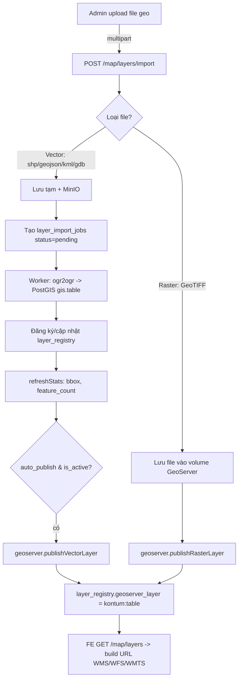

# 16 — Kế hoạch: Import file GIS vào PostGIS + GeoServer

> **Mục tiêu:** Admin upload file dữ liệu không gian (Shapefile, GeoJSON, KML/KMZ, GeoTIFF, FileGDB) → hệ thống nạp vào PostGIS (`schema gis`), đăng ký vào `gis.layer_registry`, **tự publish lên GeoServer**, để Frontend (Mapbox/MapLibre) render layer **trực tiếp qua GeoServer** (WMS/WFS/WMTS/MVT).
>
> Tài liệu này nối tiếp [12-geoserver-integration-design.md](./12-geoserver-integration-design.md) và [05-database-design.md](../architecture/05-database-design.md). Phạm vi: **đường import file → DB → GeoServer**. Render phía FE đã chốt ở §7 của tài liệu 12.

---

## 1. Hiện trạng (đã có) và khoảng trống (cần làm)

### 1.1 Đã có trong repo

| Thành phần | Vị trí | Trạng thái |
|-----------|--------|-----------|
| Schema `gis.layer_registry`, `layer_import_jobs`, `layer_edit_history` | `migrations/008,010,011,012` | ✅ Đủ. `layer_import_jobs.source_format` đã hỗ trợ `shapefile, geojson, csv, kml, wfs, postgis_dump, geotiff, filegdb` |
| CRUD layer + publish/unpublish + active toggle | `map.service.js`, `map.controller.js`, `map.routes.js` | ✅ |
| Feature CRUD + feature-info (PostGIS) | `map.service.js`, `map-layer.repository.js` | ✅ |
| GeoServer REST client (publish vector/raster, harvest, enable/disable, truncate GWC) | `utils/geoserver.client.js` | ✅ |
| Import features | `map.service.js#importFeatures` | ⚠️ Chỉ nhận **GeoJSON object / CSV array trong JSON body**, và **đòi bảng PostGIS phải tồn tại sẵn** |
| Upload file (multer) + MinIO | `middlewares/uploadRaster.middleware.js`, `services/minio.service.js` | ✅ Tái dùng được |

### 1.2 Khoảng trống cần xây (scope của kế hoạch này)

1. **Upload file geo thật** (multipart): Shapefile (`.zip`), GeoJSON file, KML/KMZ, GeoTIFF. Hiện chỉ có inline JSON.
2. **Nạp file vào PostGIS** bằng `ogr2ogr` (GDAL) — convert + reproject về EPSG:4326, **tự tạo bảng** `gis.<table_name>` nếu chưa có. Hiện `importFeatures` chỉ INSERT vào bảng có sẵn.
3. **Xử lý bất đồng bộ** cho file lớn (job worker) thay vì làm đồng bộ trong request.
4. **Tự đăng ký layer_registry** từ metadata file (geometry_type, epsg, bbox, feature_count).
5. **Auto-publish GeoServer** sau khi nạp xong (đã có hàm publish, chỉ cần nối luồng).
6. **Đường raster (GeoTIFF)**: lưu file → coveragestore → publish coverage (đã có `publishRasterLayer`, cần nối upload + lưu trữ).

> **Quyết định phụ thuộc hệ thống:** Cách nạp vector chuẩn ngành là **`ogr2ogr` (GDAL)** — đã hỗ trợ Shapefile/KML/GeoJSON/FileGDB, tự reproject, tự tạo bảng PostGIS. GDAL **không phải** dependency npm; phải cài ở môi trường chạy (Docker image hoặc host). Đây là điều kiện tiên quyết của kế hoạch — xem §7.

---

## 2. Kiến trúc luồng import



**Nguyên tắc giữ nguyên từ tài liệu 12:** Node KHÔNG proxy tile. Node nạp dữ liệu + quản trị metadata/publish; FE gọi GeoServer trực tiếp để render.

---

## 3. API thiết kế

| Method | Endpoint | Quyền | Mô tả |
|--------|----------|-------|-------|
| `POST` | `/api/v1/map/layers/import-file` | `map_layers.import` | Upload file geo (multipart). Tạo import job, trả `job_id` ngay (202). |
| `GET` | `/api/v1/map/import-jobs/:jobId` | `map_layers.import` | Poll tiến độ job (đã có, mở rộng kết quả). |
| `GET` | `/api/v1/map/layers/:code/import-jobs` | `map_layers.import` | Lịch sử import của 1 layer (đã có). |
| `POST` | `/api/v1/map/layers/:code/import` | `map_layers.import` | (Giữ nguyên) import inline GeoJSON/CSV vào bảng có sẵn. |

### 3.1 `POST /map/layers/import-file` — multipart fields

| Field | Kiểu | Bắt buộc | Ghi chú |
|-------|------|----------|---------|
| `file` | file | ✅ | `.zip` (shapefile), `.geojson/.json`, `.kml/.kmz`, `.tif/.tiff`, `.gdb.zip` |
| `code` | text | ✅ | Mã layer (tạo mới hoặc trùng để re-import) |
| `name_vi` | text | ✅ khi tạo mới | Tên hiển thị |
| `table_name` | text | ⛔ | Mặc định sinh từ `code` (sanitize identifier) |
| `source_format` | text | ✅ | `shapefile\|geojson\|kml\|geotiff\|filegdb` |
| `import_mode` | text | ⛔ | `append\|overwrite` (mặc định `overwrite` cho file mới tạo bảng) |
| `srid_input` | int | ⛔ | SRID nguồn nếu file không khai báo CRS |
| `source_layer_name` | text | ⛔ | Tên lớp con trong FileGDB/KML nhiều layer |
| `category`, `layer_kind`, `layer_group`, `data_year`, `is_public` | text | ⛔ | Metadata phân loại (migration 012) |
| `auto_publish` | bool | ⛔ | Mặc định `true` |

**Response 202:**
```json
{ "success": true, "message": "...", "data": { "job_id": 123, "code": "ranh_gioi_rung", "status": "pending" } }
```

---

## 4. Thiết kế module (file cần thêm/sửa)

### 4.1 Thêm mới

| File | Trách nhiệm |
|------|-------------|
| `src/middlewares/uploadGeoFile.middleware.js` | multer (disk storage vào thư mục tạm) + filter mime/đuôi + giới hạn dung lượng. Dùng disk thay memory vì file shapefile/gdb có thể lớn và `ogr2ogr` cần đường dẫn file. |
| `src/utils/ogr.util.js` | Bọc `ogr2ogr`/`ogrinfo` qua `child_process.spawn`. Hàm: `inspect(filePath)` (geometry_type, srid, feature_count, layers), `loadToPostgis({filePath, schema, table, srid, mode})`. **Whitelist** đường dẫn, **không** nội suy chuỗi vào shell (truyền args mảng). |
| `src/services/geo-import.service.js` | Điều phối: lưu file → tạo job → gọi ogr → đăng ký registry → auto-publish. Bóc tách khỏi `map.service.js` cho gọn. |
| `src/workers/geoImport.worker.js` | Xử lý job bất đồng bộ (file lớn). Theo mẫu `imageProcessing.worker.js`. |
| `src/validators/geo-import.validator.js` | Joi schema cho multipart fields ở §3.1. |

### 4.2 Sửa

| File | Thay đổi |
|------|----------|
| `map.controller.js` | Thêm `importGeoFile(req,res)`: validate → `geoImportService.enqueue()` → trả 202. |
| `map.routes.js` | `router.post('/layers/import-file', verifyToken, requirePermission('map_layers','import'), uploadGeoFile, asyncHandler(mapController.importGeoFile))`. |
| `map-layer.repository.js` | Thêm `upsertLayerByCode()` (đăng ký nếu chưa có, cập nhật nếu có); `createPhysicalTableMeta` không cần — ogr2ogr tạo bảng, nhưng cần thêm PK `id` + index GIST sau khi nạp (xem §5.3). |
| `validators/map-layer.validator.js` | `importPayload`: thêm các format file vào enum nếu dùng chung; hoặc tách riêng validator mới. |
| `i18n.util.js` | Thêm key thông báo (`map_import_file_accepted`, `map_geo_unsupported_format`, `map_ogr_failed`...). |

---

## 5. Chi tiết kỹ thuật then chốt

### 5.1 Nạp vector bằng ogr2ogr (vào PostGIS, tạo bảng + reproject)

```bash
ogr2ogr -f "PostgreSQL" \
  PG:"host=... dbname=... user=... password=..." \
  /tmp/upload/ranh_gioi_rung.zip \
  -nln gis.ranh_gioi_rung \      # schema.table đích
  -t_srs EPSG:4326 \             # reproject về 4326 (đồng nhất hệ thống)
  -lco GEOMETRY_NAME=geom \      # cột geom (khớp repo: geometry_column mặc định 'geom')
  -lco FID=id \                  # PK tên id (khớp getFeatureIdColumn)
  -lco SCHEMA=gis \
  -nlt PROMOTE_TO_MULTI \        # đồng nhất MULTI* tránh lỗi mixed geometry
  -overwrite                     # hoặc -append theo import_mode
```

- Đầu vào `.zip` shapefile: dùng VSI `/vsizip/`. KMZ: `/vsizip/`. GeoJSON/KML: đường dẫn trực tiếp.
- `inspect()` chạy `ogrinfo -so -json` trước để lấy `geometryType`, `srs`, `featureCount`, danh sách layer (FileGDB nhiều layer → cần `source_layer_name`).
- **An toàn:** mật khẩu DB truyền qua biến môi trường `PGPASSWORD` (env của child process), KHÔNG đưa vào chuỗi connection log. Mọi tham số truyền dạng mảng args.

### 5.2 Map geometry_type của OGR → enum registry

OGR trả `Polygon/MultiPolygon/Point/...`; registry CHECK enum `POINT/MULTIPOINT/.../MULTIPOLYGON/GEOMETRY/RASTER`. Vì dùng `PROMOTE_TO_MULTI`, chuẩn hóa: `Polygon→MULTIPOLYGON`, `LineString→MULTILINESTRING`, `Point→POINT` (point không promote). Mixed/unknown → `GEOMETRY`.

### 5.3 Hậu xử lý bảng sau khi ogr2ogr nạp

1. Đảm bảo có index GIST trên `geom` (ogr2ogr `-lco SPATIAL_INDEX=GIST` mặc định bật).
2. Xác nhận PK `id` tồn tại (khớp `getFeatureIdColumn` trong repository).
3. `ANALYZE gis.<table>`.
4. Gọi `layerRepo.refreshStats()` để tính `bbox` + `feature_count` (đã có sẵn, reproject về 4326).

### 5.4 Đường raster (GeoTIFF)

- KHÔNG vào PostGIS. Lưu file `.tif` vào **volume dùng chung với GeoServer** (đường dẫn `file://`), hoặc MinIO + sync (tùy hạ tầng — quyết định ở §7).
- Gọi `geoserver.publishRasterLayer(layer)` với `layer.source_url` = đường dẫn file. Hàm này đã tạo coveragestore + coverage.
- `geometry_type = 'RASTER'`, không tạo bảng PostGIS.

### 5.5 Xử lý bất đồng bộ

- Request chỉ: lưu file tạm + tạo `layer_import_jobs(status='pending')` + trả `job_id` (202).
- Worker `geoImport.worker.js` nhận job: `processing` → ogr2ogr (cập nhật `progress`) → `completed`/`failed`, ghi `error_log`, `imported_count`, `result_summary`.
- File nhỏ (< ngưỡng, vd 5MB GeoJSON) có thể xử lý đồng bộ luôn để UX nhanh — cấu hình `GEO_IMPORT_SYNC_MAX_BYTES`.

### 5.6 Auto-publish + re-import

- Sau `completed` và `is_active=true` và `auto_publish=true` và `geoserver_layer IS NULL` → `publishVectorLayer`.
- Re-import (`overwrite`) lên layer đã publish → KHÔNG publish lại, chỉ `truncateGwcLayer` để xóa tile cache cũ (đã có hàm).

### 5.7 Bảo mật & dọn dẹp

- Validate đuôi + magic bytes; whitelist `source_format`.
- Giới hạn dung lượng (multer `limits.fileSize`), giới hạn số layer trong FileGDB.
- Xóa file tạm trong `finally` (cả khi lỗi).
- `table_name`/`schema_name` qua regex identifier (đã có `assertIdentifier` trong repo) — chống SQL injection vào DDL.
- Chỉ role `system_admin`/`so_nnmt` có `map_layers.import` (đã cấu hình migration 010).

---

## 6. FE hiển thị layer qua GeoServer (nhắc lại, không đổi)

1. `GET /api/v1/map/layers` → metadata các layer `is_active`/`is_public` theo quyền.
2. FE tự build URL theo `geoserver_layer`:
   - Polygon/raster nền nặng → **WMS** raster source.
   - Vector tương tác (tiểu khu, ranh giới) → **WMTS/MVT** (GeoWebCache).
   - Điểm nhỏ/động → **WFS** GeoJSON.
3. Chi tiết code mẫu Mapbox: xem [12-geoserver-integration-design.md §7](./12-geoserver-integration-design.md).

> Sau import, layer xuất hiện trong `/map/layers` ngay khi job `completed` + publish thành công → FE chỉ cần refetch danh sách.

---

## 7. Phụ thuộc hạ tầng cần chốt trước khi code

| Vấn đề | Lựa chọn đề xuất | Cần xác nhận |
|--------|------------------|--------------|
| GDAL/ogr2ogr | Cài trong Docker image của API (`apt-get install gdal-bin`) | ✅ Bắt buộc cho đường vector |
| Lưu trữ GeoTIFF | Volume dùng chung API↔GeoServer (mount cùng path) | Đường dẫn `file://` GeoServer đọc được |
| GeoServer datastore | `kontum_postgis` trỏ schema `gis` (đã giả định trong config) | Đã tạo store JDBC chưa? |
| Hàng đợi worker | Theo mẫu `imageProcessing.worker.js` hiện có (in-process) hay tách process? | Quy mô file/đồng thời |

---

## 8. Kế hoạch thực thi (chia task)

| # | Task | Phụ thuộc | Ước lượng |
|---|------|-----------|-----------|
| T1 | Cài GDAL vào môi trường + `ogr.util.js` (`inspect`, `loadToPostgis`) + unit test với file mẫu | Hạ tầng §7 | M |
| T2 | `uploadGeoFile.middleware.js` + `geo-import.validator.js` | — | S |
| T3 | `geo-import.service.js` (luồng đồng bộ trước: file nhỏ) + upsert registry + refreshStats | T1,T2 | M |
| T4 | `map.controller.importGeoFile` + route `/layers/import-file` | T3 | S |
| T5 | Auto-publish + truncate GWC khi re-import | T3 | S |
| T6 | Đường raster GeoTIFF (lưu file + publishRasterLayer) | T1(storage) | M |
| T7 | `geoImport.worker.js` cho file lớn + cập nhật progress | T3 | M |
| T8 | i18n keys + Postman collection + cập nhật `docs/architecture/06-api-design.md` | T4 | S |
| T9 | Kiểm thử end-to-end: upload shp → PostGIS → publish → FE render WMS/WFS | tất cả | M |

---

## 9. Tiêu chí hoàn thành (DoD)

- [ ] Upload `.zip` shapefile EPSG:3857/VN2000 → bảng `gis.<table>` ở EPSG:4326, có PK `id` + index GIST.
- [ ] `layer_registry` được đăng ký đúng `geometry_type`, `bbox`, `feature_count`; `layer_import_jobs` ghi nhận đầy đủ trạng thái.
- [ ] `auto_publish=true` → `geoserver_layer = kontum:<table>`, `GetCapabilities` trên GeoServer thấy layer.
- [ ] FE `GET /map/layers` thấy layer mới và render được qua WMS **và** WFS.
- [ ] Re-import `overwrite` cập nhật dữ liệu + truncate tile cache, không nhân bản layer.
- [ ] GeoTIFF publish được qua coveragestore, render WMS.
- [ ] File tạm được dọn; lỗi ogr2ogr ghi vào `error_log` và trả message i18n rõ ràng.
- [ ] Không lộ credential DB/GeoServer trong log/response.
